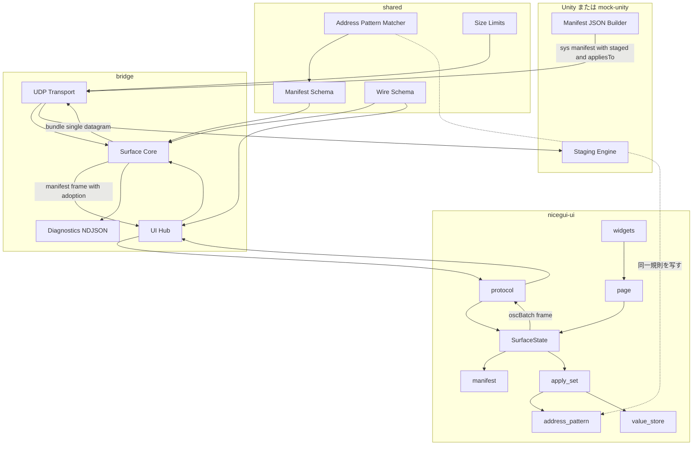
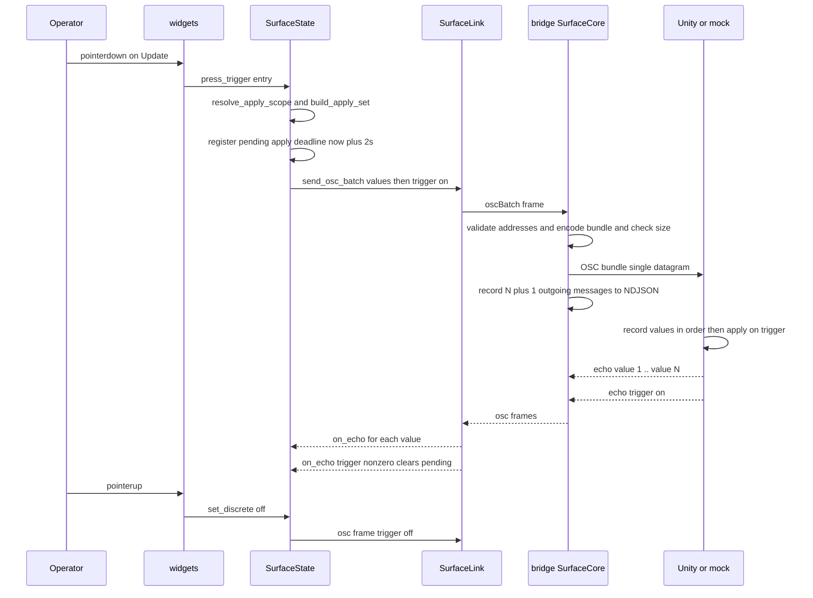
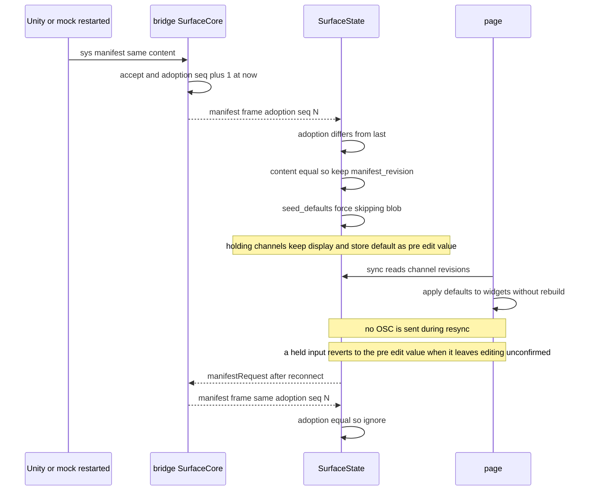
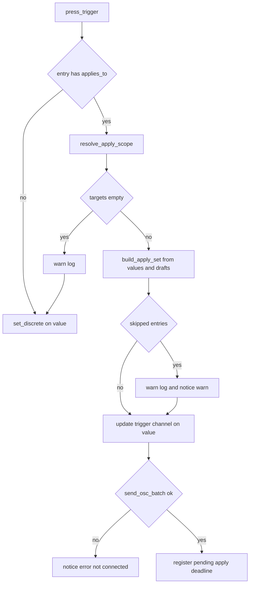

# Design Document: apply-trigger-form-values

## Overview

**Purpose**: 本機能は、適用トリガ(Update ボタン)の押下時挙動を「トリガだけを送る」から「適用範囲に含まれる全エントリの現在の表示値をセットで送ってからトリガを送る」へ改め、オペレータが「画面に見えている値がそのまま Unity に適用される」と信じられる状態を作る。あわせて、Unity 再起動などで同一内容のマニフェストが再採用されたときに UI の表示を `default`(Unity の現在値)へ再同期し、画面と Unity の内部状態が乖離したまま固定される事態を防ぐ。

**Users**: スタジオでシステムを知らずに GUI だけを見て操作するオペレータ、64 スロット規模のプリセットを構築する案件構築者、参照実装をホストへ再移植するフォーク(a8-oscdesk)の Unity 側実装者。

**Impact**: ワイヤ上のマニフェストに `appliesTo`(トリガのみ)と `staged: true`(staged エントリのみ)を追加し、`manifest` フレームに採用識別 `adoption` を追加し、UI→ブリッジに `oscBatch` フレームを新設する。ブリッジは複数メッセージを 1 つの OSC bundle(単一データグラム)として送る能力を得る。Unity 側のステージング意味論・`/sys/*`・エコーバック規則は変えない。

### Goals
- 適用トリガ押下で、適用範囲の staged エントリの表示値(未編集・編集中を含む)を全件、マニフェスト定義順で送り、最後にトリガ on 値を送る
- 値とトリガを 1 データグラム(OSC bundle)で配送し、欠損時に古い staged 値だけが適用される事態を構造的に排除する。配送が確認できないときは操作者に失敗を表示する
- 同一内容を含む「新たな採用」を UI が識別し、全エントリを `default` へ再同期する(再描画なし・OSC 送信なし)。ホールド中のエントリは表示を据え置き、確定せずに編集を離れたときに `default` へ戻す
- 64 スロット相当のマニフェストが 60 KiB に収まることを実測で回帰ガードする
- TS / Python / C# の 3 実装で照合規則と契約(zod・wire-samples・文書)を揃える

### Non-Goals
- TouchOSC 等の OSC ネイティブ UI からの適用(引き続き Unity 側ステージングに依存)
- レガシー Windows アプリ(VP_OscClient)の MemoryPack blob 互換
- Unity 側ステージング意味論・展開規則・`/sys/*`・エコーバック規則の変更、`protocol/staging-cases.json` の変更
- `docs/UPSTREAM_FEEDBACK_HOST_MIGRATION.md`(`SetManifestAsset` / `SendManifestNow`)への対応
- 適用失敗時の自動再送(操作者が再度押す)
- ブリッジ側で `manifest` の `default` を最新エコーで更新し続けること(キャッシュは採用時点の値のまま)

## Boundary Commitments

### This Spec Owns
- 共有スキーマ: `ManifestEntrySchema` の `staged` / `appliesTo`、`manifest` フレームの `adoption`、上り `oscBatch` フレーム、アドレスパターン照合器(`packages/shared/src/address-pattern.ts`)、サイズ定数(`MANIFEST_SIZE.WARNING_BYTES` の改定と `OSC_BATCH`)
- ブリッジ: `oscBatch` の受理・検証・bundle 送信・拒否通知(`notice`)、採用ごとの `adoption` 採番と再送時の同一付与、bundle 内各メッセージの NDJSON 記録
- UI: `appliesTo` / `staged` の解釈、適用範囲の解決、セットの組み立て(表示値・編集中の下書き)、`oscBatch` 送信、トリガエコー待ちと失敗通知、採用識別による強制再同期、通知の表示
- mock-unity: ワイヤ出力への `staged` / `appliesTo` 付与、`MOCK_UNITY_APPLY` への適用値の付記、64 スロット相当ステージングシナリオ
- Unity 参照実装: `TryBuildManifestJson` への `staged` / `appliesTo` 出力の追記と付録 A.2.4 の同期
- 契約資料: `protocol/wire-samples.json`、`protocol/manifest-samples.json`、新規 `protocol/address-pattern-cases.json`、`docs/BRIDGE_PROTOCOL.md`、`docs/UNITY_PROTOCOL.md`、`DESIGN.md`(D-035〜D-038)、`docs/VERIFICATION.md`

### Out of Boundary
- Unity 側の受信処理(`HandleNormalMessage`)、`StagingEngine`、`OscSurfaceManifestAsset`、S1〜S9 の検証規則
- ブリッジの `manifest-client.ts`(受理判定)と `ping-monitor.ts`、`osc-ui-router.ts`
- UI の再接続制御(`surface_link.py` の再接続・心拍)と `optionsRef` 解決
- 値の意味(staged か・トリガか)をブリッジが解釈すること。ブリッジは「複数メッセージを 1 bundle で送る」以上を知らない
- フォーク側のホスト再移植・HostDoc 更新・ワイヤサイズ再実測

### Allowed Dependencies
- `shared ← osc-codec ← bridge / mock-unity` の向きのみ。`shared` は `zod` 以外に依存しない(照合器は純粋関数)
- `nicegui-ui` は TS パッケージを import せず、`docs/BRIDGE_PROTOCOL.md` と `protocol/*.json` で結合する
- UI 内部は `config → protocol → manifest / entry_rules / address_pattern → apply_set / value_store → state → widgets → page` の向き。`apply_set.py` と `address_pattern.py` は `nicegui` を import しない
- 既存の bundle エンコード(`encodeOscPacket`)、`ManifestClient`、`ValueChannel` のホールド機構、`validate_input_confirmation`、D-021 のページ側タイマー同期

### Revalidation Triggers
- `manifest` フレームまたは `oscBatch` フレームの形が変わる(第三の UI クライアント・E2E ヘルパが影響を受ける)
- `MANIFEST_SIZE` / `OSC_BATCH` の数値変更
- Unity 側が `appliesTo` / `staged` の出力条件を変える(例: 空配列を出す、`staged: false` を出す)
- `OscSurfaceBridge.cs` の `TryBuildManifestJson` を変更した場合の付録 A.2.4 とフォーク側の再移植
- UI のホールド規則(D-033)の変更(下書きの寿命が連動する)

## Architecture

### Existing Architecture Analysis
- **2 プロセス + Unity** の構成と「ブリッジは配線のみ、ロジックは `surface-core` に集約し送信関数を注入する」パターン(structure.md)を維持する。bundle 送信も `sendBundleFn` として注入し、単体テストはプロセス起動なしで書く
- ブリッジは `/sys/manifest` を受けるたびに採用し(`surface-core.ts:150-176`)、UI 接続時と `manifestRequest` 時にキャッシュを再送する(同 `309`, `327`)。採用と再送を UI が区別する手段が無い
- UI は `state.py:242` で同一内容を早期 return し、`value_store.py:187` の `seed_defaults` は値のあるチャネルを触らない。`page.py:68` は `manifest_revision` の変化で全ウィジェットを作り直す
- ボタンは `widgets.py:349` で pointerdown に on 値、pointerup 等に off 値を送るだけ。編集中 input の下書きはウィジェット内にしか存在しない(`widgets.py:176-189`)
- 照合器は TS(`packages/mock-unity/src/staging.ts:283-297`)と C#(`OscSurfaceStaging.cs:471-593`)にあり、規則は同一(part 数一致・`*` は `/` を跨がない・形検証を双方に適用)
- UI の送信キュー(`surface_link.py` `_Outbox`)は 256 フレーム上限で古い順に捨てる
- `OscSurfaceBridge.cs` は `docs/UNITY_PROTOCOL.md` 付録 A.2.4 と `tests/guards/appendix-source-parity.test.ts` で一致が強制される

### Architecture Pattern & Boundary Map



**Architecture Integration**:
- Selected pattern: ハイブリッド(research.md Option C)。純粋ロジック(照合・範囲解決・セット組み立て)を新モジュールへ置き、既存の I/O 層は薄く拡張する
- Domain/feature boundaries: **ブリッジは意味を持たない**(`oscBatch` を bundle に変換して送るだけ)。**UI が意味を持つ**(どの値をセットに含めるか、完了をどう判定するか)。**Unity が真実の源**(値の確定はエコーバックのみ、`default` は再同期の初期値にすぎない)
- Existing patterns preserved: 送信関数の注入(`sendFn` / `sendBundleFn`)、境界での zod 検証(strict object)、不正フレームは破棄して接続維持、D-021 のページ側タイマー同期、D-033 のホールド規則、D-034 のサイズ定数
- New components rationale: `address-pattern.ts`(shared に置かないと zod 検証と mock-unity で二重化する)、`address_pattern.py` / `apply_set.py`(NiceGUI 非依存で単体テストする)、`sendBundle`(既存 `send` は単一メッセージ専用)
- Steering compliance: 責務分離(UI は WebSocket プロトコルだけを使う)、案件差分はデータ(`appliesTo` はマニフェストのデータ)、Unity が真実の源(UI の表示は再送のソースであってもキャッシュのまま)

### Technology Stack

| Layer | Choice / Version | Role in Feature | Notes |
|-------|------------------|-----------------|-------|
| Frontend / UI | Python >= 3.11, NiceGUI >= 2.0, `websockets` | 適用セットの組み立て・`oscBatch` 送信・通知表示・再同期 | 新規依存なし。`nicegui.testing.user_simulation` の `trigger("pointerdown")` でボタン検証 |
| Backend / Bridge | TypeScript 5.5 / Node >= 20, `zod`, `ws` | `oscBatch` 検証、bundle 送信、`adoption` 採番、`notice` 返却 | 新規依存なし |
| Messaging | OSC 1.0 bundle(即時タイムタグ `[0,1]`)over UDP、WebSocket JSON v1 | 値 N 件 + トリガを単一データグラムで配送 | `osc` npm の `writePacket` が bundle を書く(`osc-codec` 既存機能) |
| Unity | uOSC 2.2.0(付録 A)+ C# 参照実装 | `staged` / `appliesTo` の JSON 出力 | bundle 受信は uOSC が順序展開済み。受信処理の変更なし |
| Test | vitest(unit / e2e)、pytest、Unity batchmode | クロス言語フィクスチャ、E2E、C# コンパイル確認 | `corepack pnpm test` 単一入口を維持 |

## File Structure Plan

### 新規ファイル

```
packages/shared/src/
├── address-pattern.ts              # 形検証と * 照合(mock-unity から移設)。zod 検証と mock-unity が共用
├── address-pattern.test.ts         # protocol/address-pattern-cases.json を読む
└── limits.ts                       # MANIFEST_SIZE(56 KiB へ改定)と OSC_BATCH を集約。index.ts から再エクスポート
packages/nicegui-ui/src/oscdesk_ui/
├── address_pattern.py              # address-pattern.ts の写し(純粋関数)
└── apply_set.py                    # 適用範囲の解決とセットの組み立て(純粋関数 + Protocol)
packages/nicegui-ui/tests/
├── test_address_pattern.py         # 共有ケース集を読む
├── test_apply_set.py
└── test_browser_button_events.py   # pointerdown / pointerup の送信順序・件数・再採用時の表示
packages/mock-unity/
├── scripts/generate-large-staging-scenario.mjs   # 64 スロット + 全体更新 + MB 群のステージング付きシナリオ生成
└── scenarios/large-staging.json                  # サイズ実測と E2E 用
protocol/
└── address-pattern-cases.json      # { pattern, address, matches } の平坦なケース集(TS と Python が読む)
tests/e2e/
└── apply-set.e2e.test.ts           # oscBatch → bundle → MOCK_UNITY_APPLY、mock 再起動後の adoption 進行と再適用
```

### Modified Files
- `packages/shared/src/schemas.ts` — `staged: z.literal(true).optional()`、`appliesTo: z.array(z.string()).min(1).optional()`、superRefine(button 以外の `appliesTo`、パターン形)
- `packages/shared/src/wire.ts` — `ManifestAdoptionSchema`、`manifest` フレームへ `adoption` 必須追加、上り `oscBatch` フレーム
- `packages/shared/src/index.ts` — `MANIFEST_SIZE` を `limits.ts` へ移動して再エクスポート、`address-pattern` を再エクスポート
- `packages/shared/src/osc-types.ts` — `OSC_IMMEDIATE_TIME_TAG` 定数
- `packages/shared/src/schemas.test.ts`, `wire.test.ts`, `manifest-samples.test.ts` — 新フィールド・新フレームのケース
- `packages/bridge/src/udp-transport.ts` — `sendBundle(host, port, messages)`(エンコード・サイズ判定・送信)
- `packages/bridge/src/surface-core.ts` — `BundleSendResult` 型、`sendBundleFn` 依存、`oscBatch` 分岐、`adoption` 採番と再送時付与、`notice` 返却
- `packages/bridge/src/bridge-server.ts` — `sendBundleFn` の配線
- `packages/bridge/src/surface-core.test.ts`, `udp-transport.test.ts` — 追加ケース
- `packages/mock-unity/src/staging.ts` — 照合器を `@oscdesk/shared` から import し、`matchesPattern` を再エクスポート(既存 import 互換)
- `packages/mock-unity/src/scenario.ts` — `buildManifestEntry` が `staged` / `appliesTo` を付与、`entries` 直書きの `staged` / `appliesTo` を拒否
- `packages/mock-unity/src/index.ts` — `MOCK_UNITY_APPLY` 行の末尾に適用値 JSON を付記
- `packages/mock-unity/src/scenario.test.ts` — `staging.json` のワイヤ出力、`large-staging.json` のサイズ実測
- `packages/nicegui-ui/src/oscdesk_ui/manifest.py` — `ManifestEntry.staged` / `applies_to` と検証
- `packages/nicegui-ui/src/oscdesk_ui/entry_rules.py` — `is_display_only` と `button_values` を `widgets.py` から移設、`is_apply_trigger` 追加
- `packages/nicegui-ui/src/oscdesk_ui/protocol.py` — `ManifestFrame.adoption`、`OscMessage`、`encode_osc_batch_frame`、許容キー集合
- `packages/nicegui-ui/src/oscdesk_ui/surface_link.py` — `send_osc_batch`
- `packages/nicegui-ui/src/oscdesk_ui/value_store.py` — 下書き(`draft`)、`seed_defaults(force=)`
- `packages/nicegui-ui/src/oscdesk_ui/state.py` — `press_trigger`、`set_draft`、採用識別、エコー待ち、通知ログ、`notice` フレーム処理
- `packages/nicegui-ui/src/oscdesk_ui/widgets.py` — `on_trigger_press` / `on_draft` コールバック、`entry_rules` からの import
- `packages/nicegui-ui/src/oscdesk_ui/page.py` — 新コールバックの配線、通知表示
- `packages/nicegui-ui/tests/test_state.py`, `test_value_store.py`, `test_manifest.py`, `test_protocol.py`, `test_wire_samples.py`, `test_manifest_samples.py` — 追加ケース(FakeLink に `send_osc_batch`)
- `OscSurface/Assets/OscSurfaceBridge/OscSurfaceBridge.cs` — `TryBuildManifestJson` の `pattern` ブロック直後に `staged` / `appliesTo` 出力を追記
- `tests/e2e/helpers/process.ts`, `helpers/bridge.ts` — `stderrSnapshot()`
- `tests/e2e/ws-protocol.e2e.test.ts` — `manifest` フレームの断言は `toMatchObject`(部分一致)のため `adoption` 追加で壊れず更新不要。`adoption` 込みの断言を追加してもよい
- `protocol/wire-samples.json` — `downstream-manifest` に `adoption` と `staged` / `appliesTo` エントリ、`upstream-osc-batch`(valid)、`upstream-osc-batch-empty`(invalid)
- `protocol/manifest-samples.json` — `appliesTo` 付き valid、button 以外の `appliesTo` / 不正パターン / `staged: false` の invalid
- `docs/BRIDGE_PROTOCOL.md`, `docs/UNITY_PROTOCOL.md`(§2, §3, §4.3.1, 互換性ノート Phase 8, 付録 A.2.4), `DESIGN.md`(D-035〜D-038), `docs/VERIFICATION.md`

## System Flows

### 適用トリガ押下(Update)の系列



- 値が 1 件も解決できない(`appliesTo` が無い、または一致なし)場合は従来どおり単発 `osc` フレームで on 値だけを送る。この場合はエコー待ちを登録しない
- ブリッジが `oscBatch` を拒否したときは送信元 UI にだけ `notice(level: error, code: batch-rejected)` を返し、UI は該当トリガの待ちを即時失敗にする
- 期限切れ(2 秒)は `SurfaceState.tick()` が判定し、通知ログに積む。ページ側タイマーが `ui.notify` で表示する(D-021)

### Unity 再起動後の再同期の系列



### press_trigger の分岐



## Requirements Traceability

| Requirement | Summary | Components | Interfaces | Flows |
|-------------|---------|------------|------------|-------|
| 1.1 | zod が button の `appliesTo` を受理 | ManifestSchema 拡張 | `ManifestEntrySchema` | — |
| 1.2 | button 以外の `appliesTo` はスキーマ違反(path 付き) | ManifestSchema 拡張 | superRefine path `['entries', i, 'appliesTo']` | — |
| 1.3 | パターン形の検証 | ManifestSchema 拡張, AddressPatternMatcher | `isValidAddressShape` | — |
| 1.4 | Unity が非空 `AppliesTo` の button にだけ出力 | Unity JSON Builder | `TryBuildManifestJson` | — |
| 1.5 | mock-unity が `staging.triggers` から出力 | mock-unity Scenario | `buildManifestEntry` | — |
| 1.6 | ブリッジが `appliesTo` を削らず配信 | Surface Core | `manifest` フレーム | 再同期系列 |
| 1.7 | UI が `appliesTo` を保持 | Manifest(Python) | `ManifestEntry.applies_to` | — |
| 1.8 | `appliesTo` 無しの後方互換 | ManifestSchema 拡張, Manifest(Python) | optional | — |
| 1.9 | 契約資料に見本と説明 | Contract Docs | wire-samples / manifest-samples / BRIDGE_PROTOCOL / UNITY_PROTOCOL §2 | — |
| 1.10 | `staged: true` を staged にだけ出力 | ManifestSchema 拡張, Unity JSON Builder, mock-unity Scenario | `staged: literal(true)` | — |
| 1.11 | `staged` 無しの後方互換 | ManifestSchema 拡張, Manifest(Python) | optional | — |
| 2.1 | §4.3.1 と同一の照合規則 | AddressPatternMatcher, address_pattern.py | `matches_pattern` | — |
| 2.2 | いずれかのパターン一致で範囲に含める | ApplySet | `resolve_apply_scope` | 分岐図 |
| 2.3 | button を送信対象から除外 | ApplySet | `resolve_apply_scope` | — |
| 2.4 | blob・表示専用を除外 | ApplySet, entry_rules | `is_display_only` | — |
| 2.5 | 共有ケースで 3 実装の一致を確認 | Contract Docs, AddressPatternMatcher | `protocol/address-pattern-cases.json` | — |
| 2.6 | 一致なしは従来挙動 + 警告 | SurfaceState | `press_trigger` | 分岐図 |
| 2.7 | `staged: true` を持たないエントリを除外 | ApplySet | `resolve_apply_scope` | — |
| 3.1 | 押下で値全件 → トリガ on | SurfaceState, ApplySet, widgets | `press_trigger`, `on_trigger_press` | 押下系列 |
| 3.2 | 未編集も含めて全件(`seed_defaults` 由来の bool default を含む) | ApplySet | `build_apply_set`, `to_wire_args` の正規化 | — |
| 3.3 | 型タグは `type` 対応、bool は `i` 0/1(Python `bool` → `int` へ正規化) | ApplySet | `to_wire_args` | — |
| 3.4 | 定義順、トリガは末尾 | ApplySet | `ApplySetPlan.messages` | — |
| 3.5 | 解放時は off 値だけ | widgets | `release` は従来どおり `set_discrete` | 押下系列 |
| 3.6 | `appliesTo` 無しの button は従来どおり | SurfaceState | `press_trigger` | 分岐図 |
| 3.7 | 間引き・結合の対象外 | SurfaceState, SurfaceLink | `send_osc_batch`(ValueChannel を経由しない) | — |
| 3.8 | 表示値なしは除外 + 警告 | ApplySet | `SkippedEntry(no-value)` | — |
| 3.9 | ホールド中は編集中の値を送る | ValueStore, widgets, ApplySet | `set_draft`, `draft_of` | — |
| 3.10 | セットのエコーは通常規律で確定 | SurfaceState | `_on_frame` → `on_echo` | 押下系列 |
| 4.1 | 値未到達でトリガだけ届かない | UDP Transport, Surface Core | `sendBundle`(単一データグラム) | 押下系列 |
| 4.2 | 保証不能時は失敗をエラー表示(2 秒で「未確認」を表示、遅延エコーは `info` で補正) | SurfaceState, page | pending apply / `recent_failed_applies` / 通知ログ | 押下系列 |
| 4.3 | 既存 bundle エンコードで単一データグラム | UDP Transport | `encodeOscPacket` bundle | — |
| 4.4 | セット用フレームを zod 検証し契約に記載 | Wire 拡張, Contract Docs | `oscBatch` | — |
| 4.5 | mock-unity が bundle を順序展開 | mock-unity Responder(既存) | `visitPacket` | — |
| 4.6 | (エコー確認方式は不採用。4.2 の表示のみ) | — | — | — |
| 4.7 | 上限超過は黙って切り捨てない | UDP Transport, Surface Core | `BundleSendResult too-large` → `notice` | — |
| 4.8 | UI は WebSocket だけを使う | SurfaceLink | `send_osc_batch` | — |
| 4.9 | 各メッセージを NDJSON に個別記録 | Surface Core, Diagnostics | `recordOutgoing` × N+1 | 押下系列 |
| 5.1 | 新たな採用で `default` へ再同期 | Surface Core, SurfaceState, ValueStore | `adoption`, `seed_defaults(force=True)` | 再同期系列 |
| 5.2 | 新たな採用を識別する手段 | Wire 拡張, Surface Core | `ManifestAdoptionSchema` | 再同期系列 |
| 5.3 | 再同期で OSC を送らない | ValueStore | `seed_defaults` は送信経路を持たない | 再同期系列 |
| 5.4 | ホールド中は上書きしない(表示据え置き、`pre_edit_values` に記録し未確定離脱で復帰) | ValueStore | `pre_edit_values`, `end_hold` / `expire_hold` の復帰規則 | 再同期系列 |
| 5.5 | 入力内容・フォーカス・スクロールを保つ | SurfaceState, page | 同一内容では `manifest_revision` 不変 | 再同期系列 |
| 5.6 | blob は対象外 + 警告 | ValueStore | `seed_defaults` の戻り値 | — |
| 5.7 | 再起動後の `default` に基づく値が適用(bool default の正規化、ホールド解除後の復帰値を含む) | 全体, ApplySet, ValueStore | E2E, `to_wire_args`, `pre_edit_values` | 再同期系列 → 押下系列 |
| 5.8 | 不採用時は再同期しない | Surface Core(既存), SurfaceState | 拒否は `manifest` を配信しない | — |
| 6.1 | Unity 意味論の不変 | Unity JSON Builder | 追記のみ | — |
| 6.2 | Unity は自身の `currentValues` から適用 | Unity(既存) | — | 押下系列 |
| 6.3 | staging-cases とテストは無変更で緑 | AddressPatternMatcher(移設) | 再エクスポート互換 | — |
| 6.4 | 旧 Unity でも on/off 2 メッセージ | SurfaceState | `press_trigger` | 分岐図 |
| 6.5 | `TryBuildManifestJson` 周辺に局所化 | Unity JSON Builder | 追記 2 ブロック | — |
| 6.6 | C# コンパイル確認の記録 | Verification Docs | batchmode 手順 | — |
| 7.1 | サイズを増やす項目はトリガ / staged だけ | Unity JSON Builder, mock-unity Scenario | 出力条件 | — |
| 7.2 | 64 スロット相当の増分を実測・記録(生成スクリプトが `staged` / `appliesTo` 無しの対照出力を持ち差分を取る) | mock-unity Scenario, Design Docs | `large-staging.json`, `--without-staging`, D-038 | — |
| 7.3 | 60 KiB を超えない | mock-unity Scenario test | `MANIFEST_SIZE.PRACTICAL_LIMIT_BYTES` | — |
| 7.4 | 警告閾値の扱いを記録 | Size Limits, Design Docs | `WARNING_BYTES = 56 KiB`, D-038 | — |
| 7.5 | 警告閾値超過は警告して配信継続 | mock-unity ManifestSizeMonitor(既存) | — | — |
| 8.1 | mock 単体テストで `appliesTo` / `staged` | mock-unity Scenario test | — | — |
| 8.2 | E2E で値 N + トリガと `MOCK_UNITY_APPLY` の一致(未編集 toggle の bool default を含むセット) | E2E, Process Harness | `stderrSnapshot`, `MOCK_UNITY_APPLY` の JSON | 押下系列 |
| 8.3 | E2E で再起動後の再同期と再適用 | E2E | `adoption.seq` の進行 | 再同期系列 |
| 8.4 | ブラウザテストで送信順序・件数・off | Browser Test | `trigger("pointerdown")` | — |
| 8.5 | ブラウザテストで再採用時の表示更新とホールド保護 | Browser Test | — | — |
| 8.6 | クロス言語契約テスト | Contract Docs | wire-samples / manifest-samples / address-pattern-cases | — |
| 8.7 | UNITY_PROTOCOL の更新 | Contract Docs | §2 / §3 / §4.3.1 | — |
| 8.8 | BRIDGE_PROTOCOL の更新 | Contract Docs | `manifest.adoption`, `oscBatch`, `notice` code | — |
| 8.9 | DESIGN.md の判断記録 | Design Docs | D-035〜D-038 | — |
| 8.10 | VERIFICATION.md の手動手順 | Verification Docs | — | — |
| 8.11 | 単一入口で全テスト緑 | 全体 | `corepack pnpm test` | — |

## Components and Interfaces

| Component | Domain/Layer | Intent | Req Coverage | Key Dependencies (P0/P1) | Contracts |
|-----------|--------------|--------|--------------|--------------------------|-----------|
| AddressPatternMatcher | shared | §4.3.1 の形検証と `*` 照合の唯一の TS 実装 | 1.3, 2.1, 2.5, 6.3 | なし | Service |
| SizeLimits | shared | `MANIFEST_SIZE`(56 KiB 警告)と `OSC_BATCH` | 4.7, 7.4 | なし | State |
| ManifestSchema 拡張 | shared | `staged` / `appliesTo` の受理と違反検出 | 1.1–1.3, 1.8, 1.10, 1.11 | AddressPatternMatcher (P0) | API |
| Wire 拡張 | shared | `manifest.adoption` と上り `oscBatch` | 4.4, 5.2 | ManifestSchema (P0), SizeLimits (P1) | API |
| UDP Transport | bridge | bundle のエンコード・サイズ判定・送信 | 4.1, 4.3, 4.7 | osc-codec (P0), SizeLimits (P0) | Service |
| Surface Core 拡張 | bridge | `oscBatch` 受理、`adoption` 採番、`notice` 返却、NDJSON 記録 | 1.6, 4.1, 4.7, 4.9, 5.1, 5.2, 5.8 | UDP Transport (P0), UI Hub (P0), Diagnostics (P1) | Service, Event |
| mock-unity Scenario 拡張 | mock-unity | ワイヤ出力への `staged` / `appliesTo` 付与、適用値の可視化、64 スロットシナリオ | 1.5, 1.10, 4.5, 7.1–7.3, 8.1, 8.2 | shared (P0) | Batch |
| Unity JSON Builder 拡張 | Unity C# | `TryBuildManifestJson` への追記 | 1.4, 1.10, 6.1, 6.5, 6.6, 7.1 | `OscSurfaceManifestAsset`(既存) | API |
| Manifest / entry_rules (Python) | UI | `applies_to` / `staged` の解釈、表示専用判定の移設 | 1.7, 1.8, 1.11, 2.4 | なし | State |
| address_pattern (Python) | UI | 照合規則の写し | 2.1, 2.5 | なし | Service |
| ApplySet (Python) | UI | 適用範囲の解決とセットの組み立て(純粋) | 2.2–2.4, 2.7, 3.2–3.4, 3.8, 3.9 | address_pattern (P0), entry_rules (P0) | Service |
| ValueStore 拡張 | UI | 下書きの保持、強制再同期 | 3.9, 5.1, 5.3, 5.4, 5.6 | なし | State |
| Protocol / SurfaceLink 拡張 | UI | `adoption` の復号、`oscBatch` の符号化と送信 | 4.4, 4.8, 5.2 | なし | API |
| SurfaceState 拡張 | UI | `press_trigger`、エコー待ち、採用識別、通知ログ | 2.6, 3.1, 3.6, 3.7, 3.10, 4.2, 5.1, 5.5, 5.8, 6.4 | ApplySet (P0), ValueStore (P0), SurfaceLink (P0) | Service, State |
| widgets / page 拡張 | UI | 押下・下書きの橋渡し、通知表示 | 3.1, 3.5, 3.9, 4.2 | SurfaceState (P0) | — |
| Contract Docs / Fixtures | 契約 | wire-samples / manifest-samples / address-pattern-cases / 文書 | 1.9, 2.5, 8.6–8.8 | — | — |
| E2E / Harness | tests | `stderrSnapshot`、適用セット E2E | 8.2, 8.3 | mock-unity (P0) | — |

### 契約レイヤ(shared)

#### AddressPatternMatcher

| Field | Detail |
|-------|--------|
| Intent | §4.3.1 の形検証と `*` 照合を `shared` に置き、zod 検証・mock-unity・(写しとして)Python で同一規則にする |
| Requirements | 1.3, 2.1, 2.5, 6.3 |

**Responsibilities & Constraints**
- `packages/mock-unity/src/staging.ts` の `isValidAddressShape` / `partPatternMatches` / `matchesPattern` を挙動不変で移設する。mock-unity は `matchesPattern` を再エクスポートして既存 import を壊さない
- 規則: 先頭 `/`、長さ > 1、末尾 `/` 禁止、`//` 禁止、空 part 禁止、`?[]{},` 禁止。パターンとアドレスの双方に適用し、どちらかが不正なら不一致。part 数一致時のみ照合し、`*` は part 内 0 文字以上
- `zod` 以外に依存しない純粋関数

**Dependencies**
- Inbound: ManifestSchema 拡張 — `appliesTo` 要素の形検証 (P0)、mock-unity staging — 既存の S3 / 解決 (P0)
- Outbound: なし

**Contracts**: Service [x]

##### Service Interface
```typescript
// packages/shared/src/address-pattern.ts
export function isValidAddressShape(address: string): boolean
export function matchesPattern(pattern: string, address: string): boolean
export function matchesAnyPattern(patterns: readonly string[], address: string): boolean
```
- Preconditions: 引数は任意の文字列(空文字を含む)。例外を投げない
- Postconditions: `protocol/address-pattern-cases.json` の全ケースと一致する。`protocol/staging-cases.json` の既存結果を変えない
- Invariants: C# `TrySplitAddress` / `MatchesPart` と同じ真理値

**Implementation Notes**
- Integration: `packages/shared/src/index.ts` から再エクスポート。mock-unity の `staging.ts` は本モジュールを import し、ローカル実装を削除する
- Validation: `address-pattern.test.ts` がケース集を読む。ケース集には `//`、末尾 `/`、`?[]{},`、part 数不一致、`*` の 0 文字一致、`/member/*/*` vs `/member/all/enabled`(一致する例)を含める
- Risks: 移設漏れで mock-unity と shared が二重化する → `staging.ts` に照合器の本体が残っていないことをコードレビューで確認

#### SizeLimits

| Field | Detail |
|-------|--------|
| Intent | マニフェストと適用セットのデータグラム上限を 1 か所で持つ |
| Requirements | 4.7, 7.4 |

**Contracts**: State [x]

##### State Management
```typescript
// packages/shared/src/limits.ts(index.ts から再エクスポート。import パスは不変)
export const MANIFEST_SIZE = {
  RECOMMENDED_BYTES: 1400,
  WARNING_BYTES: 56 * 1024,          // D-038: 48 KiB から改定(64 スロット構成で常時警告になるため)
  PRACTICAL_LIMIT_BYTES: 60 * 1024,
} as const
export const OSC_BATCH = {
  MAX_MESSAGES: 512,                 // zod の上限(64 スロット = 257 件の約 2 倍)
  PRACTICAL_LIMIT_BYTES: 60 * 1024,  // エンコード後 bundle のバイト数上限。超過は送らない
} as const
```
- Persistence & consistency: `docs/UNITY_PROTOCOL.md` 互換性ノートと `docs/BRIDGE_PROTOCOL.md` に同じ数値を記載する

**Implementation Notes**
- Validation: 既存 `scenario.test.ts` の `sharedBytes < WARNING_BYTES` は閾値引き上げ後も成立する(約 40 KB)
- Risks: `wire.ts` が `OSC_BATCH` を参照するため、`index.ts` ではなく `limits.ts` から直接 import して循環を避ける

#### ManifestSchema 拡張

| Field | Detail |
|-------|--------|
| Intent | `staged` / `appliesTo` をワイヤ契約に加え、違反を path 付きで検出する |
| Requirements | 1.1, 1.2, 1.3, 1.8, 1.10, 1.11 |

**Contracts**: API [x]

##### API Contract(マニフェスト JSON の追加項目)
| 項目 | 型 | 出現条件 | 検証 |
|------|----|----------|------|
| `staged` | `true`(literal) | staged と宣言されたエントリのみ。非 staged には**キーを出さない** | `z.literal(true).optional()`。`false` はスキーマ違反 |
| `appliesTo` | `string[]`(1 件以上) | `widget: "button"` かつ適用範囲が非空のエントリのみ | `z.array(z.string()).min(1).optional()`。button 以外にあれば issue path `entries[i].appliesTo`、要素が形違反なら path `entries[i].appliesTo[j]` |

- Errors: 違反は `ManifestClient` が `schema-error` として不採用にし、`formatSchemaError` が path を含む detail をログへ残す(既存経路)
- Backward compatibility: 両項目とも省略可。旧形式のマニフェストは無変更で受理

**Implementation Notes**
- Integration: `packages/nicegui-ui/src/oscdesk_ui/manifest.py` が同じ規則を写す(`applies_to: tuple[str, ...] | None`、`staged: bool`。`staged` は `true` 以外を `ManifestError`)
- Validation: `protocol/manifest-samples.json` に valid(`appliesTo` 付き button + `staged` 付き input)、invalid(fader に `appliesTo`、`appliesTo: ["/a//b"]`、`appliesTo: []`、`staged: false`)を追加し、TS / Python の両テストで判定一致を確認する
- Risks: S2(トリガ自身が staged)や S8(blob が staged)はスキーマで検証しない(Unity 側の起動時検証に委ね、UI は button / blob を除外規則で落とす)

#### Wire 拡張

| Field | Detail |
|-------|--------|
| Intent | `manifest` フレームの採用識別と、上り `oscBatch` フレーム |
| Requirements | 4.4, 5.2 |

**Contracts**: API [x]

##### API Contract(WebSocket フレーム)

下り `manifest`(既存フレームへ `adoption` を**必須**追加):
```json
{"v":1,"type":"manifest",
 "adoption":{"seq":3,"at":"2026-09-26T09:00:00.000+00:00"},
 "manifest":{"version":1,"projectId":"oscdesk-demo","entries":[
   {"address":"/member/01/name","label":"Member 01 Name","type":"s","widget":"input","default":"Alice","staged":true},
   {"address":"/member/01/update","label":"Member 01 Update","type":"i","widget":"button","default":0,"appliesTo":["/member/01/*"]}
 ]}}
```
| 項目 | 型 | 意味 |
|------|----|------|
| `adoption.seq` | 正の整数 | ブリッジプロセス内で採用ごとに 1 ずつ増える |
| `adoption.at` | ISO 8601(offset 付き) | 採用時刻。ブリッジ再起動後の `seq` 衝突を等値比較で区別するために使う |

再送(UI 接続時・`manifestRequest`)は直近の採用と**同じ** `adoption` を付ける。UI は `(seq, at)` の等値だけで判定し、順序比較はしない。

上り `oscBatch`(新設):
```json
{"v":1,"type":"oscBatch","messages":[
  {"address":"/member/01/name","args":[{"type":"s","value":"Zed"}]},
  {"address":"/member/01/enabled","args":[{"type":"i","value":1}]},
  {"address":"/member/01/update","args":[{"type":"i","value":1}]}
]}
```
| 項目 | 検証 |
|------|------|
| `messages` | strict object の配列、`min(1)`、`max(OSC_BATCH.MAX_MESSAGES)` |
| `messages[i].address` | `/` 始まり。内部予約(`/sys/*`, `/oscdesk/*`)が 1 件でもあればフレーム全体を拒否 |
| `messages[i].args` | `WireArgSchema` の配列(単発 `osc` と同一) |

- Delivery: ブリッジは `messages` の順序を保って 1 つの OSC bundle(即時タイムタグ)にし、単一 UDP データグラムで Unity へ送る。分割しない
- Errors: スキーマ違反は既存の `notice(warn, invalid-frame)`。受理後の拒否は `notice(error, batch-rejected, detail)` を送信元にだけ返す(detail は `internal-address <addr>` / `too-large <bytes>/<limit>` / `transport-unavailable`)
- Idempotency: ブリッジは再送しない。UI も再送しない(操作者の再押下)

**Implementation Notes**
- Integration: `protocol/wire-samples.json` の `downstream-manifest` を更新し、`upstream-osc-batch`(valid)と `upstream-osc-batch-empty`(invalid)を追加。`docs/BRIDGE_PROTOCOL.md` の対応表に追記。Python `decode_frame` の許容キー集合に `adoption` を加える
- Validation: `wire.test.ts` と `test_wire_samples.py` が同じ見本を読む。Python は `encode_osc_batch_frame` の出力が見本と完全一致することを確認する
- Risks: 既存 E2E(`tests/e2e/ws-protocol.e2e.test.ts:43` 付近)は `toMatchObject` の部分一致なので `adoption` の必須追加で壊れない。第三の UI クライアントが strict 検証している場合は UI 側を先に更新する必要がある(BRIDGE_PROTOCOL に更新順序を記す)

### ブリッジレイヤ

#### UDP Transport(`sendBundle`)

| Field | Detail |
|-------|--------|
| Intent | 複数メッセージを 1 bundle にエンコードし、サイズを判定してから単一データグラムで送る |
| Requirements | 4.1, 4.3, 4.7 |

**Responsibilities & Constraints**
- bundle のタイムタグは `OSC_IMMEDIATE_TIME_TAG`(`{ seconds: 0, fractions: 1 }`)固定
- エンコード後バイト数が `OSC_BATCH.PRACTICAL_LIMIT_BYTES` を超えたら送らずに結果で返す
- 送信は既存 `sendPacket` を使い、ソケットエラーは既存の `onSocketError` へ

**Dependencies**
- Outbound: `@oscdesk/osc-codec` `encodeOscPacket` (P0)、`@oscdesk/shared` `OSC_BATCH` / `OSC_IMMEDIATE_TIME_TAG` (P0)

**Contracts**: Service [x]

##### Service Interface
```typescript
// packages/bridge/src/surface-core.ts(型の置き場。udp-transport.ts が import する)
export type BundleSendResult =
  | { ok: true; bytes: number; messageCount: number }
  | { ok: false; reason: 'too-large'; bytes: number; limitBytes: number }
  | { ok: false; reason: 'transport-unavailable' }

// packages/bridge/src/udp-transport.ts
export interface UdpTransport {
  readonly port: number
  send(host: string, port: number, address: string, args: readonly OscArg[]): void
  sendBundle(host: string, port: number, messages: readonly OscMessagePacket[]): BundleSendResult
  close(): Promise<void>
}
```
- Preconditions: `messages.length >= 1`(呼び出し側の zod が保証)
- Postconditions: `ok: true` のとき 1 回だけ `socket.send` が呼ばれ、`bytes` はデータグラム長。`ok: false` のときソケットに触れない
- Invariants: `messages` の順序 = bundle 内の要素順

**Implementation Notes**
- Validation: `udp-transport.test.ts` で、ループバック受信側が bundle 1 データグラムを受け取り `decodeOscPacket` で N 件に展開できること、`too-large` で送信されないことを確認
- Risks: MTU 超過による IP フラグメント。同一 LAN 前提で許容し、失敗は UI のエコー待ちで検出する(research.md)

#### Surface Core 拡張

| Field | Detail |
|-------|--------|
| Intent | `oscBatch` の受理と bundle 送信、採用ごとの `adoption` 採番、拒否通知、NDJSON 記録 |
| Requirements | 1.6, 4.1, 4.7, 4.9, 5.1, 5.2, 5.8 |

**Responsibilities & Constraints**
- ブリッジは `messages` の意味(値かトリガか)を解釈しない。`isInternalAddress` の拒否、サイズ、順序保持だけを担う
- `adoption` は `handleManifest` の採用成功時にのみ進む(不採用・再送では進まない)。`at` は注入された `now()` から生成する
- `manifest` フレームの 3 経路(採用時ブロードキャスト・UI 接続時・`manifestRequest`)を単一の `publishManifest(target?)` に集約し、`adoption` の付け忘れを構造的に防ぐ
- NDJSON には bundle として送った各メッセージを `dir: 'out'` で個別に記録する。送信判定(`ok`)の後に記録し、送らなかったセットは記録しない(ログに「送ったように見える」証跡を残さない)

**Dependencies**
- Inbound: UI Hub — `oscBatch` フレーム (P0)
- Outbound: `sendBundleFn` (P0)、`publish`(`notice` / `manifest`)(P0)、Diagnostics `recordOutgoing` (P1)

**Contracts**: Service [x] / Event [x]

##### Service Interface
```typescript
export interface SurfaceCoreDeps {
  // 既存に加えて
  sendBundleFn: (host: string, port: number, messages: readonly OscMessagePacket[]) => BundleSendResult
}

interface ManifestAdoption { readonly seq: number; readonly at: string }
// 内部状態: let adoption: ManifestAdoption | null(acceptedManifest と同時に更新)
```
- `handleUiFrame(frame: { type: 'oscBatch' }, clientId)` の手順:
  1. `messages` に内部予約アドレスがあれば `notice(error, batch-rejected, 'internal-address <addr>')` を `clientId` に返して終了(初回のみ WARN ログ)
  2. `toOscArgs` で `OscMessagePacket[]` にし、`sendBundleFn(unity.host, unity.sendPort, packets)`
  3. `ok: false` なら `notice(error, batch-rejected, '<reason> <bytes>/<limit>')` を `clientId` に返す
  4. `ok: true` なら各メッセージを `diagnostics.recordOutgoing` に記録

##### Event Contract
- Published events: `manifest`(採用時ブロードキャスト、接続時・要求時は個別。常に `adoption` 付き)、`notice`(`batch-rejected` は送信元 UI のみ)
- Subscribed events: 上り `oscBatch`
- Ordering / delivery guarantees: bundle 内順序は `messages` 順。`notice` は送信を試みなかったことを意味し、部分送信は存在しない

**Implementation Notes**
- Integration: `bridge-server.ts` は `sendBundleFn: (host, port, messages) => udp?.sendBundle(host, port, messages) ?? { ok: false, reason: 'transport-unavailable' }` を配線
- Validation: `surface-core.test.ts` に「`oscBatch` → `sendBundleFn` 1 回 + `recordOutgoing` N 回」「内部アドレス混入で送らず `notice`」「`too-large` で `notice`」「採用 2 回で `seq` 1→2、再送は同じ `adoption`」「不採用で `adoption` 不変」を追加
- Risks: `sendFn` の可変長シグネチャは据え置く(既存テストの互換)。`BundleSendResult` の判別は `ok` で行い `any` を使わない

### mock-unity レイヤ

#### mock-unity Scenario 拡張

| Field | Detail |
|-------|--------|
| Intent | `staging` 節からワイヤ出力へ `staged` / `appliesTo` を付与し、適用値を stderr に可視化し、64 スロット相当のサイズを実測する |
| Requirements | 1.5, 1.10, 4.5, 7.1, 7.2, 7.3, 8.1, 8.2 |

**Responsibilities & Constraints**
- `buildManifestEntry` は `staging.staged` に含まれるアドレスへ `staged: true`、`staging.triggers` に一致する button へ `appliesTo` を付ける。それ以外にはキーを出さない
- シナリオ `entries` に `staged` / `appliesTo` を直接書くことは `ScenarioSchema` の refine で拒否する(`staging` 節を唯一の宣言元にする)
- `MOCK_UNITY_APPLY <trigger> <count>` の末尾に適用値 JSON 配列(`[{"address":…,"value":…}]`、`StagingValue` の値をそのまま)を付ける。既存の接頭辞は不変
- `packages/mock-unity/src/staging.ts` の照合器を `@oscdesk/shared` へ移し、`matchesPattern` を再エクスポートする

**Contracts**: Batch [x]

##### Batch / Job Contract(`generate-large-staging-scenario.mjs`)
- Trigger: 手動実行(`node packages/mock-unity/scripts/generate-large-staging-scenario.mjs`)。生成物 `scenarios/large-staging.json` はコミットする。`--without-staging` を付けると同一エントリで `staging` 節を省いた対照シナリオを標準出力(またはスクラッチパス)へ出し、`ScenarioRuntime.manifestJson()` のバイト数を両者で比べて `staged` / `appliesTo` の**増分**を実測できる(Req 7.2)。`scenario.test.ts` はこの差分(`with - without`)を計算してログに出し、実装時に DESIGN.md D-038 へ「総量」と「増分」の両方を転記する
- Input / validation: 64 スロット × (`label` input s / `channel` input i / `intensity` input f / `device` select optionsRef)を staged、各スロットに `update` button(`appliesTo: ["/slots/NN/*"]`)、`/slots/all/update`(`appliesTo: ["/slots/*/*"]`)、MB 群(`/mb/host` input s、`/mb/port` input i を staged、`/mb/update` button)。合計 64 × 5 + 1 + 3 = 324 エントリ
- Output / destination: `ScenarioSchema` を通る JSON。`scenario.test.ts` が `manifestJson()` の UTF-8 バイト数を `< MANIFEST_SIZE.PRACTICAL_LIMIT_BYTES` で断言し、実測値をテスト名またはログに出す(実装時に DESIGN.md D-038 へ転記)
- Idempotency & recovery: 決定的生成(乱数なし)

**Implementation Notes**
- Validation: `scenario.test.ts` に `staging.json` のワイヤ出力(`/member/01/update.appliesTo == ["/member/01/*"]`、`/member/01/name.staged === true`、`/member/all/enabled` に `staged` 無し、`/legacy/status` に両キー無し)を追加。既存の `staging-cases.json` 駆動テストは無変更
- Risks: `large-staging.json` が 56 KiB を超えた場合は `ManifestSizeMonitor` が警告するが配信は続く(Req 7.5)。E2E でこのシナリオを使う場合は警告ログを失敗条件にしない

### Unity レイヤ

#### Unity JSON Builder 拡張

| Field | Detail |
|-------|--------|
| Intent | `TryBuildManifestJson` に `staged` / `appliesTo` の出力を追記する |
| Requirements | 1.4, 1.10, 6.1, 6.5, 6.6, 7.1 |

**Contracts**: API [x]

##### API Contract(出力規則)
| 条件 | 出力 |
|------|------|
| `entry.staged == true` | `,"staged":true` |
| `entry.widget == Button && entry.appliesTo.Count > 0` | `,"appliesTo":["…",…]`(各要素は `Quote`) |
| それ以外 | キーを出さない |

- 挿入位置: `pattern` ブロックの直後、`sb.Append('}')` の直前。既存行は変更しない(フォークの文字列一致再移植のため)
- 前提: `TryGetValidatedAsset` が S1〜S9 を検証済みのため、button 以外の `appliesTo` や `staged` な blob はここに到達しない

**Implementation Notes**
- Integration: `docs/UNITY_PROTOCOL.md` 付録 A.2.4 のコードブロックを実ファイルと同期する(`appendix-source-parity.test.ts`)
- Validation: `Unity.exe -batchmode -quit -nographics -projectPath … -logFile` でコンパイル(`error CS` 無し)を確認し、日付・エディタ版・結果を `docs/VERIFICATION.md` に記録する(Req 6.6)。EditMode テスト(`StagingFixtureTests`)は無変更で緑
- Risks: `Library/` が古いと batchmode がインポートで長時間かかる。Editor で同プロジェクトを開いたまま batchmode を起動しない(VERIFICATION.md 既存注記)

### UI レイヤ(Python)

#### Manifest / entry_rules(Python)

| Field | Detail |
|-------|--------|
| Intent | `applies_to` / `staged` の保持と検証、表示専用判定・ボタン値の純粋関数化 |
| Requirements | 1.7, 1.8, 1.11, 2.4 |

**Contracts**: State [x]

##### State Management
```python
# manifest.py
@dataclass(frozen=True)
class ManifestEntry:
    ...  # 既存フィールド
    staged: bool = False
    applies_to: tuple[str, ...] | None = None   # None = 適用範囲なし

# entry_rules.py(widgets.py から移設・追加。nicegui を import しない)
def is_display_only(entry: ManifestEntry) -> bool: ...   # 挙動不変で移設
def button_values(entry: ManifestEntry) -> tuple[Any, Any]: ...  # 旧 _button_values
def is_apply_trigger(entry: ManifestEntry) -> bool:
    """widget == "button" かつ applies_to が非空"""
```
- 検証(`_parse_entry`): `appliesTo` は文字列配列・1 件以上・各要素が `address_pattern.is_valid_address_shape` を満たす・`widget == "button"` のときだけ許す。`staged` は `True` のみ許す(`false` や非 bool は `ManifestError`)。エラーメッセージは `{address}: appliesTo requires widget button` のように既存の書式に合わせる

**Implementation Notes**
- Validation: `test_manifest.py` と `test_manifest_samples.py`(共有見本)
- Risks: `widgets.py` の `is_display_only` 呼び出し元(`build`)が import 先を変えるだけで挙動不変であることを `test_browser_smoke.py` で担保

#### address_pattern(Python)

| Field | Detail |
|-------|--------|
| Intent | `address-pattern.ts` と同じ規則の写し |
| Requirements | 2.1, 2.5 |

**Contracts**: Service [x]

##### Service Interface
```python
def is_valid_address_shape(address: str) -> bool: ...
def matches_pattern(pattern: str, address: str) -> bool: ...
def matches_any(patterns: Sequence[str], address: str) -> bool: ...
```
- Postconditions: `protocol/address-pattern-cases.json` の全ケースで TS と同じ真理値
- Invariants: `re` を使う場合は part 単位で `re.escape` した上で `*` → `.*` に置換し、`fullmatch` で照合する(TS の `^…$` と等価)

#### ApplySet(Python)

| Field | Detail |
|-------|--------|
| Intent | 適用範囲の解決とセットの組み立てを NiceGUI 非依存の純粋関数で行う |
| Requirements | 2.2, 2.3, 2.4, 2.7, 3.2, 3.3, 3.4, 3.8, 3.9 |

**Responsibilities & Constraints**
- 解決規則(マニフェスト定義順を保つ): トリガ自身を除く / `applies_to` のいずれかに一致 / `widget != "button"` / `type != "b"` / `not is_display_only(entry)` / `entry.staged is True`
- 値の取り出し: ホールド中かつ下書きあり → `validate_input_confirmation(entry, draft)` を通れば送信値、通らなければ `invalid-draft` として除外。それ以外は `values_of(address)`。`None` なら `no-value` として除外
- 型タグは `entry.type_tag`(bool は `i` 0/1、`_send` と同じ表現)。多値(xy)は値の個数ぶんタグを繰り返す
- 末尾にトリガの on 値を 1 件付ける

**Contracts**: Service [x]

##### Service Interface
```python
class ApplyValueSource(Protocol):
    def values_of(self, address: str) -> tuple[Any, ...] | None: ...
    def is_holding(self, address: str) -> bool: ...
    def draft_of(self, address: str) -> tuple[bool, Any]: ...   # (has_draft, raw)

@dataclass(frozen=True)
class SkippedEntry:
    address: str
    reason: Literal["no-value", "invalid-draft"]
    detail: str = ""

@dataclass(frozen=True)
class ApplySetPlan:
    trigger: ManifestEntry
    messages: tuple[OscMessage, ...]        # 値 N 件 + トリガ on(末尾)
    skipped: tuple[SkippedEntry, ...]
    @property
    def value_count(self) -> int: ...       # len(messages) - 1

def resolve_apply_scope(manifest: Manifest, trigger: ManifestEntry) -> tuple[ManifestEntry, ...]
def build_apply_set(
    trigger: ManifestEntry,
    targets: Sequence[ManifestEntry],
    source: ApplyValueSource,
) -> ApplySetPlan
def to_wire_args(entry: ManifestEntry, values: Sequence[Any]) -> tuple[WireArg, ...]
```
- Preconditions: `is_apply_trigger(trigger)` が真
- Postconditions: `messages[-1].address == trigger.address`、`messages[:-1]` の順序は `targets` の順序、`skipped` と `messages[:-1]` のアドレスは互いに素で合わせて `targets` を網羅
- Postconditions(`to_wire_args`): 送信値は必ずワイヤ型へ正規化する。`type_tag == "i"`(`bool` 型を含む)は Python の `bool` を `int(0/1)` に、数値は `int()` に変換し、`type_tag == "f"` は `float()` に変換する。`seed_defaults` 由来の `default`(`manifest.py` は `default` に Python `bool` を許し、`value_store.py` はそのまま `values` へ入れる)をそのまま送ると `{"type":"i","value":false}` になり、ブリッジの `Int32Schema`(`wire.ts:10`)で **フレーム全体**が `invalid-frame` として破棄される。正規化はこの経路の唯一の防波堤であり、`_send`(単発)と同じ表現(bool は `i` 0/1)に収束させる
- Invariants: 副作用なし。`ValueStore` に触れない(Protocol 越しに読むだけ)

**Implementation Notes**
- Validation: `test_apply_set.py` で `staging.json` 相当の定義(`/member/all/enabled` に `staged` 無し、`/legacy/status` は text)を使い、`/member/all/update` の範囲が `01/name, 01/enabled, 02/name, 02/enabled` の 4 件になること、bool が `i` 0/1、下書きの採用・除外、`no-value` 除外を確認。**必須ケース**: `seed_defaults` 由来の bool `default`(`(False,)` / `(True,)`)を含む未編集 toggle のセットが `{"type":"i","value":0}` / `1` になり、`int` / `float` 以外の値が `messages` に一切現れないこと(`isinstance(value, bool)` が False であることまで断言する)
- Risks: `OscMessage` を `protocol.py` に置くと `apply_set → protocol` の依存になるが、`protocol` は純粋(標準ライブラリのみ)なので許容

#### ValueStore 拡張

| Field | Detail |
|-------|--------|
| Intent | 編集中の下書きを保持し、新たな採用で `default` を強制再同期する |
| Requirements | 3.9, 5.1, 5.3, 5.4, 5.6 |

**Contracts**: State [x]

##### State Management
```python
@dataclass
class ValueChannel:
    ...  # 既存
    draft: Any = field(default=None, repr=False)
    has_draft: bool = field(default=False, repr=False)
    # 編集開始時点の確定値(pre-edit value)。ホールド中に届いた default(force seed)や echo は
    # 表示を上書きせず、ここだけを更新する。未確定でホールドを離れたときの戻り先になる
    pre_edit_values: tuple[Any, ...] | None = field(default=None, repr=False)
    def begin_hold(self, now, timeout_s) -> None     # 既存 + pre_edit_values = values(ホールド開始時に保存)
    def set_draft(self, raw: Any) -> None            # holding のときだけ保持。holding でなければ無視
    def clear_draft(self) -> None                    # end_hold / expire_hold / on_local_immediate から呼ぶ
    def on_echo(self, values) -> bool                # holding 中は表示を変えず pre_edit_values だけ更新(戻り値 False)
    def end_hold(self, now) -> tuple[Any, ...] | None
        """操作終了。間引きで保留していた最終値があれば返す(呼び出し側が送る)。
        返す値が無い(未確定で離脱)かつ pre_edit_values が現在の values と異なるときは、
        下書きを破棄して pre_edit_values を _set_values し表示へ戻す(revision 進行、OSC 送信なし)。"""
    def expire_hold(self, now) -> tuple[Any, ...] | None   # end_hold と同じ復帰規則

class ValueStore:
    def set_draft(self, address: str, raw: Any) -> None
    def draft_of(self, address: str) -> tuple[bool, Any]
    def is_holding(self, address: str) -> bool
    def seed_defaults(self, entries: Iterable[Any], *, force: bool = False) -> list[tuple[str, str]]
        """force=False: 既存挙動(値が無いチャネルだけ)。force=True: holding でないチャネルを default で上書きし、
        holding のチャネルは表示を据え置いたまま pre_edit_values だけを default に更新する。
        戻り値は表示を変えなかった (address, reason) で reason は "blob" | "holding"。type "b" は両モードで除外。"""
```
- Persistence & consistency: `seed_defaults` は送信経路を持たない(`_pending` / `_last_sent_at` に触れない)ため OSC は発生しない(Req 5.3)。値が等しいときは `revision` を進めない(再描画を起こさない)。ホールド中に再採用や echo で更新された Unity 側の値は `pre_edit_values` に蓄積され、確定せずに離脱(blur・`release_holds`・期限切れ)したときに表示へ反映される。したがって「ホールド中に再同期を飛ばしたエントリがホールド解除後も古いまま残る」状態は生じない。確定して離脱したときは従来どおり確定値を送り、echo で表示が確定する
- Concurrency strategy: 単一スレッド(既存と同じ)

**Implementation Notes**
- Integration: `SurfaceState.end_hold` / `release_holds` / `tick()` は既存どおり「返された値があれば送る」だけでよい(復帰の `_set_values` はチャネル内で完結し、値を返さないので送信されない)。`widgets.py` の input は `apply()` が次回同期で `pre_edit_values` 由来の表示を受け取る(`request_reapply` 不要)
- Validation: `test_value_store.py` に「force で上書き・revision 進行」「holding は据え置き(表示不変)かつ `pre_edit_values` が default になる」「blob は除外して理由を返す」「end_hold で draft が消える」「ホールド中に force seed → 未確定で `end_hold` → 表示が default になり戻り値 None(送信なし)」「ホールド中に force seed → `on_local_immediate` で確定 → 確定値が返され表示は確定値のまま」「ホールド中に echo → 未確定で `expire_hold` → 表示が echo 値になる」を追加
- Risks: `draft` と `pre_edit_values` は `holding` と寿命を共有する。D-033 の期限切れ(`expire_hold`)では下書きを破棄して `pre_edit_values` へ戻すため、120 秒放置後に Update を押すと Unity 側の最新値(戻した値)が送られる(仕様どおり: ホールドが切れた時点で編集中ではない)

#### Protocol / SurfaceLink 拡張

| Field | Detail |
|-------|--------|
| Intent | `adoption` の復号、`oscBatch` の符号化と 1 フレーム送信 |
| Requirements | 4.4, 4.8, 5.2 |

**Contracts**: API [x]

##### API Contract
```python
# protocol.py
@dataclass(frozen=True)
class OscMessage:
    address: str
    args: tuple[WireArg, ...]

@dataclass(frozen=True)
class ManifestFrame(DecodedFrame):
    manifest: dict[str, Any] | None = None
    adoption: dict[str, Any] | None = None    # {"seq": int >= 1, "at": str}。欠落・型違いは FrameDecodeError

def encode_osc_batch_frame(messages: Sequence[OscMessage]) -> str
    # 空は ProtocolError。出力は {"v":1,"type":"oscBatch","messages":[{"address":…,"args":[…]},…]}

# surface_link.py
def send_osc_batch(self, messages: Sequence[OscMessage]) -> bool
    # 接続中なら 1 フレームを outbox に積んで True。未接続なら False(send_osc と異なり呼び出し側が失敗を知れる)
```
- Errors: `decode_frame` の許容キー集合(`protocol.py:175`)に `adoption` を加える。`manifest` フレームは `{"v","type","manifest","adoption"}` の strict

**Implementation Notes**
- Validation: `test_protocol.py`(`adoption` 欠落で拒否、`oscBatch` 符号化)、`test_wire_samples.py`(見本との完全一致)、`test_bridge_link.py`(`send_osc_batch` が 1 フレーム)
- Risks: `_Outbox` の 256 上限は 1 フレームなら無関係。下り `osc` エコーが 257 件連続で届くのは受信側で、上限はない

#### SurfaceState 拡張

| Field | Detail |
|-------|--------|
| Intent | 押下時のセット送信、トリガエコー待ち、採用識別による再同期、通知ログ |
| Requirements | 2.6, 3.1, 3.6, 3.7, 3.10, 4.2, 5.1, 5.5, 5.8, 6.4 |

**Responsibilities & Constraints**
- `press_trigger` は「分岐図」のとおり。セットの値は `ValueChannel` を経由せず(間引き・保留の対象外)、トリガのチャネルだけ `on_local_immediate` で on 値に更新する
- エコー待ち: `pending_applies: dict[str, PendingApply]`。トリガアドレスの非ゼロエコーで解除。`tick()` で期限切れ(`APPLY_ECHO_TIMEOUT_S` = 固定 2 秒)を**「確認できなかった」**として通知する(適用の有無は断定しない。bundle が遅延して届き Unity が適用した可能性は残る)。`notice(error)` で `code` が `batch-rejected` または `invalid-frame`(`oscBatch` がスキーマ検証で破棄された場合。bool 混入などの型違反はここに来る)のとき、および切断時に全件を失敗にする
- 遅延確認: 期限切れにしたトリガは `recent_failed_applies: dict[str, float]`(アドレス → 失効時刻)に `APPLY_LATE_ECHO_WINDOW_S`(10 秒)だけ保持し、その間に同トリガの非ゼロエコーが届いたら `info` 通知「遅れて確認されました」を出して削除する。`tick()` で期限切れ分を掃除する
- 採用識別: `(seq, at)` が前回と等しければ何もしない。異なれば `seed_defaults(force=True)` を行い(ホールド中のチャネルは表示据え置きで `pre_edit_values` だけ更新)、内容が異なる場合だけ `_manifest` / `_entry_index` / `manifest_revision` を更新する。切断時に `(seq, at)` を捨てない
- 通知は `ui.notify` を直接呼ばず、seq 付きログに積む(D-021)

**Contracts**: Service [x] / State [x]

##### Service Interface
```python
APPLY_ECHO_TIMEOUT_S: Final = 2.0          # 固定(ユーザー判断)。「未確認」の判定時間であり「未適用」の証明ではない
APPLY_LATE_ECHO_WINDOW_S: Final = 10.0     # 期限切れ後に遅延エコーを「遅れて確認」として拾う窓

@dataclass(frozen=True)
class Notice:
    seq: int
    level: Literal["info", "warn", "error"]
    message: str

@dataclass
class PendingApply:
    trigger: ManifestEntry
    deadline: float
    value_count: int

class SurfaceState:
    def press_trigger(self, entry: ManifestEntry) -> None
    def set_draft(self, entry: ManifestEntry, raw: Any) -> None
    def notices_since(self, cursor: int) -> tuple[Notice, ...]      # seq > cursor。ログは直近 50 件を保持
    @property
    def adoption(self) -> tuple[int, str] | None
    @property
    def pending_applies(self) -> Mapping[str, PendingApply]          # テスト・表示用の読み取り
```
- Preconditions: `press_trigger` は `entry.widget == "button"` で呼ばれる
- Postconditions(`press_trigger`): `is_apply_trigger` でない、または範囲が空 → `link.send_osc` 1 回(on 値)。それ以外 → `link.send_osc_batch` 1 回、成功時 `pending_applies[entry.address]` が登録される
- Postconditions(`_on_manifest`): 同一 `adoption` では状態が一切変わらない。新 `adoption` かつ同一内容では `manifest_revision` 不変・値チャネルの `revision` のみ進む

##### State Management
- State model: `_adoption: tuple[int, str] | None`、`_pending_applies`、`_recent_failed_applies: dict[str, float]`、`_notices: deque[Notice](maxlen=50)`、`_notice_seq: int`
- 通知文言(日本語): 期限切れ `"{label} の適用を 2 秒以内に確認できませんでした(Unity からの応答なし。画面の値と Unity の値が一致しているか確認してください)"`(error)、遅延確認 `"{label} の適用が遅れて確認されました"`(info)、拒否 `"{label} の適用をブリッジが拒否しました: {detail}"`(error)、未接続 `"ブリッジ未接続のため {label} を適用できません"`(error)、除外 `"{label}: {n} 件を送信対象から除外しました(ログ参照)"`(warn)

**Implementation Notes**
- Integration: `_on_frame` で `NoticeFrame` を扱う分岐を追加(`level == "error"` かつ `code in {"batch-rejected", "invalid-frame"}` で全 pending を失敗)。既存の `OscFrame` 分岐の末尾で pending 解除と `_recent_failed_applies` の遅延確認を判定
- Validation: `test_state.py` に「押下で `send_osc_batch` の順序 = 定義順 + トリガ末尾」「範囲なしで `send_osc`」「非ゼロエコーで pending 解除」「2 秒経過で『確認できなかった』error 通知」「期限切れ後 10 秒以内の非ゼロエコーで info 通知、10 秒超は無視」「`invalid-frame` notice で pending 失敗」「同一 adoption 再送で無変化」「新 adoption 同一内容で revision 不変・値更新」「holding は表示据え置きで解除後に default へ戻る」「`applies_to` 無し(旧 Unity)で on/off 2 メッセージ」
- Risks: 重複採用(2 秒以内の 2 回)で 2 回再同期するが冪等(research.md)。UI プロセス再起動直後はキャッシュ `default` で初期化される(現行と同じ既知の限界)

#### widgets / page 拡張

| Field | Detail |
|-------|--------|
| Intent | 押下と下書きを state へ橋渡しし、通知を表示する |
| Requirements | 3.1, 3.5, 3.9, 4.2 |

**Implementation Notes**
- Integration: `WidgetFactory.__init__` に `on_trigger_press: Callable[[ManifestEntry], None]` と `on_draft: Callable[[ManifestEntry, Any], None]` を追加。`_build_button.press` は `on_trigger_press(entry)` を呼ぶ(`release` は従来どおり `on_discrete(off)`)。`_build_input.on_value_change` は `begin_hold()` の直後に `on_draft(entry, _input_value(input_box, entry))` を呼ぶ。`is_display_only` / `button_values` は `entry_rules` から import。`page.py` は `_on_trigger_press` → `state.press_trigger`、`_on_draft` → `state.set_draft` を配線し、`sync()` で `state.notices_since(self._notice_cursor)` を `ui.notify(message, type=...)` に流してカーソルを進める(`error` → `negative`、`warn` → `warning`、`info` → `info`)
- Validation: `test_browser_button_events.py`(`trigger("pointerdown")` で `send_osc_batch` 1 回・順序・件数、未編集 toggle の bool default が `i` 0/1 で含まれる、`trigger("pointerup")` で `send_osc` の off 1 回、`applies_to` 無しボタンで `send_osc` 2 回、同一内容の新 adoption で input の表示が `default` に戻る・フォーカス中(ホールド中)の input はその場では戻らず、確定せずに `blur` すると `default` に戻り送信は発生しない・確定して `blur` すると確定値が送られる)
- Risks: 複数ページで通知が二重に出る(各ページが自分のカーソルで表示するため、同じ通知が各ブラウザに 1 回ずつ出る。これは意図どおり)

### 契約・検証レイヤ

#### Contract Docs / Fixtures

| Field | Detail |
|-------|--------|
| Intent | 3 言語の契約を同じ見本で固定する |
| Requirements | 1.9, 2.5, 8.6, 8.7, 8.8, 8.9, 8.10 |

**Implementation Notes**
- `protocol/address-pattern-cases.json`: `{ "version": 1, "cases": [{ "id", "pattern", "address", "matches" }] }`。最低ケース: `/member/*/*` × `/member/01/name`(true)、`/member/*` × `/member/01/name`(false: part 数)、`/a/*` × `/a/`(false: 末尾 `/`)、`/a//b` × `/a/x/b`(false)、`/a/?` × `/a/x`(false: `?`)、`/a/*x` × `/a/x`(true: 0 文字)、`/a/*` × `/a/x/y`(false)、`*` × `/a`(false: 先頭)
- `docs/BRIDGE_PROTOCOL.md`: `manifest` 節に `adoption`、`staged`、`appliesTo`、widget 一覧の `input` / `select` 追記(既存の抜け)、上り `oscBatch` 節、`notice` の `batch-rejected`、対応表に `upstream-osc-batch`
- `docs/UNITY_PROTOCOL.md`: §2 スキーマに `staged?: true` / `appliesTo?: string[]`、§3 に「新たな採用(同一内容を含む)で表示を `default` へ再同期する。ホールド中は除く」、§4.3.1 に「UI は適用範囲の staged 値を bundle で再送してからトリガを送る。Unity 側の意味論は不変」、互換性ノート Phase 8(`staged` は非 staged に出さない・空 `appliesTo` は出さない・bundle 受信の前提・64 スロット実測値)、付録 A.2.4 同期
- `DESIGN.md`: D-035(配送方式: bundle + トリガエコー待ち)、D-036(`staged` / `appliesTo` のワイヤ公開)、D-037(採用識別 `adoption { seq, at }`)、D-038(警告閾値 56 KiB と 64 スロット実測値)
- `docs/VERIFICATION.md`: Update 押下でブリッジ NDJSON に値 N 件 + トリガが `out` で並び、Unity ログ / `MOCK_UNITY_APPLY` に同じ値が出ること。Unity Play 停止 → 再 Play 後に画面が `default` に戻り、その後の Update で再起動後の値が適用されること。編集中の input を確定せずに離れると編集前(再起動後)の値に戻ること。C# batchmode コンパイル結果。既存手順の期待値 `MOCK_UNITY_APPLY /member/01/update 2`(`docs/VERIFICATION.md:195`)を JSON 付きの新形式 `MOCK_UNITY_APPLY /member/01/update 2 [{"address":…,"value":…},…]` へ更新する

#### E2E / Harness

| Field | Detail |
|-------|--------|
| Intent | 実プロセスで bundle 配送と再同期を検証する |
| Requirements | 8.2, 8.3 |

**Implementation Notes**
- `tests/e2e/helpers/process.ts`: `ManagedProcess.stderrSnapshot(): string` を追加(`#logs` の stderr を連結)。`helpers/bridge.ts` も透過
- `tests/e2e/apply-set.e2e.test.ts`: (1) bridge + mock(`staging.json`)起動、`manifest` フレームで `/member/01/update.appliesTo` と `staged` を確認 → `oscBatch`(`/member/01/name "Zed"`, `/member/01/enabled 1`, `/member/01/update 1`)→ 3 件の `osc` エコーが順序どおり届く → mock stderr に `MOCK_UNITY_APPLY /member/01/update 2 [...]` があり値が一致。(2) mock を停止・再起動 → `manifest` フレームの `adoption.seq` が進み `default` が `Alice` に戻る → `oscBatch`(`Alice`, `0`, トリガ)→ `MOCK_UNITY_APPLY` の値が `Alice` / `0`。(3) 内部アドレスを含む `oscBatch` で `notice(error, batch-rejected)` が返り mock に届かない
- Risks: `MOCK_UNITY_APPLY` は非同期に stderr へ出るため、ポーリング(既存の `waitForFrame` と同様のタイムアウト付き)で待つ

## Data Models

### Domain Model
- **適用トリガ(ApplyTrigger)**: `widget: button` かつ `appliesTo` 非空のエントリ。適用範囲は Unity が宣言し、UI は解釈するだけ
- **適用範囲(ApplyScope)**: トリガと採用済みマニフェストから決まるエントリ列(定義順)。不変条件: button / blob / 表示専用 / 非 staged を含まない
- **適用セット(ApplySet)**: 適用範囲の各エントリの「画面に見えている値」+ トリガ on 値。1 回の押下で 1 つ生成され、1 つの WebSocket フレーム = 1 つの UDP データグラムとして配送される(集約の境界 = 原子性の境界)
- **採用(Adoption)**: ブリッジが `/sys/manifest` を受理した事象。`(seq, at)` で一意。再送は採用ではない
- **下書き(Draft)**: ホールド中の input の未確定値。ホールドと同じ寿命。表示値(`values`)とは別
- **編集前値(PreEditValue)**: ホールド開始時点の確定値。ホールド中に届いた `default` / echo で更新され、未確定でホールドを離れたときの復帰先になる。不変条件: ホールド中は表示(`values`)を変えず、ホールド解除後に `values` と乖離したまま残らない

### Logical Data Model
- `ManifestEntry` 1 — 0..n `appliesTo` パターン(文字列)。パターンは他エントリの `address` に部分一致(多対多、実行時に解決)
- `ValueChannel` 1 — 0..1 `draft`、0..1 `pre_edit_values`(いずれも `holding` が真のときのみ有効)
- `SurfaceState` 1 — 0..n `recent_failed_applies`(期限切れトリガ → 失効時刻。10 秒で掃除)
- `SurfaceState` 1 — 0..n `PendingApply`(トリガアドレスをキー。同じトリガの再押下は上書き)
- `SurfaceCore` 1 — 0..1 `adoption`(`acceptedManifest` と同時に更新)

### Data Contracts & Integration
- マニフェスト JSON の追加項目: 「ManifestSchema 拡張」の表
- WebSocket: 「Wire 拡張」の `manifest.adoption` / `oscBatch`
- OSC: bundle(即時タイムタグ)に `messages` 順で N + 1 メッセージ。各メッセージは単発送信と同じ型タグ表現(bool は `i` 0/1)
- stderr(mock-unity): `MOCK_UNITY_APPLY <trigger> <count> <json>`
- スキーマ版数: `version: 1` / `v: 1` を据え置く。追加項目はすべて省略可(マニフェスト)または新種別(`oscBatch`)であり、`adoption` は必須追加だが両側を同時に更新する(旧 UI は strict のため `manifest` を破棄する。UI を先に更新する順序を BRIDGE_PROTOCOL に記す)

## Error Handling

### Error Strategy
- **境界で拒否、接続は維持**(tech.md): スキーマ違反の `oscBatch` はフレーム破棄 + `notice(warn, invalid-frame)`。受理後の拒否(内部アドレス・サイズ・トランスポート不在)は `notice(error, batch-rejected)`。いずれも部分送信をしない
- **UI は黙って落とさない**: 除外したエントリ(`no-value` / `invalid-draft`)は警告ログ + 通知。適用が確認できなければ通知。再送はしない(操作者の判断に委ねる)
- **再同期はガードを維持**: 不採用マニフェストは `manifest` フレームにならないため UI に届かない(既存)。UI 側の `ManifestError` でも状態を変えない(既存)

### Error Categories and Responses
| 分類 | 事象 | 応答 |
|------|------|------|
| プロトコル | `oscBatch` のスキーマ違反 | ブリッジが破棄、`notice(warn)`、接続維持 |
| プロトコル | 内部予約アドレスを含む | 送らずに `notice(error, batch-rejected, internal-address …)`、UI は待ちを即時失敗 |
| 容量 | エンコード後 60 KiB 超 | 送らずに `notice(error, batch-rejected, too-large …)` |
| 通信 | bundle の喪失 / Unity 無応答 / 遅延 | UI が 2 秒で「適用を確認できませんでした」を表示する(**未確認**であり未適用の断定ではない。遅延して届けば Unity は適用している)。期限切れ後 10 秒以内に同トリガの非ゼロエコーが届けば「遅れて確認されました」を `info` で表示する。操作者は画面と Unity の値を見比べ、必要なら再度 Update を押す |
| プロトコル | `oscBatch` に bool 等の型違反が混入(`invalid-frame`) | ブリッジが破棄 + `notice(warn, invalid-frame)`。UI は待ちを即時失敗にする。`to_wire_args` の正規化でこの経路を塞ぐ |
| 通信 | WebSocket 未接続 | `send_osc_batch` が False、UI が即時「ブリッジ未接続」を表示 |
| 入力 | 下書きが pattern / range 違反 | 当該エントリを除外して警告、残りは送る。除外件数を通知 |
| 入力 | 表示値なし(`default` もエコーも未受信) | 当該エントリを除外して警告 |
| マニフェスト | `appliesTo` が button 以外 / 形違反 / `staged: false` | 不採用(`schema-error`、path 付きログ)。直前の採用状態を維持 |
| マニフェスト | 一致なしの `appliesTo` | 従来どおりトリガのみ送信、警告ログ |

### Monitoring
- ブリッジ NDJSON: bundle の各メッセージが `dir: 'out'` で個別に並ぶ(値 N 件 + トリガ)。拒否は `(WARN, BRIDGE)` ログ
- UI ログ: 除外・一致なし・期限切れ・拒否は `logger.warning` / `logger.error`。再同期は `logger.info`(採用 `seq` と除外件数)
- mock-unity stderr: `MOCK_UNITY_APPLY` に適用値

## Testing Strategy

### Unit Tests
- `address-pattern.test.ts` / `test_address_pattern.py`: 共有ケース集の全件一致
- `schemas.test.ts` / `test_manifest.py`: `appliesTo`(button 以外・形違反・空配列)、`staged: false`、後方互換
- `wire.test.ts` / `test_protocol.py`: `adoption` 必須、`oscBatch` の min/max、内部アドレスは通す(拒否は core)
- `udp-transport.test.ts`: bundle 1 データグラム、`too-large`
- `surface-core.test.ts`: `oscBatch` → `sendBundleFn` + `recordOutgoing` N 回、拒否 → `notice`、採用 `seq` 進行、再送同一
- `scenario.test.ts`: `staging.json` のワイヤ出力、`entries` 直書きの拒否、`large-staging.json` のサイズ
- `test_apply_set.py`: 範囲解決(4 件)、除外規則、順序、型タグ、下書き、`seed_defaults` 由来の bool default の `int` 正規化(必須)
- `test_value_store.py`: draft の寿命、`seed_defaults(force=True)` の除外と revision、ホールド中の `pre_edit_values` 更新と未確定離脱時の復帰 / 確定時の送信
- `test_state.py`: `press_trigger` の分岐、pending の解除 / 期限切れ(未確認通知)/ 遅延エコーの info 通知、`invalid-frame` での失敗、採用識別

### Integration Tests
- `test_browser_button_events.py`: pointerdown / pointerup、`applies_to` 無しボタン、再採用時の表示更新とホールド保護
- `test_wire_samples.py` / `wire.test.ts` / `test_manifest_samples.py` / `manifest-samples.test.ts`: 更新した見本のクロス言語一致
- `tests/guards/appendix-source-parity.test.ts`: 付録 A.2.4 と `OscSurfaceBridge.cs` の一致(既存)
- `tests/guards/staging-fixture-parity.test.ts` + `packages/mock-unity` の staging テスト: 無変更で緑(Req 6.3)

### E2E
- `apply-set.e2e.test.ts`: bundle 配送と `MOCK_UNITY_APPLY` の値一致、mock 再起動後の `adoption` 進行と再適用、拒否通知
- `bridge-loopback.e2e.test.ts` / `ws-protocol.e2e.test.ts`: `manifest` フレームの断言を `adoption` 込みに更新

### Manual(`docs/VERIFICATION.md`)
- 実 Unity(uOSC)で 64 スロット相当の Update を押し、`ApplyRequested` が 1 回・値 256 件で発火すること
- Unity の Play 停止 → 再 Play で画面が `default` へ戻り、その後の Update で再起動後の値が適用されること
- C# batchmode コンパイル

## Performance & Scalability
- 適用セットの bundle サイズ: 64 スロット(257 メッセージ)で概算 8〜10 KB。上限 60 KiB に対して十分な余裕。エンコードは同期処理で 1 ms 未満を想定
- UI 側の範囲解決は O(エントリ数 × パターン数) = 324 × 2 程度。押下ごとに計算しキャッシュしない(マニフェスト変更に追従するため)
- 再同期は値チャネルの `revision` 更新のみで再描画を伴わない。260 エントリで 20 Hz の `sync()` 1 周期内に収まる(既存の初回 `seed_defaults` と同じコスト)
- マニフェスト: 64 スロット相当で約 57 KB(概算)。警告 56 KiB、上限 60 KiB。実測値を D-038 に記録

## Supporting References
- 照合規則の原典: `docs/UNITY_PROTOCOL.md` §4.3.1、C# `OscSurfaceStaging.cs:471-593`、TS `packages/mock-unity/src/staging.ts:283-297`(移設前)
- 既存の bundle エンコード: `packages/osc-codec/src/osc-codec.ts:62-80`、`osc-codec.test.ts`
- uOSC の bundle 受信: research.md「bundle 配送の実現可能性」
- サイズ概算の内訳: research.md「64 スロット相当マニフェストのサイズ」
