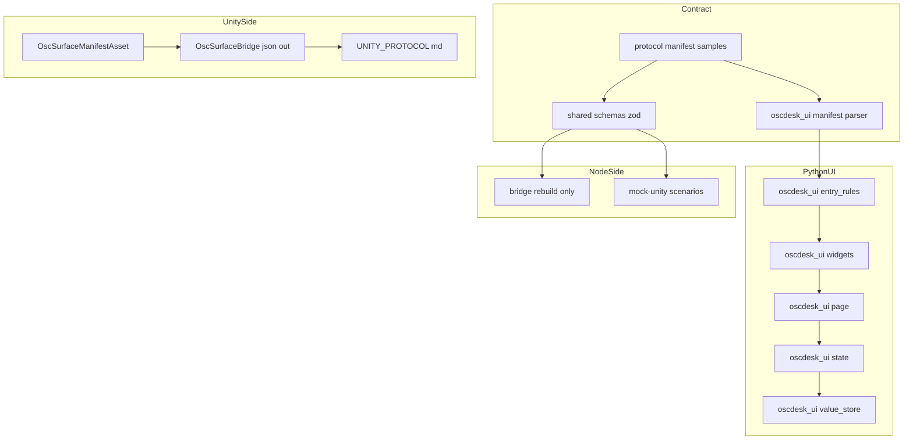
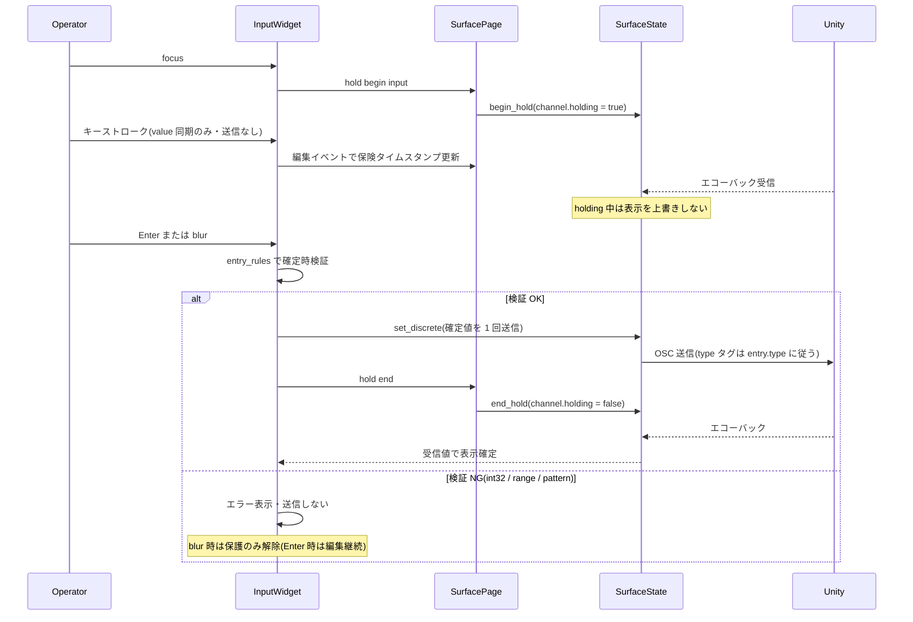

# Design Document — manifest-input-select-widgets

## Overview

**Purpose**: マニフェストの widget enum に編集可能な入力ウィジェット `"input"`(type `s`/`i`/`f`、確定時送信)と選択式ウィジェット `"select"`(type `s`、ドロップダウン、選択肢は `options` インラインと `optionsRef` + トップレベル `optionLists` 共有参照の併存)を追加する。レガシー版 VP_OscClient の「Facial Client IP 入力」「LipSync Device 選択」「MB Address / Port 入力」を OscDesk のマニフェスト方式で再現するための upstream 側機構である。

**Users**: マニフェスト作成者(Unity 側アセット定義者)は C# を書き換えずアセット定義だけで編集・選択 UI を宣言し、オペレーター(ブラウザ UI 利用者)は入力欄・ドロップダウンで値を編集・選択して Unity へ送信する。

**Impact**: `packages/shared` の zod スキーマと Python 側ミラーを `version: 1` のまま後方互換で拡張し(D-2)、NiceGUI ウィジェット層に 2 種の対話ウィジェットを追加し、mock-unity・Unity 参照実装・`docs/UNITY_PROTOCOL.md` を追従させる。ブリッジ本体は無改造(D-3。shared の再ビルドと `dist/oscdesk-bridge.js` の再生成のみで追従する)。

### Goals

- `input` / `select` / `options` / `optionsRef` / `optionLists` / `pattern` をマニフェスト契約に追加し、TS / Python で同一の受理・拒否判定を機械的に担保する(共通フィクスチャ)
- input の確定時送信(Enter / blur)と編集中の上書き保護(fader の hold と同等)、select の即時送信 + エコーバック確定(discrete 系)を実装する
- 約 260 エントリ規模での描画実用性(グループ折りたたみ、既定全開)と実測手段を提供する

### Non-Goals

- Unity 側ステージング機構(R3、§6.3)— 別 spec `unity-staging-apply` が担当
- ブリッジ本体(`packages/bridge`)のコード変更(G-4)
- フォーク側成果物: 64 スロットのデフォルトプリセット、`vp-concert-default` シナリオ、E2E(G-5)
- マニフェストのチャンク分割拡張、遅延描画(D-18 で見送り。問題が実測されたら後続起案)

## Boundary Commitments

### This Spec Owns

- マニフェスト契約の拡張定義: widget enum への `input` / `select` 追加、エントリ任意フィールド `options` / `optionsRef` / `pattern`、トップレベル任意フィールド `optionLists`(zod スキーマ = 契約の正、Python ミラー、共通フィクスチャ)
- NiceGUI UI での input / select の描画・確定時検証(int32 / range / pattern)・送信・エコーバック規律
- mock-unity の input / select テストシナリオ(通常規模 + 約 260 エントリの大規模)と `ScenarioSchema` の `optionLists` 通し口
- Unity 参照実装(`OscSurfaceManifestAsset` / `OscSurfaceBridge`)のアセット定義・検証・マニフェスト JSON 出力の拡張
- `docs/UNITY_PROTOCOL.md` §2 / §4 / 付録 A / 互換性ノートの追記(付録 A.2 の C# 全文コピー同期を含む)

### Out of Boundary

- ステージング(`staged` / `applies` 等)の宣言・挙動 — `unity-staging-apply` が担当。本 spec は同スキーマへの布石を置かない
- ブリッジのコード・ワイヤプロトコル(WebSocket フレーム形状)の変更。`WireArgSchema` は `s` 引数対応済み
- UI レイアウトの全面刷新。グループ折りたたみ(D-15)以外の見た目変更は行わない
- 「形式不正の値を Unity 側で無視する」受け皿 — D-13 により本 spec の pattern 検証が入力時点で止めるため不要

### Allowed Dependencies

- `packages/shared`(zod)→ ブリッジ / mock-unity が再ビルドで追従(コード変更なし)
- NiceGUI 2.x(Quasar QSelect / QInput)の標準 props とイベント。カスタム Vue コンポーネントは追加しない
- 既存の `ValueChannel.holding` / `set_discrete` / `seed_defaults` の各機構。これらの契約(エコーバックのみが値を確定する)を変更しない

### Revalidation Triggers

- `ManifestEntrySchema` / `ManifestSchema` の形状変更(後続 spec `unity-staging-apply` と、フォークの 64 スロットプリセットが `optionLists` を直接利用する)
- `docs/UNITY_PROTOCOL.md` §2 / 付録 A の変更(`unity-staging-apply` が同一ファイルを後続で変更する。順次実行でコンフリクト回避)
- `protocol/manifest-samples.json` のケース追加・変更(両言語テストが同時に影響を受ける)
- `dist/oscdesk-bridge.js` の再生成(スキーマ拡張の配布物への反映。漏れるとブリッジが新マニフェストを拒否する)

## Architecture

### Existing Architecture Analysis

- **スキーマの正は TS**: `packages/shared/src/schemas.ts` の `ManifestSchema` が唯一の受け入れ判定であり、ブリッジ(`manifest-client.ts`)がこれで検証してから UI へ配る。Python `manifest.py` は手書きミラーパーサ(pydantic 不使用)で、UI 側でも再検証する
- **値の規律**: Unity が真実の源。UI 操作は `state.set_local`(連続系・間引きあり)/ `state.set_discrete`(離散系・間引きなし)で送信し、表示確定は `ValueStore.on_echo` のみ。操作中は `ValueChannel.holding` がエコーバックを無視し、`page._release_stale_holds` が 2 秒でホールドを強制解除する保険を持つ
- **表示専用への降格**: `widgets.is_display_only()` が「type が `("i","f","bool")` 外」の操作系エントリを表示専用へ落とす。この型ベース判定が `s` 型対話ウィジェットの追加を阻んでおり、widget 種別を考慮する判定へ変更する(既存 5 widget × `s` は従来どおり表示専用 = 非退行)
- **mock-unity**: 非 `/sys/*` 受信値の同一アドレスエコーバックは実装済み。シナリオは `ManifestEntrySchema` を直接参照する JSON ファイル
- **Unity 参照実装**: StringBuilder 手組み JSON で「値のない任意フィールドはキー省略」を実践済み。presence フラグ(`hasRange` 等)方式のアセット定義

### Architecture Pattern & Boundary Map

採用パターンは validate-gap 推奨の **Option C(ハイブリッド)**: スキーマ・mock-unity・C#・page.py は既存ファイルの in-place 拡張、Python 側の確定時検証と optionsRef 解決のみ純関数モジュール `entry_rules.py` へ小分離する。



**Architecture Integration**:

- 責務分離: 「受理判定」(スキーマ 2 系統 + 共通フィクスチャ)、「確定時検証」(entry_rules 純関数)、「描画と送信」(widgets / page)、「値の調停」(state / value_store、既存契約のまま)を分ける
- 既存パターン維持: discrete 送信経路(toggle の `_on_discrete`)、`_applying` ガード、`seed_defaults`、hold によるエコーバック抑止、binding_holder パターン
- 新規モジュールの理由: `entry_rules.py` は int32 / range / pattern 判定と optionsRef 解決を UI フレームワーク非依存の純関数にし、pytest で網羅する(widgets.py 内に書くとテスト不能な肥大になる)
- Steering 準拠: 「案件差分はコードでなくデータ」「Unity が真実の源」「ブリッジと UI の責務分離」を維持。ブリッジ境界は越えない(D-3)

**依存方向**(左からのみ import する。違反はエラーとする):

`shared schemas / manifest.py` → `entry_rules.py` → `widgets.py` → `page.py`、および `state.py` → `value_store.py`(既存のまま)。`entry_rules.py` は `nicegui` を import しない。

### Technology Stack

| Layer | Choice / Version | Role in Feature | Notes |
|-------|------------------|-----------------|-------|
| 共有スキーマ | zod(既存導入済み) | マニフェスト契約の正。superRefine でクロスフィールド検証 | 新規依存なし |
| UI | NiceGUI >= 2.0(Quasar QInput / QSelect) | input / select の描画。`display-value` prop で選択肢外値表示 | 新規依存なし。Python 3.11+ |
| 検証 | Python `re`(標準) | pattern の受理判定の正(D-19)と確定時検証 | TS 側は `new RegExp` 近似 |
| モック | mock-unity(既存 Node) | シナリオ供給とエコーバック(エコーは実装済み) | `ScenarioSchema` 拡張のみ |
| Unity | C#(Unity 標準シリアライズ + StringBuilder JSON) | アセット定義と JSON 出力 | `System.Text.RegularExpressions` を早期警告に使用 |

## File Structure Plan

### 新規ファイル

```
protocol/
└── manifest-samples.json                     # マニフェスト受理/拒否の共通フィクスチャ(TS/Python 両方が検証)
packages/shared/src/
└── manifest-samples.test.ts                  # フィクスチャの TS 側検証(vitest)
packages/nicegui-ui/
├── src/oscdesk_ui/entry_rules.py             # 確定時検証(int32/range/pattern)と optionsRef 解決の純関数
└── tests/
    ├── test_manifest_samples.py              # フィクスチャの Python 側検証(pytest)
    └── test_entry_rules.py                   # 純関数の単体テスト
packages/mock-unity/
├── scenarios/input-select.json               # input/select 通常規模シナリオ(options と optionsRef の両形態)
├── scenarios/large-input-select.json         # 約 260 エントリの大規模シナリオ(生成物をコミット)
└── scripts/generate-large-scenario.mjs       # 大規模シナリオの決定論的生成スクリプト
```

### Modified Files

- `packages/shared/src/schemas.ts` — `ManifestEntrySchema` の widget enum 拡張 + `options` / `optionsRef` / `pattern` 追加 + エントリ superRefine。`ManifestSchema` へ `optionLists` 追加 + 参照解決 superRefine
- `packages/shared/src/schemas.test.ts` — 新規則の単体テスト追加
- `packages/nicegui-ui/src/oscdesk_ui/manifest.py` — ミラーパーサへ同一規則を追加。`ManifestEntry` / `Manifest` のフィールド拡張とアドレス索引
- `packages/nicegui-ui/src/oscdesk_ui/widgets.py` — `_build_input` / `_build_select` 追加、`is_display_only()` を widget 種別考慮の判定へ変更
- `packages/nicegui-ui/src/oscdesk_ui/page.py` — グループ折りたたみ(`ui.expansion`、既定オープン)、input 用ホールドタイムアウトの分離
- `packages/nicegui-ui/src/oscdesk_ui/state.py` — マニフェスト採用時のアドレス索引 dict 化(`entry_for` の線形探索置換)
- `packages/mock-unity/src/scenario.ts` — `ScenarioSchema` へ `optionLists` 通し口追加、`#buildManifest()` でトップレベルへ出力
- `OscSurface/Assets/OscSurfaceBridge/OscSurfaceManifestAsset.cs` — `WidgetType` へ `Input` / `Select` 追加、`options` / `optionsRef` / `pattern` / `optionLists` のアセット定義
- `OscSurface/Assets/OscSurfaceBridge/OscSurfaceBridge.cs` — 検証(`TryGetValidatedAsset`)と JSON 出力(`TryBuildManifestJson`)の拡張。文字列現在値の default 反映を確認
- `docs/UNITY_PROTOCOL.md` — §2 / §4 / 付録 A(A.2 全文コピー同期含む)/ 互換性ノートの追記
- `docs/VERIFICATION.md` — input / select の手動検証手順と 260 エントリ実測手順の追記
- `packages/bridge/dist/oscdesk-bridge.js` — shared 再ビルドに伴う再生成(コード変更なし。再生成漏れはブリッジ側拒否につながるため必須)

## System Flows

### input の確定時送信とエコーバック保護



補足(フロー上の決定):

- キーストロークは NiceGUI の value 同期(表示状態)であり OSC 送信ではない。送信は `keydown.enter` / `blur` ハンドラのみが行う(2.3 / 2.4)
- 保険タイムアウト: ホールドの失効管理は**共有層(`ValueChannel` / `SurfaceState`)が持つ**(D-21)。`ValueChannel` に `hold_started_at` / `hold_timeout_s` を持たせ、`SurfaceState.tick()`(どのページの `sync()` からでも呼ばれる)が期限切れホールドを解除する。input は `INPUT_HOLD_TIMEOUT_S = 120` 秒(最終編集イベント起点で更新)、既存ウィジェットは従来どおり `HOLD_TIMEOUT_S = 2.0` 秒を適用する。`SurfacePage._hold_started_at` / `_release_stale_holds` のページ単位の期限管理は撤去する
- クライアント切断時の解放: NiceGUI の `app.on_disconnect` で当該クライアント由来のホールドを解放する(D-21)。ページ単位タイマーに依存した期限管理では、入力欄にフォーカスしたままタブを閉じるとそのページのタイマーが消え `holding = True` が全ページで恒久残留する(既存 fader / xy にも同じ穴があるが 2 秒で解除されるため顕在化していない)。共有層への移設と併せてこの穴を塞ぐ
- Enter 確定後の再打鍵は value change イベントで保護を再開する(確定後〜再編集前の受信値は表示を確定する = 3.2)

### select の選択と選択肢外値表示

select は toggle と同じ discrete 経路(hold なし)。`on_value_change`(`_applying` ガード付き)→ `set_discrete` で選択肢文字列を `s` タグ即時送信し、エコーバックで確定する。エコーバック値/default が選択肢外のときは `value = None` + Quasar `display-value` prop で受信値をそのまま表示し、選択肢一覧には加えない(D-20)。選択肢内に戻ったら `display-value` を解除して通常表示に戻す。シーケンス図は input との差分(検証なし・即時送信)のみのため省略する。

## Requirements Traceability

| Requirement | Summary | Components | Interfaces / Flows |
|-------------|---------|------------|--------------------|
| 1.1–1.5, 1.7–1.12 | スキーマ拡張と厳格検証 | SharedManifestSchema, PythonManifestParser | Manifest 契約(Data Models) |
| 1.6 | TS/Python 同一判定 | ManifestSamplesFixture | フィクスチャ駆動テスト |
| 2.1–2.2 | input の描画 | InputWidget | `_build_input` |
| 2.3–2.5 | 確定時送信・型タグ | InputWidget, SurfaceState | input フロー / `set_discrete` |
| 2.6–2.7, 2.9 | int32 / range / pattern 検証 | EntryRules, InputWidget | `validate_input_confirmation` |
| 2.8 | default 初期表示(送信なし) | ValueStore(既存 `seed_defaults`), InputWidget | `_applying` ガード |
| 3.1–3.3 | 編集中の上書き保護 | InputWidget, SurfacePage, ValueStore(既存 holding) | input フロー |
| 4.1–4.3 | select 描画と選択肢解決 | SelectWidget, PythonManifestParser | `resolved options` |
| 4.4 | 空選択肢の無効化表示 | SelectWidget | D-17 |
| 4.5 | マニフェスト再送で選択肢更新 | SurfacePage(既存 `_rebuild`) | 既存採用フロー |
| 5.1–5.2, 5.5 | 即時送信とエコーバック確定 | SelectWidget, SurfaceState | select フロー |
| 5.3–5.4 | 選択肢外値の表示 | SelectWidget | `display-value` prop |
| 6.1–6.4 | mock-unity シナリオ | MockUnityScenarios | `ScenarioSchema` |
| 7.1–7.4 | Unity アセット定義と JSON 出力 | UnityManifestAsset, UnityBridgeJson | C# 契約 |
| 8.1–8.3 | 描画実用性と折りたたみ | SurfacePage, MockUnityScenarios(大規模), SurfaceState(索引) | `ui.expansion` / 実測手順 |
| 9.1, 9.1a, 9.2–9.4 | プロトコル文書更新 | ProtocolDocs | docs 追記 |

## Components and Interfaces

| Component | Domain/Layer | Intent | Req Coverage | Key Dependencies | Contracts |
|-----------|--------------|--------|--------------|------------------|-----------|
| SharedManifestSchema | 契約(TS) | zod スキーマ拡張とクロスフィールド検証 | 1.1–1.5, 1.7–1.12 | zod(P0) | State(型) |
| PythonManifestParser | 契約(Python) | ミラーパーサの同一規則 + 選択肢解決 | 1.1–1.12, 4.3 | なし | Service |
| ManifestSamplesFixture | 契約(共通) | 受理/拒否の両言語同一判定の機械担保 | 1.6 | SharedManifestSchema(P0), PythonManifestParser(P0) | Batch(テスト) |
| EntryRules | UI ロジック(Python) | 確定時検証の純関数 | 2.6, 2.7, 2.9 | PythonManifestParser(P0) | Service |
| InputWidget | UI(Python) | input の描画・確定送信・保護 | 2.1–2.9, 3.1–3.3 | EntryRules(P0), SurfaceState(P0) | State |
| SelectWidget | UI(Python) | select の描画・即時送信・選択肢外表示 | 4.1–4.4, 5.1–5.5 | SurfaceState(P0) | State |
| SurfacePage | UI(Python) | 折りたたみ描画と input ホールド保険 | 3.3, 4.5, 8.1, 8.3 | InputWidget/SelectWidget(P0) | State |
| SurfaceState | UI(Python) | エントリ索引の dict 化 | 2.5, 8.2 | 既存 | Service |
| MockUnityScenarios | テスト供給(TS) | シナリオ 2 種と optionLists 通し口 | 6.1–6.4, 8.1 | SharedManifestSchema(P0) | Batch |
| UnityManifestAsset | Unity(C#) | アセット定義の宣言手段 | 7.1, 7.2 | なし | State |
| UnityBridgeJson | Unity(C#) | 検証と JSON 出力 | 7.2–7.4 | UnityManifestAsset(P0) | Service |
| ProtocolDocs | 文書 | §2/§4/付録 A/互換性ノート | 9.1, 9.1a, 9.2–9.4 | 全契約(P1) | — |

### 契約レイヤ

#### SharedManifestSchema

| Field | Detail |
|-------|--------|
| Intent | マニフェスト契約の正(zod)。widget enum 拡張と厳格なクロスフィールド検証 |
| Requirements | 1.1, 1.2, 1.3, 1.4, 1.5, 1.7, 1.8, 1.9, 1.10, 1.11, 1.12 |

**Responsibilities & Constraints**

- `version: 1` のまま後方互換で拡張する。既存 5 widget のみのマニフェストの受理判定を一切変えない(1.5, 1.8)
- 検証はエントリ単位(`ManifestEntrySchema.superRefine`)とマニフェスト単位(`ManifestSchema.superRefine`、`optionsRef` の参照解決)の 2 段。エラーは zod issue として path 付きで報告する(ブリッジの既存ログ経路に乗る)
- ブリッジ・mock-unity はこのスキーマを import しているため、再ビルドのみで同一判定に追従する(コード変更なし)

**Contracts**: State [x](型定義)

##### 型定義(契約の正)

```typescript
// ManifestEntrySchema(拡張後)の型
interface ManifestEntry {
  address: string                 // 既存: '/' 始まり
  label: string
  type: 'i' | 'f' | 's' | 'b' | 'bool'
  widget: 'fader' | 'button' | 'toggle' | 'xy' | 'text' | 'input' | 'select'
  range?: [number, number]
  default?: number | string | boolean
  group?: string
  options?: string[]              // 新規: select のインライン選択肢(空配列は「選択肢なし」として受理)
  optionsRef?: string             // 新規: optionLists への参照キー
  pattern?: string                // 新規: 正規表現による入力書式検証(type 's' のみ)
}

interface Manifest {
  version: 1
  projectId: string
  entries: ManifestEntry[]
  optionLists?: Record<string, string[]>  // 新規: 共有選択肢
}
```

##### 検証規則(受理・拒否判定。エントリ 1 つの違反でマニフェスト全体を不採用)

| # | 規則 | 根拠 |
|---|------|------|
| V1 | `widget: "input"` は `type` が `s` / `i` / `f` 以外なら拒否 | 1.2(厳格方針 D-14 と一貫) |
| V2 | `widget: "select"` は `type` が `s` 以外なら拒否 | 1.3 |
| V3 | select に `options` と `optionsRef` の両方 → 拒否 | 1.10(D-14) |
| V4 | select に `options` / `optionsRef` のいずれもなし → 拒否 | 1.7 |
| V5 | `optionsRef` の参照キーが `optionLists` に不在 → 拒否(select 以外のエントリの `optionsRef` も同様に解決を試み、不在なら拒否) | 1.11(D-14) |
| V6 | `pattern` が `type: "s"` 以外に付与 → 拒否 | 1.12(D-19) |
| V7 | `pattern` が正規表現として解釈不能 → 拒否。判定の正は Python `re.compile`、TS は `new RegExp` try/catch の近似(research.md Decision 3) | 1.12(D-19) |
| V8 | 既存 5 widget のみのマニフェストは従来判定のまま(既存 widget への `options` 等付与は無視・受理。ただし V5 の参照解決は行う) | 1.5, 2.x 非退行 |

**Implementation Notes**

- Integration: `ScenarioSchema`(mock-unity)はエントリ superRefine を自動で受ける。トップレベル検証は `ManifestSchema.parse(#buildManifest())` で効く
- Validation: `schemas.test.ts` で V1〜V8 を単体テスト。共通フィクスチャは ManifestSamplesFixture 参照
- Risks: superRefine 化により schema 型が `ZodEffects` になる。既存の `.parse` / `z.infer` 利用箇所は互換だが、`.extend` 等を使う将来変更は base スキーマを別 export する(現時点で利用箇所なし)

#### PythonManifestParser(manifest.py 拡張)

| Field | Detail |
|-------|--------|
| Intent | zod と同一の受理・拒否判定を行う手書きミラー + 選択肢の解決済み表現の提供 |
| Requirements | 1.6, 1.1–1.12, 4.2, 4.3 |

**Responsibilities & Constraints**

- `WIDGET_TYPES` へ `"input"` / `"select"` を追加し、V1〜V8 と同一規則を `_parse_entry` / `parse_manifest` に実装する(V7 は `re.compile` = 判定の正)
- `optionsRef` はパース時に解決し、`ManifestEntry` に解決済み選択肢を保持する(widgets 層は参照解決を知らない)
- frozen dataclass の等値比較(採用の冪等判定)に新フィールドが自然に参加する

**Contracts**: Service [x]

##### Service Interface(Python)

```python
# manifest.py への追加フィールド(frozen dataclass)
@dataclass(frozen=True)
class ManifestEntry:
    ...  # 既存フィールドは不変
    options: tuple[str, ...] | None = None       # 解決済み選択肢(inline / ref どちらも解決後をここへ。select 以外は None)
    options_ref: str | None = None               # 参照キー原文(等値比較・診断用)
    pattern: str | None = None                   # 正規表現原文(コンパイル可否はパース時に検証済み)

@dataclass(frozen=True)
class Manifest:
    ...  # 既存フィールドは不変
    option_lists: dict[str, tuple[str, ...]] | None = None

# アドレス索引は Manifest に持たせず state.py 側で採用時に構築する(下の Implementation Notes)

# _parse_entry は optionsRef 解決のためトップレベル optionLists を受け取る
def _parse_entry(raw: dict, option_lists: dict[str, tuple[str, ...]] | None) -> ManifestEntry: ...
```

- Preconditions: `parse_manifest` の入力は dict または JSON 文字列(既存どおり)。`_parse_entry` は現行のエントリ単体受け取り(`manifest.py` L105)から `option_lists` を追加で受け取る形へ変更する
- Postconditions: 返る `Manifest` の select エントリは `options` が必ず tuple(空 tuple = 選択肢なし)。違反マニフェストは `ManifestError`
- Invariants: 受理・拒否判定は `protocol/manifest-samples.json` の全ケースで zod と一致する。**この一致保証は共通サブセットの範囲**(要件 1.6 / D-19): pattern の正規表現方言差があるため、フィクスチャには TS `new RegExp` と Python `re.compile` の双方で同一判定になる構文のみを収録する
- `ManifestError` の文言には対象アドレスと pattern 原文を含める(TS 通過 / Python 拒否の分裂時に切り分け可能にするため)

**Implementation Notes**

- Integration: `Manifest` が frozen dataclass のため索引 dict は `state.py` 側で採用時に構築する(dataclass の等値比較へ索引を含めない)。`Manifest` 自身に `entry_by_address` は持たせない
- Validation: `test_manifest_samples.py` + 既存 `test_manifest`(あれば)拡張
- Risks: dict の等値比較(`option_lists`)は順序非依存で妥当。なし

#### ManifestSamplesFixture(新規)

| Field | Detail |
|-------|--------|
| Intent | 受理/拒否ケースの単一ソース化により 1.6(両言語同一判定)を機械的に担保する |
| Requirements | 1.6 |

**Contracts**: Batch [x](テストデータ)

##### Batch / Job Contract

- Trigger: `corepack pnpm test`(vitest + `scripts/run-python-tests.mjs` 経由の pytest)
- Input / validation: `protocol/manifest-samples.json` — `{ "cases": [{ "name", "valid": boolean, "manifest": object, "note" }] }`。`wire-samples.json` の既存形式を踏襲
- Output / destination: TS 側 `packages/shared/src/manifest-samples.test.ts` は `ManifestSchema.safeParse` の成否、Python 側 `packages/nicegui-ui/tests/test_manifest_samples.py` は `parse_manifest` の例外有無を `valid` と突き合わせる
- Idempotency & recovery: ケースは V1〜V8 + 受理系(既存 widget のみ / input 3 型 / select 両形態 / 空選択肢 / 選択肢外 default / pattern + range 付き input)。**pattern は TS/Python の判定が一致する共通サブセットのみ収録する**(方言差パターンは収録しない。docs 注記でカバー)

### UI レイヤ(Python)

#### EntryRules(entry_rules.py、新規)

| Field | Detail |
|-------|--------|
| Intent | input 確定時検証(int32 / range / pattern / 整数強制)の UI 非依存純関数 |
| Requirements | 2.6, 2.7, 2.9 |

**Contracts**: Service [x]

##### Service Interface(Python)

```python
INT32_MIN: Final = -2_147_483_648
INT32_MAX: Final = 2_147_483_647

@dataclass(frozen=True)
class ConfirmResult:
    """確定時検証の結果。ok なら values を送信し、ng なら error を表示する。"""
    values: tuple[Any, ...] | None   # 送信すべき値(型変換済み)。拒否時は None
    error: str | None                # 入力欄へ表示するエラー文言。受理時は None

def validate_input_confirmation(entry: ManifestEntry, raw: str | float | None) -> ConfirmResult: ...
```

- Preconditions: `entry.widget == "input"`。`raw` は UI 要素の現在値(`ui.input` は str、`ui.number` は float | None)
- Postconditions(判定順):
  1. `type: "s"`: `pattern` があれば `re.fullmatch` 相当で照合し、不一致は拒否(2.9)。一致(または pattern なし)なら `(raw,)` を受理(空文字も有効な `s` 値)
  2. `type: "i"`: None / 非整数値は拒否。int32 値域外は拒否(2.6)。`range` があれば範囲外を拒否(2.7、クランプしない)。受理値は `(int(raw),)`
  3. `type: "f"`: None / 非有限値は拒否。`range` があれば範囲外を拒否(i と同基準に統一。research.md Decision 5)。受理値は `(float(raw),)`
- Invariants: 副作用なし・NiceGUI 非依存。pattern は照合失敗時も例外を出さない(コンパイル可否はパース時に検証済み)

#### InputWidget(widgets.py `_build_input`)

| Field | Detail |
|-------|--------|
| Intent | input エントリの描画・確定時送信・編集中保護 |
| Requirements | 2.1, 2.2, 2.3, 2.4, 2.5, 2.8, 3.1, 3.2, 3.3 |

**Responsibilities & Constraints**

- `type: "s"` は `ui.input`、`type: "i"` / `"f"` は `ui.number`(`i` は `step=1` 等の整数向け props)で描画(2.1, 2.2)
- 送信は `keydown.enter` / `blur` ハンドラのみ。要素の現在値を `validate_input_confirmation` へ通し、受理なら `on_discrete` で 1 回送信(2.3, 2.5。型タグは既存 `entry.type_tag`)、拒否ならエラー表示(Quasar `error` / `error-message` props)して送信しない(2.4, 2.6, 2.7, 2.9)
- 保護: `focus` と value change(`_applying` ガード付き)で `on_hold_begin`、`blur` / Enter 確定成功で `on_hold_end`。Enter で拒否された場合は編集継続とみなし保護を維持する
- **blur 拒否時の表示復元**(D-22): blur で拒否された場合は、保護解除に加えて `_applying` ガード下で要素値を `channel.values` の現在値へ復元し、エラー表示を消したうえで「形式不正のため送信しませんでした」の一時通知(`ui.notify`)を出す。エコーバック任せにはしない — 送信していないのでエコーは来ず、仮に同値のエコーが来ても `ValueChannel._set_values` は値変化時のみ `revision` を上げる(`value_store.py` L88-94)ため `sync()` の revision 比較で弾かれ `apply()` が呼ばれない。復元を省くと「Unity に存在しない値」が入力欄に無期限で残り、送信済みと誤認される
- 強制再適用の口: `apply()` を revision 差分に依存せず呼び直せるよう、`binding.revision = -1` を設定して次の `sync()` で再適用させる小さな経路を用意する(上記復元および将来の同種ケース用)
- `apply()`(エコーバック / default 反映)は `_applying` ガード下で要素値を設定し、エラー表示を解除する(2.8, 3.2)。holding 中は `apply` 自体が呼ばれない(value_store 既存挙動)

**Contracts**: State [x]

##### State Management

- State model: 表示値は `ValueChannel`(既存)。編集中フラグは `ValueChannel.holding` を流用(新規状態を持たない)
- Concurrency strategy: 複数ページ同時編集は既存 hold と同じ「後勝ち」セマンティクス(既知の既存特性、変更しない)

**Implementation Notes**

- Integration: `WidgetFactory` に確定用コールバックは増やさず、既存 `on_discrete` / `on_hold_begin` / `on_hold_end` を流用する。ホールドの種別判定(タイムアウト値の選択)は `SurfaceState.begin_hold` が `entry.widget` で行う
- 分岐位置: `WidgetFactory.build()`(`widgets.py` L53-66)の末尾は `return self._build_fader(entry)` のフォールバックのため、`input` / `select` の分岐は既存 `xy` 分岐の後・fader フォールバックの前に追加する(フォールバックへ落ちないこと)
- Validation: NiceGUI のイベントは要素生成時に登録する(Issue #4154)。value change ハンドラでは送信しない(キーストローク送信の構造的抑止)
- Risks: IME 確定の Enter が送信を兼ねる可能性 → `keydown.enter` は Quasar/ブラウザの composition 終了後に発火するのが通常だが、実機で日本語入力を手動検証項目に含める(VERIFICATION.md)

#### SelectWidget(widgets.py `_build_select`)

| Field | Detail |
|-------|--------|
| Intent | select エントリの描画・即時送信・選択肢外値表示・空選択肢の無効化 |
| Requirements | 4.1, 4.2, 4.3, 4.4, 5.1, 5.2, 5.3, 5.4, 5.5 |

**Responsibilities & Constraints**

- `ui.select(options=list(entry.options))` で描画(選択肢はパース時解決済み。inline / ref の区別を widgets は持たない)(4.1–4.3)
- 空選択肢: `disable` + 「選択肢なし」注記ラベルを表示。ダミー項目は挿入しない(4.4、D-17)
- 送信: `on_value_change`(`_applying` ガード)→ `on_discrete` で選択文字列を `s` タグ即時送信(5.1)。hold は使わない
- `apply()`: 受信値が選択肢内なら `value` 設定 + `display-value` 解除。選択肢外なら `value = None` + `display-value` に受信値を設定(選択肢一覧に加えない)(5.2, 5.3, 5.4)。default 反映は既存 `seed_defaults` → 初回 `apply` 経由で送信なし(5.5)
- マニフェスト再採用時は `_rebuild` で全ウィジェットを作り直すため、選択肢更新は自動で反映される(4.5、D-10)

**Contracts**: State [x](InputWidget と同じ `ValueChannel` ベース。差分のみ上述)

**Implementation Notes**

- Integration: toggle の `_on_discrete` パスと `binding_holder` パターンを踏襲
- Validation: `display-value` は props 文字列に埋め込むため引用符・改行をエスケープする(NiceGUI の `props` 記法での安全な設定方法を実装時に確認し、必要なら `_props` 直接設定 + `update()` を使う)
- Risks: Quasar バージョンによる `display-value` 挙動差 → 手動検証項目化(research.md Risks)
- Plan B: `display-value` が期待どおり効かない場合は、ドロップダウン直下に受信値をラベル併記する形へ退避する(「選択肢外の現在値を UI から見せる」という D-20 の意図は満たせる)。選択肢一覧へ受信値を混ぜる回避策は取らない(一覧が Unity 供給のものと乖離するため)

#### SurfacePage(page.py 変更)

| Field | Detail |
|-------|--------|
| Intent | グループ折りたたみ描画。ホールド失効管理は共有層へ移設 |
| Requirements | 3.3, 4.5, 8.1, 8.3 |

**Responsibilities & Constraints**

- `_rebuild`: グループ名ありは `ui.expansion(group, value=True)`(既定オープン、D-15 / D-18)配下に、グループなし(None)は従来どおりパネルなしで先頭に描画する。開閉状態はマニフェスト再採用でリセットされる(許容。D-10 の再送反映を優先)
- **ホールド失効管理の撤去**(D-21): `_hold_started_at` と `_release_stale_holds` を撤去し、失効判定は `SurfaceState.tick()` に委ねる。`sync()` の `ui.timer` から `state.tick()` を呼ぶ形へ変更する。ページ単位のタイマーで期限を持つ現行構造は、タブを閉じた時点で期限を知る主体が消えるため保護が恒久残留する
- `app.on_disconnect` ハンドラで当該クライアント由来のホールドを解放する(D-21)
- `is_display_only()`(widgets.py)の変更: 「widget が `text`」または「既存 5 widget かつ type が `INTERACTIVE_VALUE_TYPES` 外」のときのみ表示専用。`input` / `select` はスキーマが型を保証済みのため常に対話可能(既存 5 widget × `s` の表示専用降格は非退行で維持)

**Contracts**: State [x](既存 `_bindings` の拡張。`_hold_started_at` は撤去)

#### SurfaceState(state.py 変更)

- `_on_manifest` の採用成功時に `{address: entry}` 索引を構築し、`entry_for` を dict 参照へ置換する(2.5 の送信経路は無変更、8.2 の応答性対策)
- **`tick()` の新設**(D-21): 全 `ValueChannel` を走査し、`hold_started_at` から `hold_timeout_s` を過ぎたホールドを解除する。ページの `sync()` タイマーから呼ばれる。ページが 1 つも生きていない場合は解除されないが、その状態では表示する UI 自体が無いため実害はない
- `begin_hold` は widget 種別に応じた `hold_timeout_s` を `ValueChannel` へ設定する(input は 120 秒、既存ウィジェットは 2 秒)。input の編集イベントごとに `hold_started_at` を更新する

#### ValueChannel(value_store.py 変更)

- **ホールド期限フィールドの追加**(D-21): `hold_started_at: float | None` と `hold_timeout_s: float` を持たせ、`begin_hold` / `end_hold` で更新する。期限判定のロジック自体は `SurfaceState.tick()` に置き、`ValueChannel` は状態の保持のみを担う
- 既存 fader / xy の 2 秒ホールドもこの共通経路へ移行する(ユーザー確認済み: 既存の同じ穴も本 spec 内で塞ぐ)。既存テストの調整が発生する

### テスト供給レイヤ

#### MockUnityScenarios(scenario.ts + シナリオ 2 件)

| Field | Detail |
|-------|--------|
| Intent | input / select を含むマニフェスト供給とエコーバックの模擬 |
| Requirements | 6.1, 6.2, 6.3, 6.4, 8.1 |

**Responsibilities & Constraints**

- `ScenarioSchema` へ `optionLists: z.record(z.string(), z.array(z.string())).optional()` を追加し、`#buildManifest()` でトップレベルへ出力する(存在時のみキーを出す)
- `input-select.json`: input(`s` / `i` / `f`、range・pattern 付きを含む)+ select(`options` インラインと `optionsRef` + `optionLists` の両形態、空選択肢、選択肢外 default)を含む通常規模シナリオ(6.1, 6.2)
- `large-input-select.json`: 約 260 エントリ(64 グループ × 4 エントリ + グローバル群を模す)。`generate-large-scenario.mjs` で決定論的に生成した JSON をコミットする(8.1、実測用)。フォークの `vp-concert-default` プリセットは含まない(6.4)
- エコーバックは既存 `responder.ts` の非 `/sys/*` エコーで成立(6.3)。`recordValue` の型一致チェック(`s` は string)も既存のまま input / select に適用される

**Contracts**: Batch [x](シナリオ JSON。`scenario.test.ts` へ受理テスト追加)

### Unity レイヤ(C#)

#### UnityManifestAsset(OscSurfaceManifestAsset.cs)

| Field | Detail |
|-------|--------|
| Intent | アセット定義だけで input / select と選択肢を宣言できるデータ形状 |
| Requirements | 7.1, 7.2 |

**Contracts**: State [x](シリアライズ形状)

##### アセット定義の拡張(宣言形状)

```csharp
public enum WidgetType { Fader, Button, Toggle, Xy, Text, Input, Select }

[Serializable]
public sealed class OptionList
{
    public string key = "";
    public List<string> values = new List<string>();
}

// OscSurfaceManifestAsset 本体に追加
public List<OptionList> optionLists = new List<OptionList>();

// Entry に追加(既存の presence フラグ流儀に従う)
public bool hasOptions;                          // true のとき options をインライン出力(空リストも「選択肢なし」として有効)
public List<string> options = new List<string>();
public string optionsRef = "";                   // 空文字 = 不在(既存 group と同じ規約)
public string pattern = "";                      // 空文字 = 不在
```

- Unity の `Dictionary` 非シリアライズ制約のため `optionLists` は key + values のペアリストで持ち、JSON 出力時にオブジェクトへ畳む(research.md Research 6)

#### UnityBridgeJson(OscSurfaceBridge.cs)

| Field | Detail |
|-------|--------|
| Intent | アセット検証と後方互換な JSON 出力 |
| Requirements | 7.2, 7.3, 7.4 |

**Responsibilities & Constraints**

- `TryGetValidatedAsset` に追加(違反は `Debug.LogError` + マニフェスト不送信。V1〜V7 と同旨):
  - `Input` は type が String / Int / Float 以外 → エラー。`Select` は String 以外 → エラー
  - `Select` は `hasOptions` と `optionsRef`(非空)のちょうど一方 → 両方 / どちらもなしはエラー
  - `optionsRef` の参照キーが `optionLists` に不在 → エラー。`optionLists` の重複キー・空キー → エラー
  - `pattern` 非空は type String のみ許可。`new Regex(pattern)` の try/catch で早期警告(最終判定は下流。research.md Decision 3)
- `TryBuildManifestJson` に追加: `hasOptions` 時のみ `"options":[...]`、`optionsRef` 非空時のみ `"optionsRef":"..."`、`pattern` 非空時のみ `"pattern":"..."`、`optionLists` 非空時のみトップレベル `"optionLists":{"key":[...]}`。値がなければキーごと省略し `null` を書かない(7.3)。`version: 1` のまま(7.4)
- input / select の現在値(エコーバック済み文字列等)を `default` として埋める既存経路(`TryGetDefaultValue` / currentValues)が文字列値で機能することを確認する(既存 `defaultString` あり)

**Contracts**: Service [x](JSON 出力 = マニフェスト契約に従属)

**Implementation Notes**

- Integration: `Editor/OscSurfaceBridgeEditor.cs` のインスペクタ表示が新フィールドで破綻しないことを確認(必要最小限の追従)
- Validation: C# 変更後、**`docs/UNITY_PROTOCOL.md` 付録 A.2 の全文コピーを必ず同期更新する**(完了条件。research.md Research 7)
- Risks: .NET Regex と Python re の方言差で早期警告がすり抜ける → 許容(最終判定は下流。docs 注記)

### 文書レイヤ

#### ProtocolDocs(docs/UNITY_PROTOCOL.md ほか)

- §2: スキーマ表記へ `input` / `select` / `options` / `optionsRef` / `optionLists` / `pattern` を追加し、検証規則 V1〜V7 の要旨を記す(9.1)。pattern は「TS / Python で共通に使える基本機能(文字クラス・アンカー・量指定子・選択・素のグループ・`\d \w \s`)のみ使う」注記を置く(9.1a、D-19)
- §4: input の確定時送信・編集中保護・エコーバック確定、select の即時送信・選択肢解決・選択肢外値表示の実装指針を追記(9.2)
- 付録 A: A.2 の C# 全文コピー同期、A.3 / A.4 に input / select の対応・制約を追記(9.3)
- 互換性ノート: `version: 1` 後方互換であること、新 widget 値を知らない旧 UI は検証エラーでマニフェスト全体を不採用にする現行流儀(G-6)を記録(9.4)
- `docs/VERIFICATION.md`: input / select の手動検証手順(IME 含む)と 260 エントリ実測手順を追記(リポジトリ規律)

## Data Models

### Data Contracts & Integration

変更されるのはマニフェスト JSON(Unity → ブリッジ → UI へ `s` 1 引数の `/sys/manifest` で運ばれる文字列)のみ。ワイヤプロトコル(WebSocket フレーム)・OSC 型タグは無変更。

拡張後のマニフェスト例(契約の要点をすべて含む):

```json
{
  "version": 1,
  "projectId": "example",
  "optionLists": { "audio-devices": ["Device A", "Device B"] },
  "entries": [
    { "address": "/vp/member/01/ip", "label": "Facial Client IP", "type": "s", "widget": "input",
      "pattern": "^\\d{1,3}\\.\\d{1,3}\\.\\d{1,3}\\.\\d{1,3}$", "default": "127.0.0.1", "group": "01 Alice" },
    { "address": "/vp/member/01/lip", "label": "LipSync Device", "type": "s", "widget": "select",
      "optionsRef": "audio-devices", "default": "Device A", "group": "01 Alice" },
    { "address": "/vp/mb/port", "label": "MB Port", "type": "i", "widget": "input",
      "range": [1, 65535], "default": 22000, "group": "MotionBuilder" },
    { "address": "/misc/mode", "label": "Mode", "type": "s", "widget": "select",
      "options": ["A", "B"], "default": "A", "group": "Misc" }
  ]
}
```

- スキーマバージョニング: `version: 1` 固定(1.8)。後方互換は「既存マニフェストの判定不変(V8)」で担保し、前方互換は「旧 UI は未知 widget を検証エラーとして全体不採用」(G-6、互換性ノートに記録)
- ドメイン不変条件: select エントリはパース後、必ず解決済み選択肢配列(空可)を持つ。選択肢外の値はマニフェスト不採用の理由にならない(D-9。表示層で吸収する)

## Error Handling

### Error Strategy

「アセット定義の誤りは最初に気づける」(厳格・fail fast)と「実行時の値のズレには頑健」(graceful)を層で分ける。

- **契約違反(マニフェスト)**: V1〜V8 違反はマニフェスト全体を不採用(D-14 / D-19)。ブリッジは zod issue を既存ログ経路へ、UI は `ManifestError` を既存の `manifest_status`(「不正」+ エラー文言)へ表示する。直前に採用済みのマニフェストと UI 状態は維持される(既存挙動)
- **確定時の入力エラー(オペレーター起因)**: int32 / range / pattern 違反は送信せず、入力欄に Quasar `error` / `error-message` でフィールドレベル表示(2.6, 2.7, 2.9)。クランプ・自動補正はしない(D-16)。Enter 拒否時は編集継続としてエラー表示を維持し、次の有効確定で解消する。**blur 拒否時は入力欄を `channel.values` の現在値へ復元してエラー表示を消し、`ui.notify` で「形式不正のため送信しませんでした」を一時表示する**(D-22)。エコーバック任せの解消はしない(送信していないためエコーは来ず、同値エコーは revision 差分で弾かれる)
- **実行時の値のズレ(選択肢外の default / エコーバック)**: 不採用にせず `display-value` 表示へ落とす(D-9 / D-20)。選択は勝手に変更しない
- **Unity アセット定義エラー**: `TryGetValidatedAsset` が `Debug.LogError` してマニフェストを送信しない(既存流儀)。UI 側は「マニフェスト待ち」のまま = 作成者が最初に気づく

### Monitoring

新規の監視機構は追加しない。既存のブリッジログ(zod issue、同一理由の連続拒否抑制)と UI の `manifest_status` / 診断パネルで足りる。

## Testing Strategy

### Unit Tests

1. `schemas.test.ts` — V1〜V8 の受理・拒否(widget enum、options/optionsRef 排他、参照解決、pattern 制約、既存マニフェスト非退行)
2. `test_entry_rules.py` — `validate_input_confirmation` の全分岐(s + pattern 一致/不一致/空文字、i の非整数・int32 境界値・range 境界、f の range・非有限値)
3. `manifest.py` テスト — 拡張フィールドのパース、選択肢の解決(inline / ref)、拒否ケースの `ManifestError` 文言
4. `scenario.test.ts` — `optionLists` 通し口とトップレベル出力(存在時のみキー出力)
5. Python 側 import スモークの維持(page.py を import するテストを消さない — 既存の検証穴の再発防止)

### Integration Tests(フィクスチャ駆動)

1. `manifest-samples.test.ts` / `test_manifest_samples.py` — `protocol/manifest-samples.json` の全ケースで TS / Python の判定一致(1.6 の機械的担保)
2. mock-unity: `input-select.json` シナリオのマニフェスト供給と、input / select アドレスへの送信 → 同一アドレスエコーバック(既存 responder テストの拡張)
3. UI 状態遷移(NiceGUI 非依存で state / value_store / entry_rules を組み合わせ): 確定送信 → holding 中のエコー無視 → end_hold 後のエコー確定(3.1–3.3 のロジック部分)
4. **ホールド失効の共有層テスト**(D-21): `SurfaceState.tick()` が input(120 秒)と既存ウィジェット(2 秒)のホールドを各自の期限で解除すること、`on_disconnect` 相当の解放でホールドが残らないこと。既存の `_release_stale_holds` テストはこの経路へ移行する

### Browser E2E Tests(`nicegui.testing`、D-23)

ウィジェット層のイベント結線そのもの(`keydown.enter` / `blur` のみ送信、focus / value-change での hold 開始、`_applying` ガード、`display-value` の設定・解除)は、上記のロジックテストでは捕捉できない。ユーザー決定により `nicegui.testing` の `User` フィクスチャで実画面を操作する自動テストを導入し、最小シナリオを CI に載せる:

1. input(`s` + pattern / `i` + range): キーストロークでは送信されないこと、Enter / blur で 1 回だけ送信されること、拒否時に送信されず blur では現在値へ復元されること(2.3, 2.4, 2.6, 2.7, 2.9 / D-22)
2. input: 編集中(フォーカス保持)のエコーバックで表示が上書きされないこと、blur 後のエコーバックで表示が確定すること(3.1, 3.2)
3. select(inline / optionsRef): 選択で即時送信されること、選択肢外のエコーバック値が `display-value` で表示されること、空選択肢がグレーアウトすること(5.1, 5.3, 5.4, 4.4)

導入コストとして pytest 依存(`nicegui[testing]`)と実行時間が増え、非同期 UI 由来のフレークを抱えやすい。フレークが出た場合は待機条件の明示化で対処し、テスト自体の削除で回避しない(このリポジトリには「テスト全部緑で UI 起動不能を見逃した」既往があるため)。`scripts/run-python-tests.mjs` 経由で `pnpm test` から実行できるようにする。

### Manual / E2E(docs/VERIFICATION.md 追記)

1. `start-oscdesk.bat` + mock-unity `input-select.json` で input の Enter / blur 確定、キーストローク非送信(診断パネルの送信ログで確認)、エラー表示(range / pattern / int32)
2. select の即時送信・エコーバック確定・選択肢外 default の `display-value` 表示・空選択肢のグレーアウト
3. 日本語 IME での入力確定(Enter の二重解釈がないこと)
4. `large-input-select.json` で初回描画時間・折りたたみ開閉・操作応答を実測し記録(D-18。問題があれば後続起案)

### Performance

- 260 エントリ採用時: 全エントリ描画 + 各操作受付(8.1)、操作とエコーバック反映が実用応答(8.2)を上記実測で確認。`entry_for` の dict 索引化で flush 経路を規模非依存にする
- 数値目標は定めない(D-18 で「実測して問題があれば後続起案」がユーザー決定)

## Migration Strategy

スキーマは後方互換拡張のためデータ移行はない。適用順序のみ規律とする:

1. `packages/shared` 拡張 + フィクスチャ → `corepack pnpm -r run build` で `dist/oscdesk-bridge.js` を再生成(これを怠るとブリッジが新マニフェストを拒否する)
2. Python ミラー + UI 実装(shared と同一コミット群で揃える。フィクスチャテストが乖離を検出)
3. mock-unity シナリオ → C# 参照実装 → docs(A.2 同期を C# と同時に)
4. 後続 spec `unity-staging-apply` は本 spec 完了後に着手(同一ファイル群を触るため順次実行)
