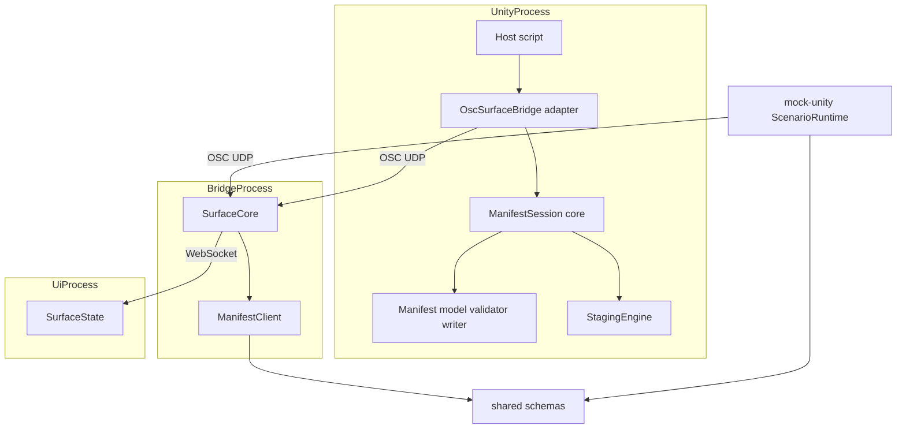
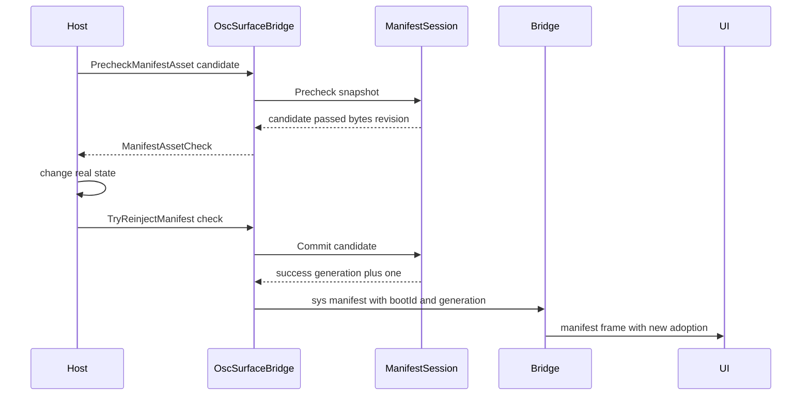
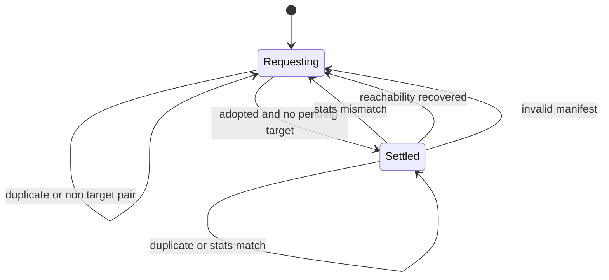
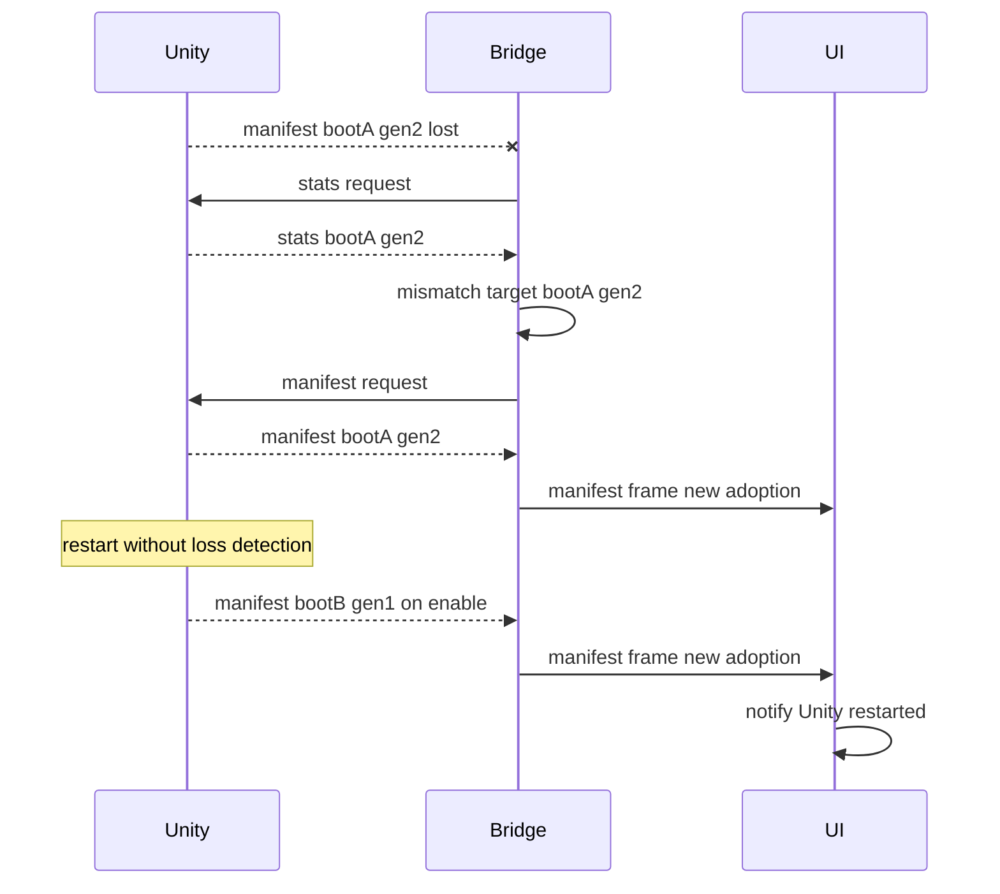
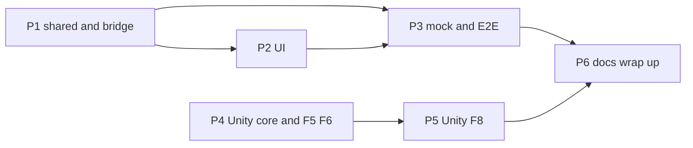

# 設計書: runtime-manifest-reinject

## Overview

**Purpose**: Unity の `OscSurfaceBridge` が、Play 中にマニフェストを差し替えて staging 計画を組み直し、`/sys/manifest` を送り直せるようにする。あわせてフォーク a8-oscdesk の F-5 / F-6 を取り込み、エントリが増減してもブリッジ・UI・mock-unity が追従することをテストで保証する。

**Users**: ホスト開発者(フォークの MB 接続先の追加・削除など)は、事前検査 → 実機設定の変更 → 再注入の順で API を呼ぶ。オペレータは、行の増減が画面に反映され、別の接続先の値が混ざらないことを期待する。

**Impact**: Unity の参照実装は、検証・JSON 組み立て・計画の保持を純 C# の中核(`ManifestSession`)へ移し、`OscSurfaceBridge.cs` を薄いアダプタにする。`/sys/manifest` と `/sys/stats` の JSON に `bootId` と `structureGeneration` を足す。ブリッジは同じ組の再受信で採用を発行しなくなり、受理済みの後も `/sys/stats/request` で照合する。UI は現在のマニフェストに無いアドレスのエコーを無視し、Unity の再起動を通知する。

### Goals

- F-5 / F-6 / F-8(事前検査つき)を公開 API として提供し、失敗時は旧状態を完全に保つ
- 別の実体の値を新しい実体に残さない(引き継ぎ規則とアドレス再利用の禁止)
- 再注入のマニフェストを取りこぼしても、UI が照合の間隔(4 秒)+ 要求の間隔(2 秒)程度で追いつく
- 同じ組の再受信で編集中の入力を打ち切らない
- 各段階が、組を持たない既存の送信元・既存のブリッジと混在しても動く

### Non-Goals

- 値の版、エコーへの版の付加、Unity の再起動をまたぐ順序付け、遅れた旧いマニフェストの版による破棄(requirements「方針の見直し」)
- F-7(値注入 API)。別 spec とする
- 案件固有の意味論(MB の追加・削除の規則、NodeTranslator / Crescent への反映、実状態の巻き戻し、フォーク側のアドレス設計の変更)
- `/sys/*` のアドレス体系、エコーの形式、wire の `adoption` の形式の変更
- ワイヤサイズの閾値の再議論、マニフェストの分割送信

## Boundary Commitments

### This Spec Owns

- Unity 参照実装の公開 API: `SetManifestAsset` / `SendManifestNow` / `PrecheckManifestAsset` / `TryReinjectManifest` / `TryReinjectManifestAsset` と、その失敗理由の型
- Unity 中核の状態: マニフェストのスナップショット、staging 計画と現在値、起動の識別子、構造の世代、アドレスと識別子の対応表、状態の版
- `/sys/manifest` と `/sys/stats` の JSON への `bootId` / `structureGeneration` の追加(ワイヤ契約)
- ブリッジのマニフェスト採否(同じ組の重複判定、到達性回復時の強制採用)と、`/sys/stats` による照合
- UI の追従: 計画外のアドレスのエコーの無視、再起動の通知、D-037 の挙動のテストでの固定
- mock-unity の実行時切り替え、版の送出、従来形式の模倣、再注入マニフェストの喪失の注入
- 関連文書(`UNITY_PROTOCOL.md` の互換性ノートと付録 A.2、`BRIDGE_PROTOCOL.md`、`VERIFICATION.md`、`DESIGN.md`)と、付録一致ガードの一覧

### Out of Boundary

- ホストが実機設定を変える処理と、再注入が失敗したときの巻き戻し(フォークの責務。契約だけを文書化する)
- MB のアドレスを識別子から作るフォーク側の変更
- 値の即時性の保証(同じ組の間の値は、従来どおりエコーで追従する)
- `/oscdesk/*` の OSC ネイティブ UI 向けの応答の意味の変更(中身に項目が増えるだけ)

### Allowed Dependencies

- Unity: `System`、`System.Text.RegularExpressions`、既存の `OscDesk.Staging`(`StagingPlan` / `StagingEngine`)。中核は `UnityEngine` と uOSC を参照しない。アダプタだけが `UnityEngine` / uOSC を使う
- ブリッジ / mock-unity: `@oscdesk/shared`(zod スキーマ・定数)、既存の依存だけ。新しい npm 依存は足さない
- UI: 標準ライブラリだけ。TypeScript の型を import しない(wire サンプルと文書で結合)
- C# の検証: NUnit(Unity 同梱)。Unity 外のチェック(J2 確定)用に `dotnet` SDK と NuGet の NUnit 系パッケージ。`dotnet` が無い環境ではスキップする

### Revalidation Triggers

- `bootId` / `structureGeneration` の名前・型・出現条件(両方あるか両方ないか)を変えたとき
- ブリッジが採用を発行する条件(重複判定、強制採用)を変えたとき
- 照合の間隔や、照合を行う条件(組を持つ受理済みマニフェストがあること)を変えたとき
- F-6 の許可リスト(取り込める表示の項目とウィジェットの種類)を変えたとき、または staging の宣言が `widget` の「button かどうか」以外を使うようになったとき
- `OscSurfaceManifestAsset` の項目を足したとき(スナップショットの変換と F-6 の比較の更新が要る)

## Architecture

### Existing Architecture Analysis

- Unity: `OscSurfaceBridge.cs`(Assembly-CSharp)が `Awake` で検証 → 宣言写像 → `StagingPlan.TryCompile` → シードを 1 回だけ行う。JSON は外から書き換えられる `manifestAsset` と `stagingEngine` から毎回組み立てる。EditMode のテストアセンブリは `OscSurfaceBridge.Staging` しか参照できない
- 付録一致ガード: `tests/guards/appendix-source-parity.test.ts` が、付録 A.2 のコードブロックと C# の実ファイルの 1 字 1 句の一致を検査する
- ブリッジ: `ManifestClient` は `requesting` / `settled` の 2 状態で、正しいマニフェストは常に採用する。`surface-core.ts` は採用のたびに `adoption.seq` を進め、`/sys/stats` は黙って捨てる
- UI: `SurfaceState._on_manifest` は `adoption_key` が同じなら何もしない。内容が変われば全ホールドを打ち切って再描画し、新しい採用では `seed_defaults(force=True)` で再同期する(D-037)
- 共有スキーマ: `ManifestSchema` / `StatsPayloadSchema` は strip(未知キーを取り除いて受理)。Python の `parse_manifest` も未知キーを無視する。このため新しい項目は、既存のブリッジと UI に無害に追加できる

### Architecture Pattern & Boundary Map



**Architecture Integration**:

- 採用するパターン: 純粋な中核 + 薄いアダプタ(Unity)、既存の状態機械の拡張(ブリッジ)。状態を持つ判定は、テストから直接呼べる場所に置く
- 境界: Unity の中核は「マニフェストの状態と判定」、アダプタは「アセットの変換・送受信・ログ」、ブリッジの `ManifestClient` は「採否と照合の状態」、`SurfaceCore` は「配線と送信」、UI は「表示の追従」だけを持つ
- 維持する既存パターン: 純粋ロジックと I/O の分離、`createXxx` / クラスの注入可能な時計、`/sys/*` の定数を `SYS` に集約、プロトコル変更は「スキーマ → wire サンプル → 文書 → 両言語」の順
- 新しいコンポーネントの理由: `ManifestSession` は EditMode でテストするため(Assembly-CSharp から出す)。`runtime-switch.ts` は mock のシナリオ切り替えを `scenario.ts` から分けて見通しを保つため
- steering との整合: Unity が真実の源(マニフェストの `default` は中核の現在値)、案件差分はデータ(ホストが渡すアセット、mock のシナリオ)、OSC 1.0 の範囲(JSON 文字列への項目追加だけ)

### Dependency Direction

- Unity: `OscSurfaceStaging.cs`(計画・engine)← `OscSurfaceManifestModel.cs`(DTO・検証・JSON)← `OscSurfaceManifestSession.cs`(セッション)← `OscSurfaceBridge.cs`(アダプタ)← ホストのスクリプト。逆向きの参照は禁止
- TypeScript: `shared` ← `bridge` / `mock-unity`(既存どおり)。`mock-unity` 内は `staging.ts` ← `runtime-switch.ts` ← `scenario.ts` ← `responder.ts` ← `index.ts`
- Python: `manifest.py` ← `state.py`

### Technology Stack

| Layer | Choice / Version | Role in Feature | Notes |
|-------|------------------|-----------------|-------|
| Unity 参照実装 | C#(Unity 6000.0 系、C# 9 相当)、uOSC 2.2.0 | 中核とアダプタ | 新しい依存なし。起動の識別子は `System.Guid` |
| ブリッジ / mock | TypeScript 5.5、Node.js 20+、zod | 採否・照合・シナリオ切り替え | 新しい依存なし。mock の識別子は `node:crypto` の `randomUUID` |
| UI | Python 3.11+、NiceGUI 2 | エコーの絞り込みと再起動の通知 | 既存の通知(`_add_notice` → `ui.notify`)を使う |
| C# の Unity 外チェック(J2) | .NET SDK 8、NUnit 3、`LangVersion` 9.0 | 中核のコンパイルとテスト | `dotnet` が無ければスキップ |

## File Structure Plan

### Directory Structure

```
OscSurface/Assets/OscSurfaceBridge/
├── Staging/
│   ├── OscSurfaceManifestModel.cs      # 新規: スナップショット DTO・検証・JSON 組み立て・サイズ定数
│   ├── OscSurfaceManifestModel.cs.meta # 新規: GUID はランダムな 32 桁 hex を生成する
│   ├── OscSurfaceManifestSession.cs    # 新規: セッション(初期化・事前検査・確定・F-6・引き継ぎ・再利用の禁止・版)
│   └── OscSurfaceManifestSession.cs.meta
├── Tests/Editor/
│   ├── ManifestSessionTests.cs         # 新規: NUnit と System だけを使う(UnityEngine を参照しない)
│   └── ManifestSessionTests.cs.meta
├── ManifestReinjectProbe.cs            # 新規: 手動検証用のサンプル(付録には載せない。StagingApplyProbe と同じ扱い)
└── ManifestReinjectProbe.cs.meta

packages/mock-unity/
├── src/runtime-switch.ts               # 新規: variants のスキーマ、切り替えの検査、引き継ぎ、再利用の検査
├── src/runtime-switch.test.ts          # 新規
└── scenarios/runtime-switch.json       # 新規: E2E と手動検証用(行の削除・追加・再利用違反・projectId 違い・選択肢の更新・ウィジェットの種類の変更)

tests/
├── e2e/runtime-manifest-reinject.e2e.test.ts   # 新規
└── csharp-core/OscDesk.CoreCheck.csproj        # 新規(J2): Staging/*.cs と NUnit のみのテストを Unity 外でコンパイル・実行

scripts/run-csharp-core-tests.mjs       # 新規(J2): dotnet が無ければ理由を出して exit 0
```

### Modified Files

- `OscSurface/Assets/OscSurfaceBridge/OscSurfaceBridge.cs` — F-5 / F-6 / F-8 の公開 API を足し、検証・JSON 組み立て・計画の保持を `ManifestSession` へ移す。アセットから DTO への変換、送受信、ログだけを残す
- `OscSurface/Assets/OscSurfaceBridge/OscSurfaceManifestAsset.cs` — `Entry` に `public string id = "";` を足す
- `packages/shared/src/schemas.ts` — `ManifestSchema` / `StatsPayloadSchema` に任意の `bootId` / `structureGeneration` を足す(両方あるか両方ないか)
- `packages/shared/src/schemas.test.ts` — 上記の境界テスト
- `packages/bridge/src/manifest-client.ts` / `.test.ts` — 重複判定、強制採用、stats による照合
- `packages/bridge/src/surface-core.ts` / `.test.ts` — `/sys/stats` の受信(Unity ホストだけ)、照合の送信、重複時に採用を発行しない
- `packages/nicegui-ui/src/oscdesk_ui/manifest.py` — `ManifestOrigin` と `parse_manifest_origin`
- `packages/nicegui-ui/src/oscdesk_ui/state.py` — 計画外のアドレスのエコーを無視、再起動の通知
- `packages/nicegui-ui/tests/test_state.py`(または新規 `test_state_reinject.py`) — Req 5.7 / 9.x のテスト
- `packages/mock-unity/src/scenario.ts` / `responder.ts` / `index.ts` と各テスト — `id`、`runtime`、版の送出、`--legacy-origin`、`--fault drop-reinject-manifest`
- `protocol/wire-samples.json` — 組を持つマニフェストのサンプルを足す
- `tests/guards/appendix-source-parity.test.ts` — 付録 A.2.8〜A.2.10 の 3 項目を足す
- `package.json` — (J2)`test` スクリプトの末尾に `node scripts/run-csharp-core-tests.mjs` を足す
- `docs/UNITY_PROTOCOL.md` — §1 / §2 の JSON、§4.1 / §4.3 の擬似コード、§4.6(新設: 実行時の再注入。F-6 で取り込める項目とウィジェット変更の条件を含む)、互換性ノート「Phase 8 追記」(`{characterName}` の置換がスナップショット時点になる挙動の変更を含む)、付録 A.2 の見出し文と A.2.3 / A.2.4 の全文、A.2.8〜A.2.10(新設)
- `docs/BRIDGE_PROTOCOL.md` — マニフェストの新しい項目、採用を発行しない条件、再起動の検出
- `docs/VERIFICATION.md` — 再注入の手動検証手順
- `docs/UPSTREAM_FEEDBACK_HOST_MIGRATION.md` — F-5 / F-6 の取り込み状況と、F-6 の意味の変更(スナップショットと許可リスト)の注記
- `DESIGN.md` — D-040〜D-042 を追記

## System Flows

### 事前検査 → 実状態の変更 → 再注入



- 事前検査は、検証 → `projectId` の照合 → アドレス再利用の検査 → コンパイル → 引き継ぎとシード → JSON の組み立てとサイズ測定、の順に行い、最初に失敗した段の理由を返す。副作用は無い
- 確定は、事前検査の時点から状態の版が変わっていなければ再判定せずに差し替える(失敗しない)。変わっていれば同じ判定をやり直し、失敗したら `StateChangedSinceCheck = true` を付けて返す
- 差し替えの順序は Req 2.5 どおり: コンパイル → シード(事前検査で済み)→ スナップショット・計画・世代・対応表の差し替え → 差し替え後の状態から JSON を組み立てて送信。非アクティブなら送信を省く(次の `OnEnable` で送る)

### ブリッジの採否と照合



`ManifestClient` の状態は `phase`(`requesting` / `settled`)、`acceptedOrigin`(受理済みの組。未受理、または組の無いマニフェストを受理済みなら `null`)、`hasAccepted`、`targetOrigin`(stats が示した組)、`adoptNextRegardless`(到達性回復後の強制採用)を持つ。

マニフェスト受信の規則(スキーマと `expectedProjectId` の検査を通った後):

| 条件(上から順に判定) | 結果 | 状態の更新 |
|---|---|---|
| `adoptNextRegardless` が立っている | 採用 | 旗を下ろす |
| まだ何も受理していない | 採用 | — |
| 受信が組を持たない | 採用(従来どおり) | `acceptedOrigin = null`、`targetOrigin = null` |
| 受信の組が `acceptedOrigin` と同じ | 重複(採用を発行しない) | なし |
| それ以外(組が違う、または受理済みが組なし) | 採用 | — |

採用したときは `acceptedOrigin` を受信の組にする。`targetOrigin` が `null` か受信の組と同じなら `targetOrigin = null` として `settled` へ、違えば `requesting` のまま要求を続ける。

stats 受信の規則:

| 条件 | 結果 | 状態の更新 |
|---|---|---|
| JSON 不正・スキーマ違反 | `invalid` | なし(警告は同じ理由の連続を抑制) |
| 受理済みが無い、受理済みが組なし、stats が組なし | `not-applicable` | なし |
| stats の組 == `acceptedOrigin` | `match` | `targetOrigin = null`。`adoptNextRegardless` が無ければ `settled` |
| stats の組 != `acceptedOrigin` | `mismatch` | `targetOrigin = stats の組`、`requesting`、直前の要求時刻を消す(すぐ要求する) |

- 照合の送信は、`acceptedOrigin` が `null` でない間だけ、4 秒間隔(ping の tick は 2 秒なので 2 回に 1 回)で行う
- 回復の目安: 再注入のマニフェストを 1 通落としても、次の照合(最大 4 秒 + tick のずれ 2 秒)で不一致を検出し、すぐに要求を送る。要求への応答も失われた場合は 2 秒ごとに要求を続ける

### 取りこぼしからの回復と、Unity の再起動



- 再起動の直後の自発送信が失われても、次の照合で `bootId` の違いを検出して取り直す(Req 8.7)
- UI は、採用したマニフェストの `bootId` が直前の採用と異なるときだけ通知する。最初の採用と、組を持たないマニフェストでは通知しない

## Requirements Traceability

| Requirement | Summary | Components | Interfaces | Flows |
|-------------|---------|------------|------------|-------|
| 1.1 | Awake 前の注入で計画と送信を構築 | OscSurfaceBridge、ManifestSession | `SetManifestAsset`、`Initialize` | — |
| 1.2 | null・消費済みは拒否してログ | OscSurfaceBridge | `SetManifestAsset` | — |
| 1.3 | 有効時に 1 回送って true | OscSurfaceBridge、ManifestSession | `SendManifestNow`、`PublishContentUpdate` | — |
| 1.4 | 非アクティブ・抑止中・検証失敗で false | OscSurfaceBridge、ManifestSession | `SendManifestNow(out)` | — |
| 1.5 | 注入しなければ Inspector の経路 | OscSurfaceBridge | `Awake` | — |
| 1.6 | 既存挙動を変えない | OscSurfaceBridge、ManifestJsonWriter | 固定文字列の回帰テスト | — |
| 2.1 | 再注入で検証・コンパイル・差し替え | ManifestSession | `Precheck`、`Commit` | 事前検査 → 再注入 |
| 2.2 | 失敗時は旧状態を維持し理由を区別 | ManifestSession | `ManifestChangeFailure` | 同上 |
| 2.3 | projectId の不一致を拒否 | ManifestSession | `ProjectIdMismatch` | 同上 |
| 2.4 | Awake 前の再注入を拒否 | OscSurfaceBridge、ManifestSession | `NotInitialized` | — |
| 2.5 | コンパイル → シード → 差し替え → 送信 | ManifestSession、OscSurfaceBridge | `Commit` | 同上 |
| 2.6 | 非アクティブ時は送信を有効化時に任せる | OscSurfaceBridge | `TryReinjectManifest` | 同上 |
| 2.7 | 抑止中の成功で抑止を解除 | ManifestSession | `State` | — |
| 2.8 | 何回でも、失敗後も直前の状態で動く | ManifestSession | `Commit` | — |
| 2.9 | appliesTo を新しい計画で解決 | ManifestSession、StagingPlan | `Commit` | — |
| 3.1 | 同じ判定の事前検査 API | ManifestSession、OscSurfaceBridge | `Precheck`、`PrecheckManifestAsset` | 同上 |
| 3.2 | 結果にバイト数 | ManifestSession | `ManifestCandidate.PayloadBytes` | — |
| 3.3 | シード済み候補の実ペイロードで測る | ManifestSession、ManifestJsonWriter | `Precheck` | — |
| 3.4 | 60 KiB 超過を拒否 | ManifestSession、ManifestLimits | `PayloadTooLarge` | — |
| 3.5 | 直後の確定は失敗しない | ManifestSession | 状態の版 | 同上 |
| 3.6 | 事前検査後の状態変化を区別 | ManifestSession | `StateChangedSinceCheck` | 同上 |
| 3.7 | F-6 の内容更新もサイズ検査 | ManifestSession | `PublishContentUpdate` | — |
| 3.8 | 他の送信経路は拒否せず警告 | OscSurfaceBridge | `SendManifest` | — |
| 3.9 | 呼ぶ順序と巻き戻しの責務を文書化 | docs | UNITY_PROTOCOL §4.6 | — |
| 4.1 | エントリの任意の識別子 | OscSurfaceManifestAsset、ManifestSnapshotEntry | `id`、`EffectiveId` | — |
| 4.2 | 識別子・アドレス・型が一致したら引き継ぐ | ManifestSession | `Precheck` | — |
| 4.3 | それ以外は default でシード | ManifestSession | `Precheck` | — |
| 4.4 | 送る default は引き継ぎ後の現在値 | ManifestJsonWriter | `WriteManifest` | — |
| 4.5 | 表示値と ApplyRequested の値が一致 | ManifestSession、mock-unity | `Commit`、`Handle` | E2E |
| 4.6 | 識別子を wire に載せない | ManifestJsonWriter、mock-unity | `WriteManifest` | — |
| 5.1 | アドレスと識別子の対応を記録 | ManifestSession | 対応表 | — |
| 5.2 | 再利用を拒否 | ManifestSession | `AddressReused` | — |
| 5.3 | 同じ識別子の復帰は受け付ける | ManifestSession | 対応表 | — |
| 5.4 | 消えたアドレスの値を記録しない | StagingEngine(既存) | `Handle` | — |
| 5.5 | 消えたアドレスもエコーする | OscSurfaceBridge | `HandleNormalMessage`(既存) | — |
| 5.6 | 遅れた旧い送信が別の実体を変えない | ManifestSession | 再利用の禁止 | — |
| 5.7 | UI は計画外のエコーを無視 | SurfaceState | `_on_frame` | — |
| 6.1 | 消費時・再注入時にスナップショット | ManifestSession、OscSurfaceBridge | `Initialize`、`Commit` | — |
| 6.2 | 外部の書き換えだけでは内容を変えない | ManifestSession | スナップショット | — |
| 6.3 | 表示の変更だけなら取り込み世代を進める | ManifestSession | `PublishContentUpdate` | — |
| 6.4 | 計画に影響する変更は拒否 | ManifestSession | `StructuralChangeRequiresReinject` | — |
| 6.5 | optionLists.devices の利用例 | ManifestSession、OscSurfaceBridge | `SendManifestNow` | — |
| 7.1 | 組を manifest と stats に載せる | ManifestJsonWriter、ManifestSession | `ManifestOrigin` | — |
| 7.2 | 再注入と内容更新で世代を 1 回進める | ManifestSession | `Commit`、`PublishContentUpdate` | — |
| 7.3 | 応答・自発送信・内容不変では進めない | ManifestSession | `TryBuildManifestJson` | — |
| 7.4 | JSON への項目追加として表す | ManifestJsonWriter、shared schemas | ワイヤ契約 | — |
| 7.5 | 互換性ノート | docs | UNITY_PROTOCOL Phase 8 追記 | — |
| 8.1 | 組が違えば採用(大小は見ない) | ManifestClient | `onManifestPayload` | 採否と照合 |
| 8.2 | 同じ組は採用を発行しない | ManifestClient、SurfaceCore | `duplicate: true` | 同上 |
| 8.3 | 到達性回復後は同じ組でも採用 | ManifestClient | `onReachabilityRecovered` | 同上 |
| 8.4 | 一定間隔で stats を照合 | ManifestClient、SurfaceCore | `shouldRequestStats` | 同上 |
| 8.5 | 違えばその組を受理するまで要求 | ManifestClient | `onStatsPayload` | 同上 |
| 8.6 | 取りこぼしから時間内に追従 | ManifestClient、SurfaceCore | 照合 4 秒 + 要求 2 秒 | 回復 |
| 8.7 | 再起動に追従 | ManifestClient | `bootId` の比較 | 回復 |
| 8.8 | 組の無い送信元は従来どおり | ManifestClient | `not-applicable` | 同上 |
| 8.9 | expectedProjectId の照合を維持 | ManifestClient | `onManifestPayload` | — |
| 8.10 | スキーマ・サンプル・文書の更新 | shared schemas、wire-samples、docs | — | — |
| 9.1 | 行の増減を再描画 | SurfaceState(既存) | `_on_manifest` | — |
| 9.2 | 内容が変わった採用で全ホールド打ち切り | SurfaceState(既存) | `_on_manifest` | — |
| 9.3 | 同じ組の再受信で入力を保つ | ManifestClient、SurfaceState | 採用を発行しない | — |
| 9.4 | 選択肢の更新と、後の応答で再採用なし | ManifestSession、ManifestClient、SurfaceState | — | — |
| 9.5 | 再起動の通知 | SurfaceState、manifest.py | `parse_manifest_origin` | 回復 |
| 10.1 | トリガで切り替えて世代を進め再送 | RuntimeSwitch、ScenarioRuntime、Responder | `trySwitch` | — |
| 10.2 | Unity と同じ規則で組を載せる | ScenarioRuntime、Responder | `originFields` | — |
| 10.3 | 従来の送信元として振る舞う | ScenarioRuntime、index.ts | `--legacy-origin` | — |
| 10.4 | 案件固有の意味論を持たない | RuntimeSwitch | シナリオのデータ | — |
| 10.5 | 1 通の喪失と再起動を再現 | Responder、E2E、surface-core テスト | `drop-reinject-manifest` | 回復 |
| 11.1 | 再注入の意味論を互換性ノートへ | docs | UNITY_PROTOCOL | — |
| 11.2 | 既知の制限を記録 | docs | UNITY_PROTOCOL | — |
| 11.3 | サイズの方針と方針の見直しを DESIGN へ | docs | D-041、D-042 | — |
| 11.4 | 手動検証の手順 | docs、ManifestReinjectProbe | VERIFICATION | — |
| 11.5 | 既存テストを緑に保つ | 全体 | `corepack pnpm test`、EditMode | — |
| 11.6 | EditMode で成功・失敗・一致・F-5/F-6 | ManifestSessionTests | — | — |
| 11.7 | 引き継いだ値で初めて超過する場合 | ManifestSessionTests | — | — |
| 11.8 | 識別子が一致したものだけ引き継ぐ | ManifestSessionTests | — | — |
| 11.9 | 事前検査で失敗したら何も変わらない | mock-unity、E2E | 拒否される variant | — |

## Components and Interfaces

| Component | Domain/Layer | Intent | Req Coverage | Key Dependencies (P0/P1) | Contracts |
|-----------|--------------|--------|--------------|--------------------------|-----------|
| ManifestModel(Snapshot / Validator / JsonWriter / Limits) | Unity 中核 | アセットの不変な写しを検証し JSON にする | 1.6, 3.3, 3.4, 4.1, 4.4, 4.6, 7.1, 7.4 | StagingEngine (P0) | Service |
| ManifestSession | Unity 中核 | 計画と現在値と版を持ち、変更を検査・確定する | 1.1, 1.3, 1.4, 2.x, 3.1-3.7, 4.2-4.5, 5.1-5.6, 6.x, 7.1-7.3 | ManifestModel (P0)、StagingPlan (P0) | Service, State |
| OscSurfaceBridge | Unity アダプタ | 公開 API・アセット変換・送受信・ログ | 1.x, 2.4, 2.6, 3.8, 5.5, 6.5 | ManifestSession (P0)、uOSC (P0) | Service |
| OscSurfaceManifestAsset | Unity データ | エントリの識別子 `id` を持つ | 4.1 | — | — |
| ManifestReinjectProbe | Unity サンプル | 手動検証で再注入を呼ぶ | 11.4 | OscSurfaceBridge (P2) | — |
| shared schemas | 共有 | 組の項目をスキーマに足す | 7.4, 8.10 | zod (P0) | API |
| ManifestClient | ブリッジ | 採否・重複・強制採用・照合の状態 | 8.1-8.9 | shared schemas (P0) | State |
| SurfaceCore | ブリッジ | stats の受信と照合の送信の配線 | 8.2, 8.4-8.7 | ManifestClient (P0) | Event |
| SurfaceState / manifest.py | UI | 計画外エコーの無視と再起動の通知 | 5.7, 9.x | protocol.py (P0) | State |
| RuntimeSwitch / ScenarioRuntime / Responder | mock-unity | 切り替え・組の送出・喪失の注入 | 10.x, 4.5, 11.9 | staging.ts (P0)、shared (P0) | Service |
| E2E / ガード / C# チェック | テスト | 順序の再現と付録の一致 | 10.5, 11.5-11.9 | 各プロセス (P1) | Batch |

### Unity 中核(`OscDesk.Staging` アセンブリ)

#### ManifestModel

| Field | Detail |
|-------|--------|
| Intent | アセットの不変な写し(スナップショット)を表し、検証と JSON の組み立てを行う |
| Requirements | 1.6, 3.3, 3.4, 4.1, 4.4, 4.6, 7.1, 7.4 |

**Responsibilities & Constraints**

- スナップショットは構築時に全リストを複製し、以後変わらない。`null` のリスト・要素も受け付けて保持する(検証で理由を報告するため)
- 検証は現在の `TryGetValidatedAsset` と同じ規則を、ログを出さずに `ManifestIssue` の列として返す。加えて、空白だけの `id` を拒否する
- JSON の組み立ては、現在の `TryBuildManifestJson` と**同じバイト列**を出し、`"projectId"` の直後に `"bootId"` と `"structureGeneration"` を挿入する点だけが異なる。`optionLists` の `": ["`(コロンの後の空白)などの既存の書式も保つ。`id` は出力しない
- stats の JSON は現在の `BuildStatsJson` の末尾に同じ 2 項目を足す
- 列挙型の数値の並びは、`OscSurfaceManifestAsset` の `EntryType` / `WidgetType` / `DefaultKind` と一致させる(アダプタは整数のキャストで写し、範囲外の値は検証で拒否する)

**Contracts**: Service [x]

##### Service Interface

```csharp
namespace OscDesk.Staging
{
    public enum ManifestWidgetKind { Fader, Button, Toggle, Xy, Text, Input, Select }
    public enum ManifestDefaultKind { None, Int, Float, String, Bool }

    public readonly struct ManifestOrigin
    {
        public ManifestOrigin(string bootId, int structureGeneration);
        public string BootId { get; }              // 非空、64 文字以下
        public int StructureGeneration { get; }    // 1 以上、int32
    }

    public sealed class ManifestIssue
    {
        public string Code { get; }                // "V1".. の検証コード、または staging の "S1".."S9"
        public string Address { get; }             // 無ければ空文字
        public string Message { get; }
    }

    public sealed class ManifestSnapshotOptionList
    {
        public ManifestSnapshotOptionList(string key, IReadOnlyList<string> values);
        public string Key { get; }
        public IReadOnlyList<string> Values { get; }   // null を許す(検証で拒否)
    }

    public sealed class ManifestSnapshotEntry
    {
        public ManifestSnapshotEntry(
            string id, string address, string label,
            StagingEntryType type, ManifestWidgetKind widget,
            bool hasRange, float rangeMin, float rangeMax,
            ManifestDefaultKind defaultKind, int defaultInt, float defaultFloat, string defaultString, bool defaultBool,
            string group, bool hasOptions, IReadOnlyList<string> options, string optionsRef, string pattern,
            bool staged, IReadOnlyList<string> appliesTo, IReadOnlyList<string> expandsTo);
        // 各引数と同名の get-only プロパティを持つ
        public string EffectiveId { get; }   // id が null または空なら address
    }

    public sealed class ManifestSnapshot
    {
        public ManifestSnapshot(
            string projectId,
            IReadOnlyList<ManifestSnapshotEntry> entries,          // null を許す
            IReadOnlyList<ManifestSnapshotOptionList> optionLists); // null を許す
        public string ProjectId { get; }
        public IReadOnlyList<ManifestSnapshotEntry> Entries { get; }
        public IReadOnlyList<ManifestSnapshotOptionList> OptionLists { get; }
    }

    public static class ManifestLimits
    {
        public const int WarningBytes = 57344;          // shared の MANIFEST_SIZE.WARNING_BYTES と同値
        public const int PracticalLimitBytes = 61440;   // shared の MANIFEST_SIZE.PRACTICAL_LIMIT_BYTES と同値
    }

    public static class ManifestValidator
    {
        /// 妥当なら空のリスト。最初の違反で打ち切らず、現在の検証と同じ順で集める
        public static IReadOnlyList<ManifestIssue> Validate(ManifestSnapshot snapshot);
    }

    public static class ManifestJsonWriter
    {
        public static string WriteManifest(ManifestSnapshot snapshot, StagingEngine values, ManifestOrigin origin);
        public static string WriteStats(int received, int parseErrors, string lastReceivedAt, ManifestOrigin origin);
        public static int Utf8ByteCount(string json);
    }
}
```

- Preconditions: `WriteManifest` は `Validate` が空を返したスナップショットにだけ使う
- Postconditions: 出力は `ManifestSchema`(組の項目つき)に適合する
- Invariants: 同じスナップショット・同じ現在値・同じ組からは同じバイト列が出る

検証コード(現在の `TryGetValidatedAsset` の順序と 1 対 1):

| Code | 条件 |
|---|---|
| V1 | スナップショットが無い(アセットが null) |
| V2 | `projectId` が空・空白 |
| V3 | `entries` が null |
| V4 | `optionLists` が null |
| V5 | 選択肢リストが null、またはキーが空 |
| V6 | 選択肢リストのキーの重複 |
| V7 | 選択肢リストの値が null を含む |
| V8 | エントリが null、またはアドレスが空・空白 |
| V9 | 列挙型の範囲外の値 |
| V10 | input の型が s / i / f 以外 |
| V11 | select の型が s 以外 |
| V12 | select の options と optionsRef がちょうど 1 つでない |
| V13 | options が null を含む |
| V14 | optionsRef が存在しないキーを指す |
| V15 | pattern が s 以外の型にある |
| V16 | pattern が正規表現としてコンパイルできない |
| V17 | `id` が空でないのに空白だけ(新規) |

#### ManifestSession

| Field | Detail |
|-------|--------|
| Intent | 現在のスナップショット・計画と現在値・起動の識別子・構造の世代・アドレスと識別子の対応表を持ち、変更を検査して確定する |
| Requirements | 1.1, 1.3, 1.4, 2.1-2.9, 3.1-3.7, 4.2-4.5, 5.1-5.6, 6.1-6.5, 7.1-7.3 |

**Responsibilities & Constraints**

- 状態: `Uninitialized`(Awake 前)/ `NoValidManifest`(検証に失敗。送信しない)/ `Suppressed`(staging のコンパイルに失敗。Empty 計画で動き、送信しない)/ `Ready`
- 初期化(Awake): 検証 → コンパイル → シード。失敗時の扱いは現在の `Awake` と同じ(エコーと `/sys/*` の応答は続ける)。シードできなかったアドレスを返し、アダプタが従来どおり警告する。検証が通れば、スナップショットと対応表を記録する(`Suppressed` でも `projectId` の基準として記録する)
- 構造の世代は 1 から始める。進めるのは `Commit` の成功と、`PublishContentUpdate` の内容が変わった公開だけ
- 状態の版(整数)を、値を記録したとき(`Handle` の `Recorded`)、確定したとき、内容を公開したときに進める。事前検査の結果はこの版を持つ
- すべての操作はメインスレッドから呼ぶ前提で、ロックは持たない
- 事前検査の判定順と失敗理由:

| 順 | 検査 | 失敗理由 |
|---|---|---|
| 0 | 初期化済みか | `NotInitialized` |
| 1 | 検証(V1〜V17) | `InvalidManifest` |
| 2 | 基準の `projectId`(記録があるとき)と一致するか | `ProjectIdMismatch` |
| 3 | 対応表と候補内で、同じアドレスが別の識別子に結び付いていないか | `AddressReused` |
| 4 | staging のコンパイル(S1〜S9) | `StagingCompileFailed` |
| 5 | 引き継ぎとシードの後、世代 +1 の組で組み立てた JSON が 61,440 バイト以下か | `PayloadTooLarge` |

- 引き継ぎ: 新しいスナップショットの各エントリについて、旧スナップショットに `EffectiveId`・`Address`・`Type` がすべて同じエントリがあり、旧 engine に現在値があれば、その値を新しい engine に `SeedInitialValue` で入れる。それ以外は新しいアセットの既定値(アダプタが `{characterName}` を置換済み)を入れる。型に合わない既定値は入れない(従来どおり)
- 対応表: 1 回の起動(セッションのインスタンス)の間、確定したスナップショットのアドレスと `EffectiveId` の対を覚える。エントリが消えても対は消さない。同じ識別子が同じアドレスへ戻るのは受け付ける
- `NoValidManifest` からの再注入では、基準の `projectId` が無いので照合を省く。`Suppressed` からの再注入が成功したら `Ready` になる(Req 2.7)
- F-6(`PublishContentUpdate`)の判定:

| 順 | 条件 | 結果 |
|---|---|---|
| 1 | `Uninitialized` | `NotInitialized` |
| 2 | `Suppressed` | `Suppressed` |
| 3 | 候補の検証に失敗 | `InvalidManifest` |
| 4 | `NoValidManifest`(比べる相手が無い) | `StructuralChangeRequiresReinject` |
| 5 | `projectId` が違う | `ProjectIdMismatch` |
| 6 | 許可リスト以外の項目に差分がある | `StructuralChangeRequiresReinject` |
| 7 | 差分が無い | 成功。世代を進めず、現在の内容を送る |
| 8 | 許可リストの項目だけに差分があり、世代 +1 の JSON が上限を超える | `PayloadTooLarge` |
| 9 | 同上で上限以下 | 成功。スナップショットを差し替え、世代と状態の版を進める |

- F-6 の許可リスト(J4 確定): 取り込めるのは、計画に影響しない次の項目である
  - 表示の項目: エントリの `label`、`hasRange` / `rangeMin` / `rangeMax`、`group`、`hasOptions` / `options`、`optionsRef`、`pattern`、トップレベルの `optionLists`
  - ウィジェットの種類(`widget`): button 以外の種類どうしの変更(例: fader → input、toggle → select)。staging の宣言は `widget` のうち「button かどうか」(`IsButton`)しか使わないので、計画は変わらない。変更後のエントリは通常の検証(V10〜V14。例: select は型 s と選択肢が要る)を通る必要がある
- 拒否する差分(`StructuralChangeRequiresReinject`):
  - button とそれ以外の間の `widget` の変更。適用トリガの意味(`AppliesTo` を持てるか。S1)が変わるため
  - エントリの数・順序(適用値の定義順が変わる)、`address`、`id`、`type`、`staged`、`appliesTo`、`expandsTo`、`projectId`(`projectId` は `ProjectIdMismatch`)
  - 既定値(`defaultKind` と各値)。既定値が使われるのは初期化と再注入のシードだけで、送る `default` は中核の現在値で上書きされる。取り込むと「変えたのに反映されない」状態を黙って作るため拒否し、理由の `Issues` に「既定値の変更は再注入でも、同じ実体の現在値を上書きしない。値を変えるには OSC で送るか F-7(別 spec)を使う」旨を載せる
- ウィジェットの変更は、ホールド中の値や現在値に影響しない(現在値は型で正規化されており、型は変わらない)。UI では「内容が変わった採用」として再描画される(D-037 の既存の経路)。なお、`staged` な xy を適用範囲に含むトリガは UI が押下を拒否する(既存の規則)。F-6 で xy へ変えた場合もこの規則がそのまま効く

**Dependencies**

- Inbound: OscSurfaceBridge — 全操作の呼び出し (P0)
- Outbound: ManifestValidator / ManifestJsonWriter — 検査と組み立て (P0)。StagingPlan / StagingEngine — コンパイルと現在値 (P0)

**Contracts**: Service [x] / State [x]

##### Service Interface

```csharp
namespace OscDesk.Staging
{
    public enum ManifestSessionState { Uninitialized, NoValidManifest, Suppressed, Ready }

    public enum ManifestChangeFailure
    {
        None,
        NotInitialized,                   // Awake 前。F-5 を使う
        Inactive,                         // アダプタだけが使う(SendManifestNow)
        Suppressed,
        InvalidManifest,
        ProjectIdMismatch,
        AddressReused,
        StagingCompileFailed,
        PayloadTooLarge,
        StructuralChangeRequiresReinject, // F-6 だけ
    }

    public sealed class ManifestChangeResult
    {
        public bool Succeeded { get; }
        public ManifestChangeFailure Failure { get; }
        public bool StateChangedSinceCheck { get; }      // 事前検査の後の状態変化で判定が変わった
        public int PayloadBytes { get; }                 // 測っていなければ -1
        public IReadOnlyList<ManifestIssue> Issues { get; }
        public int StructureGeneration { get; }          // 操作後の世代
        public bool GenerationAdvanced { get; }
    }

    public sealed class ManifestCandidate
    {
        public bool Passed { get; }
        public ManifestChangeResult Result { get; }      // 失敗理由(Passed なら Succeeded = true)
        public int PayloadBytes { get; }
        // 内部: 所属セッション、基準の状態の版、スナップショット、シード済み engine、コンパイル済み計画
    }

    public sealed class ManifestInitResult
    {
        public ManifestSessionState State { get; }
        public IReadOnlyList<ManifestIssue> Issues { get; }
        public IReadOnlyList<string> UnseededAddresses { get; }
    }

    public sealed class ManifestSession
    {
        public ManifestSession(string bootId);            // アダプタは Guid.NewGuid().ToString("N") を渡す
        public ManifestSessionState State { get; }
        public ManifestOrigin Origin { get; }
        public string ProjectId { get; }                  // 基準が無ければ null

        public ManifestInitResult Initialize(ManifestSnapshot snapshot);   // 1 回だけ。null は V1
        public StagingReaction Handle(string address, StagingValue value);
        public bool TryBuildManifestJson(out string json, out int payloadBytes, out IReadOnlyList<ManifestIssue> issues);
        public string BuildStatsJson(int received, int parseErrors, string lastReceivedAt);

        public ManifestCandidate Precheck(ManifestSnapshot candidate);     // 副作用なし
        public ManifestChangeResult Commit(ManifestCandidate candidate);   // F-8 の確定
        public ManifestChangeResult PublishContentUpdate(ManifestSnapshot current); // F-6
    }
}
```

- Preconditions: `Initialize` は 1 回だけ。`Commit` には `Precheck` の結果を渡す(失敗した候補を渡すと同じ失敗を返す)
- Postconditions: `Commit` の成功後、`TryBuildManifestJson` は候補の事前検査で測ったのと同じバイト数の JSON を返す(状態の版が変わっていない場合)。失敗時は状態を一切変えない
- Invariants: 対応表の 1 つのアドレスには 1 つの識別子だけが結び付く。`Origin.BootId` はセッションの生存中に変わらない。構造の世代は単調に増える

##### State Management

- State model: 上の 4 状態。`Suppressed` → `Ready` は再注入の成功だけ。`NoValidManifest` → `Ready` / `Suppressed` は再注入の結果による
- Persistence & consistency: 永続化しない。確定は「新しい engine を作ってシードし、参照を入れ替える」ので、途中の失敗で旧状態は壊れない
- Concurrency strategy: メインスレッドのみ。状態の版で、事前検査と確定の間の変化を検出する

**Implementation Notes**

- Integration: `StagingEngine` と `StagingPlan` は変更しない(既存の `StagingEngineTests` と共有フィクスチャの一致を保つ)
- Validation: 移設前の `TryBuildManifestJson` の出力を固定文字列で断言するテストを、移設より先に書く(組の項目の挿入位置以外が一致すること)
- Risks: F-6 の許可リストの漏れ。新しい表示の項目を足すときは、許可リストとテストを同時に更新する。`widget` の許可は「button かどうかが変わらない」ことを条件にしているので、将来 staging が `widget` の他の値を使うようになったら、この条件を見直す(Revalidation Triggers)

### Unity アダプタ

#### OscSurfaceBridge

| Field | Detail |
|-------|--------|
| Intent | 公開 API を提供し、アセットを DTO へ写し、uOSC で送受信し、結果をログに出す |
| Requirements | 1.1-1.6, 2.4, 2.6, 3.1, 3.8, 5.5, 6.5 |

**Responsibilities & Constraints**

- `Awake`: `manifestAssetConsumed = true` → `session = new ManifestSession(Guid.NewGuid().ToString("N"))` → アセットを DTO に写して `Initialize`。結果の `Issues` は `Debug.LogError`、`UnseededAddresses` は従来の文言で `Debug.LogWarning`
- DTO への変換では、`label` と文字列の既定値の `{characterName}` を置換する(置換はスナップショットの時点で固定される)
- `OnDataReceived` / `HandleNormalMessage` の流れは変えない。`stagingEngine.Handle` の代わりに `session.Handle` を呼ぶ。エコーは記録の可否によらず従来どおり送る(Req 5.5)
- `SendManifest`(起動時・有効化時・要求への応答): 状態が `Ready` のときだけ `TryBuildManifestJson` の結果を送る。サイズでは拒否せず、`ManifestLimits.WarningBytes` を超えたらバイト数を警告ログに出す(同じバイト数では繰り返さない)
- `SendStats`: `session.BuildStatsJson(...)` を送る
- 失敗した API 呼び出しは、失敗理由と `Issues` を `Debug.LogError` に出す(ホストが戻り値を捨てても原因が追える)

**Contracts**: Service [x]

##### Service Interface

```csharp
public sealed class OscSurfaceBridge : MonoBehaviour
{
    public event Action<StagingApplyContext> ApplyRequested;          // 既存

    /// F-5。Awake 前だけ有効。null・消費済みは false とエラーログ
    public bool SetManifestAsset(OscSurfaceManifestAsset asset);

    /// F-6。フォークとの互換のため引数なしを残す
    public bool SendManifestNow();
    public bool SendManifestNow(out ManifestChangeResult result);

    /// F-8 の事前検査。副作用なし。Awake 前は NotInitialized
    public ManifestAssetCheck PrecheckManifestAsset(OscSurfaceManifestAsset asset);

    /// F-8 の確定。事前検査の結果を渡す(Req 3.5 の保証はこの経路)
    public bool TryReinjectManifest(ManifestAssetCheck check, out ManifestChangeResult result);

    /// F-8。事前検査と確定を続けて行う簡易版
    public bool TryReinjectManifestAsset(OscSurfaceManifestAsset asset, out ManifestChangeResult result);

    public sealed class ManifestAssetCheck
    {
        public bool Passed { get; }
        public int PayloadBytes { get; }
        public ManifestChangeResult Result { get; }
        // 内部: 検査したアセットの参照と ManifestCandidate
    }
}
```

- Preconditions: すべてメインスレッドから呼ぶ
- Postconditions: `TryReinjectManifest` が成功したら、保持するアセットの参照を渡されたアセットに替え、アクティブなら `/sys/manifest` を 1 回送る。非アクティブなら送らない(次の `OnEnable` が送る)
- `SendManifestNow` は、非アクティブなら `Inactive`、それ以外は `PublishContentUpdate` の結果に従う。成功したら現在の内容を 1 回送る

**Implementation Notes**

- Integration: フォークの F-5 / F-6 の差分(32 行)を取り込んだうえで、中身を `ManifestSession` への委譲に置き換える。フォークの利用例(非アクティブな子に注入 → `SetActive(true)` → `optionLists.devices` を更新して `SendManifestNow`)が変更なしで動くこと
- Validation: アダプタは EditMode の対象外。受け入れは中核のテストと、Unity での手動検証(`VERIFICATION.md`)で確かめる
- Risks: 付録 A.2.4 の全文を同じ PR で更新しないとガードが落ちる

#### OscSurfaceManifestAsset / ManifestReinjectProbe(要約)

- `OscSurfaceManifestAsset.Entry` の先頭に `public string id = "";` を足す。既存のアセットは空文字として読まれ、アドレスが識別子になる(Req 4.1)
- `ManifestReinjectProbe` は `StagingApplyProbe` と同じ手動検証用のサンプル。Inspector で差し替え先のアセットを指定し、ContextMenu から「事前検査」「再注入」「SendManifestNow」を呼んで結果をログに出す。付録には載せない

### 共有スキーマ

#### shared schemas

| Field | Detail |
|-------|--------|
| Intent | 組の項目をマニフェストと stats のスキーマに任意項目として足す |
| Requirements | 7.4, 8.8, 8.10 |

**Contracts**: API [x]

##### API Contract(JSON ペイロード)

| ペイロード | 追加項目 | 型 | 規則 |
|---|---|---|---|
| `/sys/manifest` の JSON | `bootId` | string、1〜64 文字 | `structureGeneration` と両方あるか両方ないか |
| 同上 | `structureGeneration` | int、0〜2,147,483,647 | 同上 |
| `/sys/stats` の JSON | `bootId` / `structureGeneration` | 同上 | 同上 |

- 片方だけのペイロードはスキーマ違反(既存の拒否経路で不採用)
- スキーマは strip のまま(未知キーは従来どおり取り除く)
- `ManifestOriginSchema`(2 項目の object)と型 `ManifestOrigin` を export し、ブリッジと mock が使う

### ブリッジ

#### ManifestClient

| Field | Detail |
|-------|--------|
| Intent | マニフェストの採否(重複・強制採用を含む)と、stats による照合の状態を持つ |
| Requirements | 8.1-8.9 |

**Responsibilities & Constraints**

- 状態と遷移は「System Flows / ブリッジの採否と照合」の表のとおり
- 組の比較は `bootId` と `structureGeneration` の完全一致だけ。大小は比べない
- `expectedProjectId` の照合と、JSON・スキーマの拒否は従来のまま(拒否では状態を `requesting` にする)

**Contracts**: State [x]

##### Service Interface

```typescript
import type { Manifest, ManifestOrigin } from '@oscdesk/shared'

export type ManifestReceiveResult =
  | { accepted: true; duplicate: false; manifest: Manifest; origin: ManifestOrigin | null; bootChanged: boolean }
  | { accepted: true; duplicate: true; origin: ManifestOrigin }
  | { accepted: false; reason: 'json-parse-error' | 'schema-error'; detail: string; isRepeat: boolean }
  | {
      accepted: false
      reason: 'project-mismatch'
      expectedProjectId: string
      receivedProjectId: string
      detail: string
      isRepeat: boolean
    }

export type StatsReceiveResult =
  | { kind: 'match' }
  | { kind: 'mismatch'; reported: ManifestOrigin }
  | { kind: 'not-applicable' }
  | { kind: 'invalid'; detail: string; isRepeat: boolean }

export interface ManifestClientOptions {
  requestIntervalMs?: number   // 既定 2000(既存)
  statsIntervalMs?: number     // 既定 4000(新規)
  expectedProjectId?: string
}

export declare class ManifestClient {
  constructor(options?: ManifestClientOptions)
  shouldRequest(nowMs: number): boolean
  onRequestSent(nowMs: number): void
  shouldRequestStats(nowMs: number): boolean   // 組を持つ受理済みがあり、間隔が経過
  onStatsRequestSent(nowMs: number): void
  onManifestPayload(json: string): ManifestReceiveResult
  onStatsPayload(json: string): StatsReceiveResult
  onReachabilityRecovered(): void              // requesting にし、adoptNextRegardless を立てる
  current(): Manifest | null
}
```

- Invariants: `duplicate: true` を返すのは、組を持つ受理済みがあり、受信の組が同じで、強制採用の旗が無いときだけ

#### SurfaceCore(差分)

| Field | Detail |
|-------|--------|
| Intent | stats の受信と照合の送信を配線し、重複では採用を発行しない |
| Requirements | 8.2, 8.4-8.7 |

**Responsibilities & Constraints**

- `tick`: 既存の ping と `requestManifest()` の後に、`manifests.shouldRequestStats(now())` なら `SYS.STATS_REQUEST` を送る
- `handleOscIn`: 送信元が Unity ホストでないときに捨てる対象へ `SYS.STATS` を加える。Unity ホストからの `SYS.STATS` は `s` 引数を `onStatsPayload` へ渡し、UI へは配信しない(`isInternalAddress` の扱いを保つ)
  - `mismatch`: `logInfo` で組の変化を 1 行出し、すぐ `requestManifest()` を呼ぶ
  - `invalid`: `isRepeat` でなければ `logWarn`
- `handleManifest`: `duplicate: true` なら何もしない(`adoptionSeq` を進めず、`publishManifest` も `publishLink` も呼ばない)。`bootChanged` なら `logInfo` で Unity の再起動を 1 行出す
- UI の `manifestRequest` と接続時の配信は従来どおり受理済みのマニフェストを返す(組の項目も含まれる)

**Contracts**: Event [x]

##### Event Contract

- Published events: `manifest` フレーム(形式は不変)は、`accepted && !duplicate` のときだけ
- Subscribed events: Unity からの `/sys/stats`(`s` 1 引数)
- Ordering / delivery guarantees: UDP のため保証しない。遅れた旧い応答による一時的な逆戻りは既知の制限

**Implementation Notes**

- Integration: `surface-core.test.ts` の「`/sys/stats` を黙って捨てる」テストは、「UI へは配信しない」「Unity 以外の送信元からの stats は照合に使わない」に書き換える
- Validation: 喪失・順序・再起動の各順序は、`now` / `setIntervalFn` / `handleOscIn` の注入で決定的に書く
- Risks: 照合の送信が Unity の `received` を 4 秒ごとに 1 増やす。互換性ノートに記録する

### UI

#### SurfaceState / manifest.py(差分)

| Field | Detail |
|-------|--------|
| Intent | 計画外のアドレスのエコーを無視し、起動の識別子の変化を通知する |
| Requirements | 5.7, 9.1-9.5 |

**Responsibilities & Constraints**

- `_on_frame`: Unity からのエコーのうち、`frame.address` が `self._entry_index` に無いものは、表示にも値のキャッシュにも入れない(マニフェスト未採用のときはすべて無視)。判定は `values.on_echo` の前、Unity ホストの判定の後に置く
- `_on_manifest`: 新しい採用(`adoption_key` が新しい)で、`parse_manifest_origin(payload)` が組を返し、直前の採用の `bootId` があり、それと異なるときに `_add_notice("warn", "Unity が再起動しました。表示を Unity の現在値に戻しました")` を出す。記録する `bootId` は、組が無ければ `None` にする
- ホールドと再描画の規則(D-037)は変えない。同じ組の再受信はブリッジが採用を発行しないので、UI は何もしない

**Contracts**: State [x]

```python
@dataclass(frozen=True)
class ManifestOrigin:
    boot_id: str
    structure_generation: int


def parse_manifest_origin(payload: object) -> ManifestOrigin | None:
    """bootId が空でない str、structureGeneration が bool でない 0 以上の int のときだけ返す。

    それ以外(項目なし・片方だけ・型違い)は None。検証の正はブリッジ側にあり、ここは読むだけ。
    """
```

- `Manifest` データクラスには項目を足さない(内容の同一判定の意味を変えないため)

### mock-unity

#### RuntimeSwitch / ScenarioRuntime / Responder

| Field | Detail |
|-------|--------|
| Intent | シナリオのデータで実行時の切り替えを表し、Unity と同じ規則で組を送り、喪失を注入する |
| Requirements | 4.5, 10.1-10.5, 11.9 |

**Responsibilities & Constraints**

- シナリオのエントリは任意の `id`(1 文字以上)を持てる。wire には出さない
- `runtime.variants` は名前つきのエントリ集合(任意で `optionLists`、`staging`、検査用の `projectId`)、`runtime.switches` はトリガのアドレス(`/sys/` 以外)と切り替え先の名前の組
- トリガのアドレスに非ゼロの値(bool の真を含む)を受けたら、通常どおりエコーした後に切り替えを試みる。検査の順序は Unity と同じ(スキーマ → `projectId` → 再利用 → コンパイル → 引き継ぎとシード → サイズ)。通れば世代を進めて `/sys/manifest` を返信に積む。落ちたら切り替えず、理由を stderr に 1 行出し、何も送らない
- 引き継ぎ・再利用の規則は Unity と同じ(`id` が無ければアドレスを識別子とする)
- 起動の識別子は `randomUUID()` からハイフンを除いた 32 桁。構造の世代は 1 から。`--legacy-origin` のときは、マニフェストにも stats にも組を載せない
- `--fault drop-reinject-manifest`: 切り替えで送る `/sys/manifest` だけを落とす(要求への応答と起動時の送信は落とさない)
- シナリオの読み込み時は、各 variant のスキーマだけを検査する(再利用やサイズの違反は、切り替え時の拒否を試すためにシナリオに書ける)

**Contracts**: Service [x]

##### Service Interface

```typescript
// runtime-switch.ts
export const RuntimeVariantSchema: z.ZodType<RuntimeVariant>
export const RuntimeSectionSchema: z.ZodType<RuntimeSection>

export interface RuntimeVariant {
  entries: ScenarioEntryWithId[]
  optionLists?: Record<string, string[]>
  staging?: StagingSection
  projectId?: string
}
export interface RuntimeSection {
  variants: Record<string, RuntimeVariant>
  switches: Array<{ trigger: string; variant: string }>
}

export type SwitchRejectReason = 'schema' | 'project-mismatch' | 'address-reused' | 'compile' | 'too-large'
export type SwitchResult =
  | { kind: 'not-a-trigger' }
  | { kind: 'switched'; variant: string; structureGeneration: number; manifestJson: string }
  | { kind: 'rejected'; variant: string; reason: SwitchRejectReason; detail: string }

// scenario.ts(ScenarioRuntime への追加)
export interface ScenarioRuntimeOptions {
  characterName?: string
  projectId?: string
  random?: () => number
  bootId?: string          // テスト用。省略時は randomUUID 由来
  legacyOrigin?: boolean
}
// ScenarioRuntime:
//   trySwitch(address: string, value: number | string | boolean): SwitchResult
//   originFields(): { bootId: string; structureGeneration: number } | null   // legacy なら null

// responder.ts
export type FaultMode =
  | { kind: 'none' } | { kind: 'drop-pong' } | { kind: 'silent' }
  | { kind: 'random-loss'; rate: number } | { kind: 'delay'; ms: number } | { kind: 'corrupt' }
  | { kind: 'drop-reinject-manifest' }
```

**Implementation Notes**

- Integration: stats の応答は `originFields()` を足してから `StatsPayloadSchema.parse` を通す。マニフェストは `ManifestSchema.parse` を通すので、スキーマの更新(第 1 段)より後に入れる
- Validation: `runtime-switch.test.ts` で、引き継ぎ・再利用・サイズ・projectId の拒否、`legacyOrigin`、喪失の注入を単体で確かめる
- Risks: mock と Unity の検査の二重実装。採否の一致だけを求め、理由コードの完全一致は求めない

### テストハーネスとガード(要約)

- `tests/e2e/runtime-manifest-reinject.e2e.test.ts`: mock-unity(`scenarios/runtime-switch.json`)+ ブリッジ + WebSocket クライアントで、切り替え・喪失・再起動(`ProcessHarness` で mock を起動し直す)・拒否される variant・選択肢だけの更新を通す
- `tests/guards/appendix-source-parity.test.ts`: 一覧に A.2.8 `OscSurfaceManifestModel.cs`、A.2.9 `OscSurfaceManifestSession.cs`、A.2.10 `ManifestSessionTests.cs` を足す。既存の A.2.1〜A.2.7 の番号は変えない
- `ManifestLimits` の 2 定数が `packages/shared/src/limits.ts` と同じ値であることを、同じガードファイルに `it` を 1 つ足して確かめる(C# ファイルの文字列から定数を読む)
- (J2)`tests/csharp-core/OscDesk.CoreCheck.csproj` は `OscSurface/Assets/OscSurfaceBridge/Staging/*.cs`、`Tests/Editor/StagingEngineTests.cs`、`Tests/Editor/ManifestSessionTests.cs` をリンクしてコンパイルし、`dotnet test` で実行する。`LangVersion` は 9.0。`bin/` と `obj/` は `.gitignore` に足す

## Data Models

### Domain Model

- **セッション(集約ルート)**: 1 回の起動に 1 つ。スナップショット、計画と現在値(`StagingEngine`)、起動の識別子、構造の世代、対応表、状態の版を持つ。変更は `Commit` と `PublishContentUpdate` だけが行い、どちらも「全部変わるか、何も変わらないか」
- **スナップショット(値オブジェクト)**: アセットの不変な写し。`{characterName}` は置換済み
- **候補(値オブジェクト)**: 事前検査の結果。基準の状態の版と、シード済みの engine を持つ
- **組(値オブジェクト)**: `bootId` と `structureGeneration`。比較は等しいかどうかだけ

### Data Contracts & Integration

`/sys/manifest` の JSON(例。キーの順序はこのとおりに出す):

```json
{"version":1,"projectId":"oscdesk-demo","bootId":"3f9c2a7e0b1d4c58a6e2f7b9d0c1e3a4","structureGeneration":2,"entries":[{"address":"/dev/row/a/value","label":"A","type":"f","widget":"fader","range":[0,1],"default":0.25}]}
```

`/sys/stats` の JSON:

```json
{"received":42,"parseErrors":0,"lastReceivedAt":"2026-09-30T12:34:56.789Z","bootId":"3f9c2a7e0b1d4c58a6e2f7b9d0c1e3a4","structureGeneration":2}
```

互換性:

| 送信元 \ ブリッジ | 既存のブリッジ | 新しいブリッジ |
|---|---|---|
| 既存の Unity(組なし) | 従来どおり | 従来どおり(照合しない、受信ごとに採用) |
| 新しい Unity(組あり) | 項目を取り除いて従来どおり | 重複判定と照合が効く |

- WebSocket の `manifest` フレームの形式(`adoption { seq, at }`)は変えない。`manifest` の中に組の項目が入る。旧 UI は項目を無視する
- `/oscdesk/manifest`(OSC ネイティブ UI 向け)の JSON にも組の項目が入る

## Error Handling

### Error Strategy

- Unity の API は例外を投げず、`bool` と `ManifestChangeResult` で返す。失敗時は状態を一切変えず、`/sys/manifest` を送らず、理由をエラーログにも出す
- ブリッジは不正な stats を捨てて接続を保つ(不正フレームと同じ流儀)。同じ理由の連続はログを抑制する
- UI は組の読み取りに失敗しても採用処理を止めない(通知を出さないだけ)

### Error Categories and Responses

| 失敗 | 返す場所 | ホストが取るべき対応 |
|---|---|---|
| `NotInitialized` | 事前検査・再注入・F-6 | Awake 前は `SetManifestAsset` を使う |
| `InvalidManifest`(V1〜V17) | 同上 | アセットを直す |
| `ProjectIdMismatch` | 同上 | `projectId` を変えない。変えるならブリッジの設定変更と再起動 |
| `AddressReused` | 事前検査・再注入 | アドレスを識別子から作る。同じ識別子なら同じアドレスに戻す |
| `StagingCompileFailed`(S1〜S9) | 同上 | staging の宣言を直す |
| `PayloadTooLarge`(バイト数つき) | 事前検査・再注入・F-6 | エントリを減らす、選択肢を共有参照にする |
| `StateChangedSinceCheck = true` | 再注入 | 実状態を戻すか、事前検査からやり直す |
| `StructuralChangeRequiresReinject` | F-6 | 再注入 API を使う |
| `Inactive` / `Suppressed` | F-6 | 有効化を待つ / 再注入で宣言を直す |

### Monitoring

- Unity: API の失敗、起動時の検証・コンパイルの失敗、シードできない既定値、警告閾値を超えたサイズをログに出す
- ブリッジ: 組の変化(照合の不一致)と Unity の再起動の検出を `(INFO, BRIDGE)`、不正な stats を `(WARN, BRIDGE)` で出す。debug 時は照合の送受信も NDJSON に残る(既存の記録経路)

## Testing Strategy

### Unit Tests

- Unity EditMode(`ManifestSessionTests.cs`、NUnit のみ):
  - 移設前後の JSON の一致(固定文字列。`optionLists` の書式、`range`、`default`、`staged`、`appliesTo` を含む)と組の項目の位置
  - 再注入の成功、各失敗(検証・コンパイル・サイズ・projectId・再利用)で旧スナップショット・旧計画・旧現在値・世代が変わらないこと
  - 事前検査と確定の判定の一致、確定までに値が記録されたときの `StateChangedSinceCheck`
  - サイズ: アセット単体では上限未満だが、引き継いだ長い文字列を含めると超過する場合(Req 11.7)
  - 引き継ぎ: 中間の行の削除、型の変更、識別子の変更、同じ識別子の復帰。staged の未適用値を引き継いだ後のトリガで、`ApplyPayload` が JSON の `default` と一致すること
  - F-5 / F-6: Awake 前の注入(アダプタ相当の初期化)、許可リストの項目だけの変更で世代が 1 進むこと、差分なしで進まないこと、構造の変更の拒否、`optionLists.devices` の利用例
  - F-6 のウィジェット変更: button 以外どうしの変更(fader → input など)は取り込まれて世代が 1 進み、現在値(staged の未適用値を含む)と計画が変わらないこと。button ↔ button 以外の変更、および `type` / `address` / `staged` / `appliesTo` / `expandsTo` / 既定値の変更は `StructuralChangeRequiresReinject` で拒否され、状態が変わらないこと。変更後に検証に落ちるウィジェット(型 f のまま select にする等)は `InvalidManifest`
- ブリッジ(`manifest-client.test.ts` / `surface-core.test.ts`):
  - 同じ組の再受信で採用を発行しない / 違う組は採用する(大小に関係なく)
  - 照合の不一致 → 即時の要求 → 目標の組まで要求を続ける / 途中で届いた別の組も採用する
  - 到達性回復後は同じ組でも採用する
  - 組の無い送信元は従来どおりで、stats を送らない / Unity 以外からの stats を無視する
- shared: 組の両方あり・両方なし・片方だけ・範囲外の検証
- UI(pytest): 計画外アドレスのエコーを無視、再起動の通知(最初の採用と組なしでは出さない)、同じ adoption では何も変えない、行の増減と全ホールドの打ち切り(D-037 の固定)。同じアドレス・同じ型で `widget` だけが変わった採用で、`manifest_revision` が進み(再描画される)、`entry_for(address).widget` が新しい種類になり、表示値が `default` に再同期されること
- mock-unity: 切り替え、引き継ぎ、各拒否、`--legacy-origin`、`drop-reinject-manifest`

### Integration / E2E Tests

- 再注入のマニフェストを 1 通落としても、照合で追いついて UI が新しい行を持つ(Req 8.6)
- mock を起動し直すと、新しい `bootId` のマニフェストが採用される(Req 8.7)
- 拒否される variant(再利用・projectId 違い)を呼んでも、新しい採用が起きず、UI のマニフェストが変わらない(Req 11.9)
- 選択肢だけを更新する variant で UI の選択肢が変わり、その後に `/sys/manifest/request` を直接 mock へ送っても新しい採用が起きない(Req 9.4)
- ウィジェットの種類だけを変える variant(例: fader → input)で新しい採用が起き、UI クライアントが受け取るマニフェストのそのエントリの `widget` が変わる。値は引き継がれる(`default` が切り替え前の現在値のまま)
- staged の値を送る → 行を削除する variant → 採用後の `default` と、トリガ後の mock の適用値が一致する(Req 4.5)

### C# の検証経路

- 一次: Unity EditMode(uloop または Test Runner)で `OscSurfaceBridge.Staging.Tests` を全件実行する。クラウドの実装者は実行できないため、PR に「EditMode 未実行」を明記し、マージ前に人間(またはローカルのエージェント)が実行する
- 補助(J2 確定): `corepack pnpm test` の中で `scripts/run-csharp-core-tests.mjs` が `dotnet test tests/csharp-core` を実行する。`dotnet` が無ければ、スキップの理由と対処(.NET SDK 8 の導入)を出して exit 0。Unity EditMode が最終確認であることは変わらない

## Migration Strategy

段階ごとに独立してマージでき、どの段階の後でも、組を持たない送信元・既存のブリッジと混在して動く。



| 段階 | 内容 | 主な要件 | 互換性の確認 |
|---|---|---|---|
| P1 | shared のスキーマ、wire サンプル、`ManifestClient` と `SurfaceCore` の変更、BRIDGE_PROTOCOL | 7.4, 8.x | 組なしのマニフェストで既存テストが緑 |
| P2 | UI の計画外エコーの無視、再起動の通知、D-037 のテスト固定 | 5.7, 9.x | 組なしのマニフェストで通知が出ない |
| P3 | mock の組の送出・切り替え・喪失の注入・`--legacy-origin`、E2E | 10.x, 4.5, 8.6, 8.7, 9.4, 11.9 | `--legacy-origin` で既存の E2E と同じ挙動 |
| P4 | Unity 中核の抽出(モデル・セッション)、F-5 / F-6、スナップショット、組の送出、付録 A.2.3 / A.2.4 / A.2.8〜A.2.10、ガードの一覧、(J2)C# チェック | 1.x, 6.x, 7.x | 移設前後の JSON 一致テスト。既存のブリッジは組を取り除いて受理 |
| P5 | F-8(事前検査・確定・引き継ぎ・再利用の禁止・サイズ)、`ManifestReinjectProbe`、UNITY_PROTOCOL §4.6 | 2.x, 3.x, 4.x, 5.1-5.6 | 再注入を呼ばなければ P4 と同じ |
| P6 | 互換性ノートと既知の制限、DESIGN.md D-040〜D-042、VERIFICATION、UPSTREAM_FEEDBACK の注記 | 11.1-11.4 | 文書のみ |

- P4 と P5 は付録 A.2 の全文を同じ PR で更新する。新しい `.meta` の GUID はランダムに生成する
- P1〜P3 と P4〜P5 は互いに依存しない(並行して進められる)

## 判断事項(2026-10-01 ユーザー確定)

| # | 論点 | 確定した案 | 備考 |
|---|---|---|---|
| J1 | 照合の間隔 | **確定**: 4 秒の定数 | 回復の目安は 4〜6 秒。Unity の `received` の増え方も穏やか。テストでは `statsIntervalMs` を注入する |
| J2 | C# の中核をテストの入口から到達できるようにするか | **確定**: `tests/csharp-core` の csproj を置き、`corepack pnpm test` から実行する。`dotnet` が無ければ理由を出して exit 0 | Unity EditMode が最終確認であることは変わらない |
| J3 | `{characterName}` の置換時点 | **確定**: スナップショットの時点 | Play 中に Inspector で変えた `characterName` は、次の再注入か `SendManifestNow` まで反映されない。この小さな挙動の変更を UNITY_PROTOCOL の互換性ノート(Phase 8 追記)に記録する |
| J4 | F-6 の許可リストの範囲 | **確定(推奨から変更)**: 表示の項目に加えて、button 以外どうしの `widget` の変更も再注入なしで取り込む | button ↔ button 以外、`type` / `address` / `id` / `staged` / `appliesTo` / `expandsTo` / エントリの数・順序の変更は `StructuralChangeRequiresReinject`。既定値の変更も理由つきで拒否する(現在値で上書きされて表に出ないため)。UI は内容が変わった採用として再描画する。詳細は ManifestSession の F-6 の判定 |
| J5 | 照合を組の無い送信元にも行うか | **確定**: 行わない | 既存の Unity に対するブリッジの送信内容を変えない |
