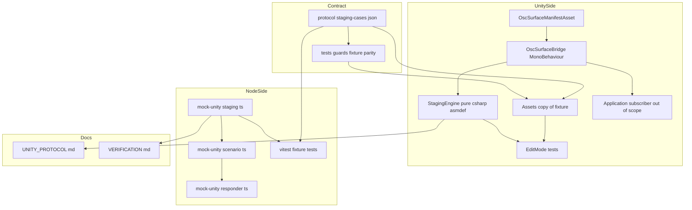
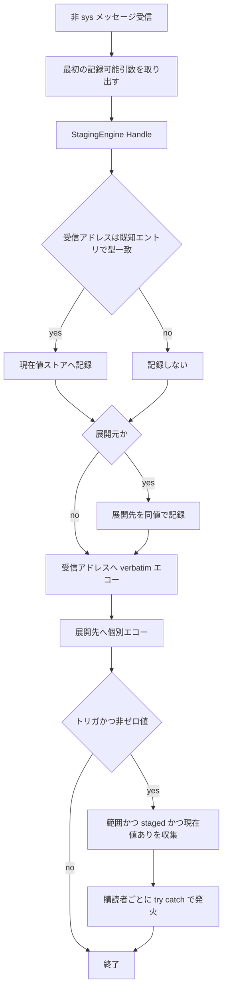
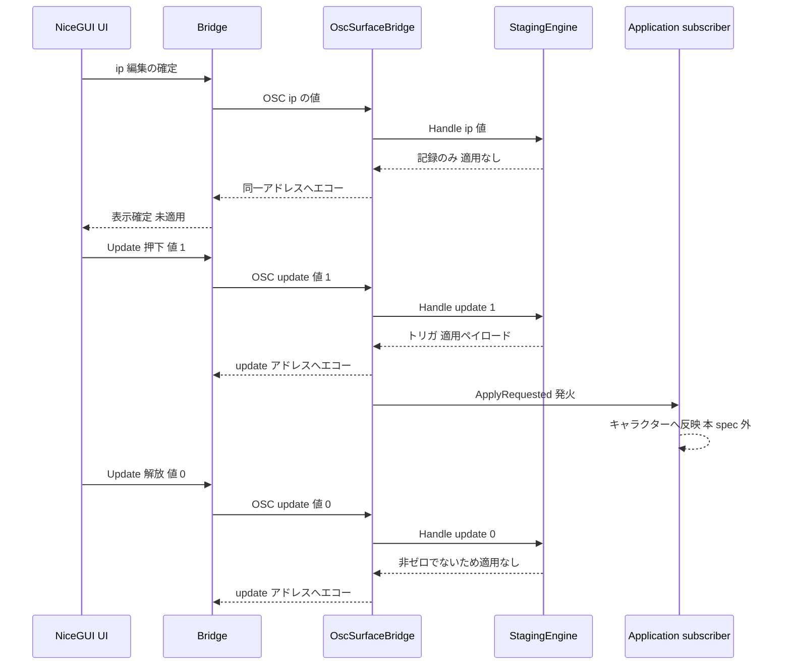
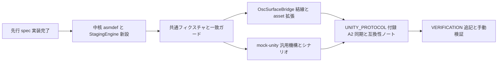

# Design Document — unity-staging-apply

## Overview

**Purpose**: Unity 側参照実装(`OscSurface/Assets/OscSurfaceBridge/`)に「受信値を蓄え、Update ボタン受信時にアプリケーションへ適用する」ステージング機構を追加する。ワイヤプロトコルは無改造(マニフェスト `version: 1`)で、UI から見れば通常のエコーバック付き送信と区別がつかないため、既存の UI・ブリッジ・共有スキーマを一切変更せずにレガシー版 VP_OscClient の運用感を再現できる(D-5 / S2-1)。

**Users**: 案件担当者(Unity 側アセット作成者)はステージング対象・適用トリガ・展開規則を**アセット定義だけ**で宣言し(D-6)、アプリケーション実装者は公開された C# `event` を購読して適用処理を書く(D-11)。オペレーターは「編集しても Update を押すまで反映されない」レガシーと同じ操作感を得る。

**Impact**: 受信時の値記録経路を、`OscSurfaceBridge`(`MonoBehaviour`)内の逐次処理から、`UnityEngine` 非依存の純 C# 中核 `StagingEngine` へ移す。`StagingEngine` は現在値ストア(= ステージング領域、D-18)と事前コンパイル済みステージング計画を所有し、受信 1 件につき「記録・展開書き込み・エコー先・適用ペイロード」を決定する。同じ純関数境界を mock-unity の `staging.ts` にも実装し、両者を JSON 共通フィクスチャで機械的に一致させる(D-12 / D-14)。併せて、現行実装の欠陥である `bool` エントリの現在値未記録を修正する(要件 10)。

### Goals

- ステージング対象・適用トリガ・展開規則を、C# を書き換えずアセット定義だけで宣言できるようにする(1.1–1.4)
- ステージング対象の受信を「保持 + 同一アドレスへの通常エコーバック」にとどめ、適用トリガ受信時にのみ適用イベントを発火する(2.x / 3.x)
- 一括操作の展開書き込みと展開先個別エコーバックを提供する(4.x)
- マニフェスト `default` がステージング値を返し、再接続時に編集途中の状態を復元する(5.x)
- ステージング規律を mock-unity の `pnpm test` と Unity EditMode テストの双方で、同一の JSON フィクスチャにより検証する(9.x)
- `bool` エントリの現在値記録を両実装で成立させ、`default` の出力形を一致させる(10.x)

### Non-Goals

- 適用処理そのもの(キャラクターへの反映など)— 購読者(アプリ固有実装)に委ねる(3.2)
- `packages/shared` / `packages/bridge` / `packages/nicegui-ui` の変更、ワイヤプロトコル・OSC 型タグ・メッセージ種別の追加(6.3 / 6.4)
- input / select ウィジェット — 先行 spec `manifest-input-select-widgets` が担当
- フォーク側成果物(64 スロットプリセット、`vp-concert-default` シナリオ、E2E)(D-4)
- 入力値の形式検証(`pattern`)の受け皿(D-9)
- 展開バーストの緩和機構(bundle 化・間引き)— 実測項目に留める(G-9 の結論)

## Boundary Commitments

### This Spec Owns

- **ステージング宣言の正規モデル**(`StagingDeclaration`): エントリ集合 + ステージング対象 + 適用トリガ(適用範囲パターン)+ 展開規則(展開先パターン)。C# アセットと mock-unity シナリオはこのモデルへ写像する
- **ワイルドカード一致規則**(OSC 1.0 の真部分集合、`*` のみ・part 単位)と、その検証規則 S1–S9
- **現在値ストア(= ステージング領域)の所有権**: 受信値の記録可否・正規化(`bool` → `i` 0/1)・マニフェスト `default` の供給
- **受信 1 件に対する反応の決定**: 記録・展開書き込み・エコー先の順序・適用ペイロードの構成と順序・適用イベントの発火条件
- **適用イベントの契約**(トリガアドレス + 順序付きの値辞書、例外隔離の保証)
- **共通フィクスチャ `protocol/staging-cases.json` の形式と内容**、および両実装の一致ガード
- `docs/UNITY_PROTOCOL.md` §4 / 付録 A / 互換性ノート、`docs/VERIFICATION.md` のステージング関連記述

### Out of Boundary

- 適用の実処理・アプリ側の購読コード(フォーク側 §7-3)
- マニフェスト JSON のスキーマ(`packages/shared`)。ステージング宣言は **JSON へ一切出力しない**(6.2)
- ブリッジの受信・配信経路、UI のウィジェット実装。ステージングによる差分は 0(6.3)
- 具体アドレス構成(`/vp/member/{NN}/*` 等)。本 spec は機構のみを提供し、構成はデータとしてフォークが与える
- `OscSurfaceManifestAsset` の widget / 選択肢まわりの拡張(先行 spec の所有)

### Allowed Dependencies

- Unity 6000.0.36f1 / `com.unity.test-framework` 1.4.6(導入済み)/ uOSC 2.2.0。**新規パッケージ依存は追加しない**(`JsonUtility` を使い Newtonsoft を導入しない)
- `packages/shared` の `ManifestEntrySchema` / `ManifestSchema`(mock-unity 側。**読み取りのみ、変更しない**)
- 既存のフィクスチャ流儀(`protocol/*.json` を両言語のテストが読む)と `tests/guards/` のガードテスト枠

### Revalidation Triggers

- `StagingDeclaration` / 適用イベント署名の形状変更 → フォークの購読コードとプリセット定義が影響を受ける
- ワイルドカード一致規則の変更 → 既存アセット定義の意味が変わる
- `protocol/staging-cases.json` のケース追加・変更 → C# / TypeScript 双方のテストが同時に影響を受ける
- `bool` の `default` 出力形の変更 → UI 表示と既存マニフェスト・シナリオへ波及(本 spec で 1 度だけ変更する。10.4)
- `OscSurface/Assets` のアセンブリ構成(asmdef)の変更 → 付録 A.2 の構成記述と EditMode テストの成立条件

## Architecture

### Existing Architecture Analysis

| 観点 | 現状 | 本 spec での扱い |
|------|------|-----------------|
| 受信処理 | `OscSurfaceBridge.OnDataReceived` → `HandleNormalMessage` が「最初の記録可能引数を `RecordValue` → 全引数を正規化して同一アドレスへエコー」 | エコーの規律は不変。記録判断を `StagingEngine` へ委譲し、展開エコーと適用発火を後段に追加 |
| 現在値 | `Dictionary<string, object> currentValues`。`RecordValue` がエントリ配列を**線形探索**して型一致を確認 | `StagingEngine` が所有し、アドレス索引で O(1) 参照(G-7) |
| 型一致 | `TypeMatches` の `case "bool": value is bool` が実質死んでいる(ワイヤは `i` 0/1) | `bool` は `i` 0/1 を受理して 0/1 を保持(要件 10、D-23) |
| マニフェスト | `TryBuildManifestJson` が `currentValues` にあれば `default` を出力。任意フィールドはキーごと省略 | 供給源が `StagingEngine` に変わるだけ。出力規律は不変(5.3) |
| 検証 | `TryGetValidatedAsset` が `Debug.LogError` + 不送信 | ステージング計画のコンパイル結果を追加検証項目として合流(1.5 / D-25) |
| アセンブリ | `OscSurface/Assets` に asmdef ゼロ。全て `Assembly-CSharp` | ステージング中核のみ asmdef 分離(EditMode テスト成立の唯一の経路) |
| mock-unity | `ScenarioRuntime.recordValue` は `void`、`buildManifestEntry` は `entry.default` があるときだけ `default` 出力、`ManifestEntrySchema` は非 strict | `staging.ts` を新設し、`recordValue` を反応返却へ、`default` 出力条件を C# と一致させる(D-31)。宣言はシナリオのトップレベル(D-30) |

**技術的負債への対処**: (a) `RecordValue` の線形探索 → 索引化、(b) `bool` 記録の死に判定 → 修正(要件 10)、(c) mock と C# の `default` 出力条件の食い違い → 統一。いずれもフィクスチャ導入の前提として本 spec 内で解消する。

### Architecture Pattern & Boundary Map

採用パターンは **Option C(ハイブリッド)**: ステージング中核を `UnityEngine` 非依存の純 C# アセンブリへ切り出し、`OscSurfaceBridge` / `OscSurfaceManifestAsset` / mock-unity の既存ファイルは in-place 拡張にとどめる。C# と TypeScript は**同一の純関数境界**(宣言 + 受信アドレス + 値 → 反応)を持ち、共通フィクスチャで一致を担保する。



**Architecture Integration**:

- **選択パターン**: 純粋中核 + 薄いアダプタ。中核(`StagingEngine` / `staging.ts`)は I/O・ログ・UnityEngine API を一切持たず、入力から反応を返すだけ。副作用(OSC 送信・ログ・イベント発火)はアダプタ(`OscSurfaceBridge` / `responder.ts`)が担う
- **責務分離**: 「宣言の検証と索引化」(コンパイル)、「値の保持と反応の決定」(実行)、「送信とイベント発火」(アダプタ)、「一致の担保」(フィクスチャ + ガード)の 4 層
- **既存パターン維持**: エコーバックの規律(§3)、任意フィールドのキー省略、presence フラグ方式のアセット定義、`protocol/*.json` を両言語テストが読む流儀、`tests/guards/` のガードテスト枠
- **新規コンポーネントの理由**: `StagingEngine` は EditMode テスト成立の唯一の経路(asmdef 分離が必須)であり、同時に mock 側と同一境界を作る装置でもある。`staging.ts` はシナリオ固有応答でなく**汎用機構**であることが要件(7.1)
- **規律準拠**: 「案件差分はコードでなくデータ」(宣言はアセット/シナリオ)、「Unity が真実の源」(UI は表示キャッシュのまま)、「ブリッジと UI の責務分離」(境界を越えない、6.3)、「特定 OSC ライブラリに依存しない」(中核は OSC ライブラリを知らない)

**依存方向**(左からのみ参照する。違反はエラーとする):

- Unity: `StagingEngine`(依存なし。`UnityEngine` すら参照しない)← `OscSurfaceBridge` ← アプリ購読者。`OscSurfaceManifestAsset` は `UnityEngine` のみに依存し、`StagingEngine` を参照しない(写像は `OscSurfaceBridge` が行う)
- Node: `@oscdesk/shared` → `staging.ts` → `scenario.ts` → `responder.ts` → `server.ts`。`staging.ts` は `scenario.ts` を参照しない

### Technology Stack

| Layer | Choice / Version | Role in Feature | Notes |
|-------|------------------|-----------------|-------|
| Unity ランタイム | Unity 6000.0.36f1 / C#(.NET Standard 2.1)/ uOSC 2.2.0 | ステージング中核と結線 | 新規パッケージ依存なし。中核 asmdef は `noEngineReferences: true` |
| Unity テスト | `com.unity.test-framework` 1.4.6(導入済み)+ NUnit | EditMode テスト | Editor 専用 asmdef。`pnpm test` からは実行不可(9.3) |
| フィクスチャ読み込み(C#) | `UnityEngine.JsonUtility`(標準) | 共通フィクスチャの読み込み | `Dictionary` / トップレベル配列不可 → 形状を制約(D-24) |
| モック | mock-unity(既存 Node + zod) | 汎用ステージング機構とシナリオ供給 | `packages/shared` は読み取りのみ |
| テスト入口 | vitest(`packages/*/src/**/*.test.ts`, `tests/guards/**`) | mock 側テストと一致ガード | 既存 `vitest.config.ts` の include にそのまま乗る |

## File Structure Plan

### 新規ファイル

```
protocol/
└── staging-cases.json                       # 共通フィクスチャの原本(JsonUtility 適合形状)
tests/guards/
└── staging-fixture-parity.test.ts           # 原本と Unity 側複製の一致ガード
packages/mock-unity/
├── src/staging.ts                           # 汎用ステージング機構(宣言・コンパイル・エンジン)
├── src/staging.test.ts                      # 照合器と検証規則の単体テスト
├── src/staging-cases.test.ts                # フィクスチャ駆動テスト
└── scenarios/staging.json                   # upstream テスト用ステージングシナリオ
OscSurface/Assets/OscSurfaceBridge/Staging/
├── OscSurfaceBridge.Staging.asmdef          # 純 C# アセンブリ(noEngineReferences: true)
└── OscSurfaceStaging.cs                     # StagingEngine ほか中核型(1 ファイルに集約)
OscSurface/Assets/OscSurfaceBridge/Tests/Editor/
├── OscSurfaceBridge.Staging.Tests.asmdef    # EditMode テストアセンブリ
├── StagingEngineTests.cs                    # 照合器・検証規則・例外隔離の単体テスト
├── StagingFixtureTests.cs                   # フィクスチャ駆動テスト
└── Fixtures/staging-cases.json              # 原本の複製(ガードで一致を強制)
```

> `Assets` 配下に新規追加する**全てのファイルとフォルダ**に `.meta` を用意する。GUID は都度ランダムな 32 桁 hex を生成する(`[guid]::NewGuid().ToString('N')`)。既存 `.meta` からのコピー、連続パターン、ローテーション系列は禁止。

### Modified Files

- `OscSurface/Assets/OscSurfaceBridge/OscSurfaceManifestAsset.cs` — Entry へ `staged` / `appliesTo` / `expandsTo` を追加(宣言データのみ。ロジックは持たない)
- `OscSurface/Assets/OscSurfaceBridge/OscSurfaceBridge.cs` — アセット → `StagingDeclaration` への写像、計画コンパイルと検証結果の合流、受信処理の `StagingEngine` 委譲、展開エコー、適用 `event` の公開と例外隔離、`currentValues` 参照先の差し替え
- `OscSurface/Assets/OscSurfaceBridge/Editor/OscSurfaceBridgeEditor.cs` — 新フィールドでインスペクタが破綻しないことの確認(必要最小限)
- `packages/mock-unity/src/scenario.ts` — トップレベル `staging` セクションの受理、`recordValue` の反応返却化、`default` 出力条件の修正、`bool` 型一致の修正、適用の記録
- `packages/mock-unity/src/responder.ts` — 展開先への個別エコー送出、適用の観測(記録 + stderr ログ)
- `packages/mock-unity/src/scenario.test.ts` / `responder.test.ts` — 上記変更に伴う追加・調整
- `docs/UNITY_PROTOCOL.md` — §4 実装指針の追記(適用トリガは**非ゼロ値でのみ発火**する規律 D-17 を含む)、付録 A.2 の構成更新(2 ファイル → 中核 3 ファイル + asmdef)と全文同期、A.3 / A.4 の追記、互換性ノート 3 件(ステージングはワイヤ無改造の任意機構 / `bool` 記録と `default` 出力形の変更 / 適用トリガは非ゼロ値でのみ発火)
- `tests/guards/appendix-source-parity.test.ts`(**新規**) — 付録 A のコードブロックとリポジトリ実ファイルの一致を検証する(validate-design 指摘 1)。`docs/UNITY_PROTOCOL.md` は「付録 A の C# 全文はリポジトリ実ファイルと一致することを不変条件とする」と宣言しているが照合テストが無く、**既に乖離している**(付録の `[Tooltip("oscdesk へ送るマニフェスト定義…")]` に対し実ファイルは `[Tooltip("Surface へ送るマニフェスト定義…")]`)。本 spec は asmdef 分離で付録の全文コピー対象を 2 ファイルから中核 3 ファイルへ拡大するため、手動同期のままでは要件 8.2 が構造的に守られない。既存 `tests/guards/legacy-names.test.ts` と同じ枠で `pnpm test` に載せ、既存の乖離 1 行も本 spec で解消する
- `docs/VERIFICATION.md` — ステージングの手動検証手順、EditMode テストの実行手順(9.3)、展開バーストの実測項目

## System Flows

### 通常メッセージ受信の全体フロー



**フロー上の決定**:

- **エコーは適用イベントより必ず先**(D-21 / G-4)。購読者の例外はエコー送出に影響しない。これにより 2.5(ステージング対象と非対象で区別できる差分を作らない)が構造的に保たれる
- 受信アドレス自身のエコーは**受信引数をそのまま**(既存 `NormalizeValue` 適用のみ)。展開先へのエコーは**単一引数**(記録された値)で送る
- 記録可能引数が 1 つも無いメッセージは、記録も展開も適用も行わず、エコーのみ行う(既存挙動)
- 適用トリガは**非ゼロ値でのみ発火**する(D-27)。UI の button は押下 `1` / 解放 `0` の 2 メッセージを送るため、この条件がないと 1 押下で 2 回適用される
- 展開は 1 段のみ。展開書き込みは新たな受信として扱わないため連鎖しない(D-26 / 4.6)

### 適用トリガ受信の系列(スロット単位 Update)



適用後もステージング値は保持され(3.4)、以降のマニフェスト `default` は同じ値を返す(5.1)。

## Requirements Traceability

| Requirement | Summary | Components | Interfaces / Flows |
|-------------|---------|------------|--------------------|
| 1.1, 1.2, 1.3, 1.3a | ステージング対象・適用トリガ・展開規則の宣言手段(単一のワイルドカード記法) | UnityManifestAsset, StagingEngine, MockStaging | `StagingDeclaration` / `AddressPattern` |
| 1.4 | C# 変更なしで構成変更できる | UnityManifestAsset, UnityBridgeAdapter | アセット定義のみで完結する写像 |
| 1.5 | 宣言不整合はエラー記録 + マニフェスト不送信 | StagingEngine(S1–S9), UnityBridgeAdapter | `TryCompile` / `TryGetValidatedAsset` |
| 1.6 | 宣言ゼロなら現行と同一挙動 | StagingEngine(`StagingPlan.Empty`) | 通常受信フロー |
| 2.1, 2.4, 2.6 | ステージング保持と現在値更新、乖離の許容 | StagingEngine(現在値ストア) | `Handle` / `CurrentValues` |
| 2.2, 2.3, 2.5 | 通常どおりのエコーバック、適用は発火しない、差分を作らない | UnityBridgeAdapter, MockResponder | 通常受信フロー(エコー先行) |
| 3.1, 3.1a, 3.1b, 3.6 | トリガ受信で範囲内全ステージング値を渡す適用イベント | StagingEngine, UnityBridgeAdapter | `ApplyRequested` / `StagingApplyContext` |
| 3.2 | 適用処理は購読者へ委ねる | UnityBridgeAdapter | Event Contract |
| 3.3 | トリガアドレスへもエコー | UnityBridgeAdapter | 適用トリガ系列 |
| 3.4 | 適用後もステージング値を保持 | StagingEngine | `Handle` の不変条件 |
| 3.5 | 範囲にステージング値ゼロでも継続 | StagingEngine | 空ペイロードで発火 |
| 4.1, 4.3 | 展開先の書き換えと現在値更新 | StagingEngine | `StagingReaction.ExpansionWrites` |
| 4.2, 4.4 | 展開先個別エコーと展開元エコー | UnityBridgeAdapter, MockResponder | 通常受信フロー |
| 4.5 | 展開では適用しない | StagingEngine | `Handle` の分岐 |
| 4.6 | 展開の有限終了 | StagingEngine(1 段規律 + 自己除外) | コンパイル時解決 |
| 5.1 | `default` はステージング値 | StagingEngine, UnityBridgeAdapter, MockScenario | `TryGetCurrentValue` / `buildManifestEntry` |
| 5.2 | マニフェスト応答は冪等のまま | UnityBridgeAdapter | 既存 `SendManifest` を変更しない |
| 5.3 | 値同期規律の維持(`b` 除外 / `bool` は 0/1 / キー省略) | StagingEngine, UnityBridgeAdapter | 記録規則 R1–R4 |
| 6.1, 6.2, 6.4 | `version: 1` 維持、宣言を JSON へ出さない、新規アドレス・型タグなし | UnityBridgeAdapter, UnityManifestAsset | JSON 出力に宣言を含めない |
| 6.3 | shared / bridge / UI を変更しない | (境界。File Structure Plan の変更ファイル一覧が根拠) | — |
| 6.5 | 境界越えが判明したらユーザー判断へ | (実装規律) | — |
| 7.1, 7.4 | mock の汎用機構と展開エコー | MockStaging, MockScenario, MockResponder | `StagingDeclaration`(TS) |
| 7.2 | エコーと `default` 反映 | MockScenario | `recordValue` / `manifestJson` |
| 7.3 | 適用の観測可能化 | MockResponder, MockScenario | `stagingSnapshot` / stderr ログ |
| 7.5, 7.6 | upstream 用シナリオのみ、既存シナリオ非退行 | MockScenarios | `scenarios/staging.json` |
| 8.1–8.4 | プロトコル文書の追記と付録同期 | ProtocolDocs | docs 更新 |
| 8.5 | 手動検証手順 | ProtocolDocs(VERIFICATION) | docs 更新 |
| 9.1, 9.2 | 両実装のテストと共通フィクスチャ | StagingFixture, FixtureParityGuard, EditModeTests, MockTests | Batch Contract |
| 9.3 | EditMode 実行方法の文書化 | ProtocolDocs | docs 更新 |
| 9.4, 9.5 | 手動検証手順と既存テスト維持 | ProtocolDocs, (全テスト) | — |
| 10.1, 10.2 | `bool` の `i` 0/1 を記録 | StagingEngine, MockStaging | 記録規則 R2 |
| 10.3 | 両実装で `default` 出力形一致 | StagingEngine, MockScenario | D-23(0/1 の数値) |
| 10.4 | 互換性ノートへ記録 | ProtocolDocs | docs 更新 |

## Components and Interfaces

| Component | Domain/Layer | Intent | Req Coverage | Key Dependencies | Contracts |
|-----------|--------------|--------|--------------|------------------|-----------|
| StagingEngine | Unity 中核(純 C#) | 宣言の検証・索引化と、受信 1 件に対する反応の決定・値の保持 | 1.1–1.3a, 1.5, 1.6, 2.1, 2.4, 2.6, 3.1, 3.1b, 3.4, 3.5, 4.1, 4.3, 4.5, 4.6, 5.1, 5.3, 10.1, 10.3 | なし(P0: 依存ゼロが要件) | Service, State |
| UnityManifestAsset | Unity(C#) | アセット定義だけで宣言を組める形状 | 1.1, 1.2, 1.3, 1.4, 6.2 | UnityEngine(P0) | State |
| UnityBridgeAdapter | Unity(C#) | 写像・結線・OSC 送信・イベント発火・ログ | 1.4, 1.5, 2.2, 2.3, 2.5, 3.1a, 3.2, 3.3, 3.6, 4.2, 4.4, 5.1–5.3, 6.1, 6.2, 6.4 | StagingEngine(P0), UnityManifestAsset(P0), uOSC(P0) | Service, Event |
| MockStaging | mock-unity(TS) | C# 中核と同一境界の汎用ステージング機構 | 7.1, 4.1, 4.3, 4.6, 10.2 | @oscdesk/shared(P1) | Service, State |
| MockScenario | mock-unity(TS) | 宣言の受理、現在値と適用の保持、`default` 出力 | 7.1, 7.2, 7.3, 7.6, 5.1, 10.2, 10.3 | MockStaging(P0) | Service |
| MockResponder | mock-unity(TS) | 展開エコー送出と適用の観測 | 7.3, 7.4, 2.2, 4.2, 4.4 | MockScenario(P0) | Service |
| StagingFixture | 契約(共通) | 両実装の一致を機械担保する入力と期待出力 | 9.1, 9.2 | StagingEngine(P0), MockStaging(P0) | Batch |
| FixtureParityGuard | 契約(共通) | 原本と Unity 側複製の乖離検出 | 9.2 | StagingFixture(P0) | Batch |
| EditModeTests | Unity テスト | C# 実装の回帰検出 | 9.1, 9.3 | StagingEngine(P0), StagingFixture(P0) | Batch |
| ProtocolDocs | 文書 | 実装指針・付録・互換性ノート・検証手順 | 8.1–8.5, 9.3, 9.4, 10.4 | 全契約(P1) | — |

### Unity 中核レイヤ

#### StagingEngine(`Staging/OscSurfaceStaging.cs`)

| Field | Detail |
|-------|--------|
| Intent | ステージング宣言の検証・索引化と、受信 1 件に対する反応の決定、および現在値(= ステージング値)の保持 |
| Requirements | 1.1, 1.2, 1.3, 1.3a, 1.5, 1.6, 2.1, 2.4, 2.6, 3.1, 3.1b, 3.4, 3.5, 4.1, 4.3, 4.5, 4.6, 5.1, 5.3, 10.1, 10.3 |

**Responsibilities & Constraints**

- `UnityEngine` を参照しない(asmdef の `noEngineReferences: true` で機械的に強制)。ログ出力・例外送出をせず、**検証エラーはデータで返す**
- ステージング領域と現在値ストアは同一(D-18 / G-2)。マニフェスト `default` の供給源でもある
- ワイルドカードの解決は**コンパイル時のみ**。実行時はアドレス索引の参照のみで、パターン照合を行わない(D-19 / G-7)
- 宣言が 1 つも無い場合は `StagingPlan.Empty` となり、記録とエコーの挙動は現行と同一(1.6)
- スレッド安全性は要求しない(uOSC のコールバックは Unity のメインスレッドで呼ばれる前提)。この前提を型のドキュメントコメントに明記する

**Dependencies**

- Inbound: UnityBridgeAdapter — 写像・呼び出し(P0)/ EditModeTests — 直接検証(P0)
- Outbound: なし
- External: なし(BCL のみ)

**Contracts**: Service [x] / State [x]

##### Service Interface

```csharp
namespace OscDesk.Staging
{
    public enum StagingValueKind { None, Int, Float, String }

    /// <summary>OSC 1.0 の基本型のうち値同期対象(i / f / s)を表す不変値。bool は Int の 0/1 で表す。</summary>
    public readonly struct StagingValue
    {
        public StagingValueKind Kind { get; }
        public int IntValue { get; }
        public float FloatValue { get; }
        public string StringValue { get; }

        public static StagingValue FromInt(int value);
        public static StagingValue FromFloat(float value);
        public static StagingValue FromString(string value);
        public static StagingValue None { get; }
        public bool IsTruthy { get; }   // Int/Float は非ゼロ、String は非空。None は false
        public bool Equals(StagingValue other);

        // マニフェスト default の JSON リテラル化(要件 10.3 / 5.1 を中核側で機械担保する)。
        // bool 型エントリは Int 0/1 として保持され "0" / "1" を返す(D-23)。
        public string ToJsonLiteral();
    }

    /// <summary>エントリ型。マニフェストの type と 1:1(b は値同期対象外)。</summary>
    public enum StagingEntryType { Int, Float, String, Blob, Bool }

    public sealed class StagingEntryDeclaration
    {
        public string Address { get; }
        public StagingEntryType Type { get; }
        public bool IsButton { get; }                       // appliesTo の許可判定に使う(S1)
        public bool Staged { get; }
        public IReadOnlyList<string> AppliesTo { get; }      // 空 = 適用トリガではない
        public IReadOnlyList<string> ExpandsTo { get; }      // 空 = 展開元ではない
    }

    public sealed class StagingDeclaration
    {
        public IReadOnlyList<StagingEntryDeclaration> Entries { get; }
    }

    public sealed class StagingCompileError
    {
        public string Code { get; }      // "S1".."S9"(フィクスチャで照合する安定コード)
        public string Address { get; }   // 対象アドレス。全体に関わる場合は空文字
        public string Message { get; }   // 人間向け説明(ログ用。フィクスチャでは照合しない)
    }

    public sealed class StagingPlan
    {
        public static StagingPlan Empty { get; }
        public bool HasStagingDeclarations { get; }

        /// <summary>宣言を検証し索引化する。失敗時 plan は Empty、errors は 1 件以上。</summary>
        public static bool TryCompile(
            StagingDeclaration declaration,
            out StagingPlan plan,
            out IReadOnlyList<StagingCompileError> errors);

        /// <summary>OSC 1.0 の真部分集合(* のみ・part 単位)による一致判定。</summary>
        public static bool MatchesPattern(string pattern, string address);
    }

    public readonly struct StagingWrite
    {
        public string Address { get; }
        public StagingValue Value { get; }
    }

    public readonly struct StagingReaction
    {
        public bool Recorded { get; }                                  // 受信アドレス自身を記録したか
        public IReadOnlyList<StagingWrite> ExpansionWrites { get; }     // 記録済み。個別エコーの対象(4.1–4.3)
        public bool ApplyTriggered { get; }
        public IReadOnlyList<StagingWrite> ApplyPayload { get; }        // エントリ定義順(3.1b)
    }

    public sealed class StagingEngine
    {
        public StagingEngine(StagingPlan plan);

        /// <summary>アセット既定値の投入。展開・適用は行わない(起動時の初期化専用)。
        /// 記録規則 R2 の型一致のみは適用し、エントリ型と合わない既定値は投入せず握り潰す
        /// (`Debug.LogWarning` で記録)。これにより Invariants の
        /// 「TryGetCurrentValue が返す Kind は対応エントリの型に整合する」が成立する。
        /// 現行 `OscSurfaceBridge.Awake` はアセットの defaultKind と EntryType の不一致を
        /// 検証せず投入しているため、この点は挙動変更になる。</summary>
        public void SeedInitialValue(string address, StagingValue value);

        /// <summary>受信 1 件に対する反応を決定し、必要な記録を自身へ適用する。</summary>
        public StagingReaction Handle(string address, StagingValue value);

        public bool TryGetCurrentValue(string address, out StagingValue value);
    }
}
```

- **Preconditions**: `TryCompile` の `declaration` は非 null。`Handle` の `address` は非 null・非空。`value` が `None` の場合は「記録可能引数なし」を意味する
- **Postconditions**:
  - `Handle` は記録・展開書き込みを自身のストアへ反映済みで返す。呼び出し側はエコーとイベント発火のみ行う
  - `ApplyPayload` は「適用範囲に解決されたアドレス ∩ `staged` ∩ 現在値あり」の集合を**エントリ定義順**で並べたもの(G-3 / D-16 / D-20)。トリガ自身(button)は `staged` でないため自然に除外される
  - `Handle` はステージング値を破棄・リセットしない(3.4)
- **Invariants**:
  - `StagingPlan.Empty` の `Handle` は「型一致すれば記録、展開なし、適用なし」= 現行挙動(1.6)
  - `TryGetCurrentValue` が返す値の `Kind` は、対応エントリの型に整合する(`Bool` エントリは常に `Int` の 0 か 1、D-23)

##### 記録規則(R1–R4。受信アドレス・展開書き込みの双方に適用)

| # | 規則 | 根拠 |
|---|------|------|
| R1 | 宣言に無いアドレスの値は記録しない(エコーは行う) | 既存挙動 |
| R2 | 型一致: `Int`←`Int` / `Float`←`Int` または `Float` / `String`←`String` / `Bool`←`Int` の 0 または 1(0/1 以外の `Int` は記録しない)/ `Blob`← 記録しない | 5.3, 10.1 |
| R3 | `Bool` エントリの記録値は常に `Int` の 0 / 1 へ正規化する。アセット既定値(`defaultBool`)の投入時も同様 | 10.3, D-23 |
| R4 | 記録しない場合でもエコーバックは通常どおり行う(呼び出し側の責務) | 2.5 |

##### 検証規則(S1–S9。`TryCompile` の判定。コードはフィクスチャで照合する)

各行は**エラーとなる条件**を表す(該当したら当該コードを返して `TryCompile` が失敗する)。全行の極性を統一している。

| Code | エラーとなる条件 |
|------|------|
| S1 | `AppliesTo` が非空のエントリで `IsButton` が false である |
| S2 | `AppliesTo` が非空のエントリが `Staged` である(トリガ自身をステージング対象にしている) |
| S3 | パターンが `/` で始まらない、末尾が `/` である、空 part を含む、または `*` 以外のワイルドカード文字(`?` `[` `]` `{` `}` `,`)や OSC 1.1 の `//` を含む |
| S4 | 各トリガについて、`AppliesTo` の全パターンが解決する集合と `Staged` の積が空である(要件 1.5「対象範囲にステージング対象が 1 つも解決できない」) |
| S5 | 各展開元について、`ExpandsTo` の全パターンが宣言済みアドレスを 1 つも解決しない |
| S6 | 展開先エントリの型が展開元エントリの型と異なる |
| S7 | 展開先集合から展開元自身を除いた結果が空である(解決集合が空なら S5、型不一致なら S6 が原因を表すため S7 は重ねない) |
| S8 | `Staged` が `Blob` 型エントリに付与されている(値同期対象外のため) |
| S9 | 同一アドレスのエントリが重複している(ステージング宣言が 1 つでも存在する場合のみエラー。宣言ゼロのときは先勝ちで従来どおり許容し、1.6 の非退行を優先する) |

##### ワイルドカード一致規則(D-17 / G-1 / 1.3a)

- 照合の前にパターン側とアドレス側の双方へ S3 と同じ形の検証を適用し、どちらかが壊れた形(先頭が `/` でない・末尾が `/`・空 part・`//`・未採用のワイルドカード文字)なら**一致しない**。エントリのアドレス自体は S3 の検証対象外のため、この防御で壊れたアドレスが展開先・適用範囲へ紛れ込むのを防ぐ
- パターンとアドレスをともに `/` で分割し、**part 数が一致**する場合にのみ照合する
- 各 part は、`*` を「その part 内の 0 文字以上の任意の並び」として照合する。`*` は `/` を跨がない
- 対応する OSC 1.0 のアドレスパターン機能のうち `?` / `[]` / `{}` / `//` は**採用しない**(記法を 1 つに保つ D-15 の帰結)
- 例: `/vp/member/01/*` → `/vp/member/01/ip` に一致、`/vp/member/01/a/b` に不一致。`/vp/member/*/*` → `/vp/member/01/active` に一致。`/vp/member/*` → `/vp/member/01/active` に**不一致**(part 数が違う)

##### State Management

- State model: `Dictionary<string, StagingValue> currentValues`(アドレス → 現在値)。計画(`StagingPlan`)は不変で、実行時に変化しない
- Persistence & consistency: 永続化しない。プロセス寿命でリセットされる(レガシーの `member_slot_state.json` は「Unity が真実の源」の規律で置き換える。D-7)
- Concurrency: 単一スレッド前提(uOSC のメインスレッドコールバック)

**Implementation Notes**

- Integration: `StagingPlan` は「アドレス → `{ staged, triggerAppliesResolved, expansionTargets }`」の辞書 + トリガ集合として索引化する。適用範囲・展開先は**コンパイル時に解決済みのアドレス配列**として保持する
- Validation: `TryCompile` は最初のエラーで打ち切らず全件を集める(アセット作成者が 1 回で直せるようにする)
- Risks: `StagingValue` の `struct` 化で `object` ボクシングを避ける一方、`OscSurfaceBridge` の既存 `object` 経路との変換関数が必要になる。変換は 1 箇所(`OscSurfaceBridge` のアダプタ)に閉じる

### Unity 結線レイヤ

#### UnityManifestAsset(`OscSurfaceManifestAsset.cs`)

| Field | Detail |
|-------|--------|
| Intent | C# を書き換えずステージング構成を宣言できるアセット形状 |
| Requirements | 1.1, 1.2, 1.3, 1.4, 6.2 |

**Contracts**: State [x](シリアライズ形状)

```csharp
// Entry へ追加(既存の presence フラグ流儀に合わせ、空リスト = 不在)
public bool staged;                                              // 1.1 ステージング対象
public List<string> appliesTo = new List<string>();              // 1.2 適用トリガの適用範囲パターン(button のみ)
public List<string> expandsTo = new List<string>();              // 1.3 展開先パターン
```

- 宣言はエントリ単位に置く。Unity インスペクタでの編集しやすさと「エントリ = 1 アドレスの全設定」という既存の読み方を維持するため
- これらのフィールドは**マニフェスト JSON へ出力しない**(6.2)。`TryBuildManifestJson` は既存の出力キーのみを扱う
- 適用範囲・展開先とも `List<string>`(複数パターンの和)。記法は D-15 のワイルドカード 1 種類のみ(1.3a)

#### UnityBridgeAdapter(`OscSurfaceBridge.cs`)

| Field | Detail |
|-------|--------|
| Intent | アセット → 宣言モデルの写像、計画の適用、OSC 送信、適用イベントの公開 |
| Requirements | 1.4, 1.5, 2.2, 2.3, 2.5, 3.1a, 3.2, 3.3, 3.6, 4.2, 4.4, 5.1, 5.2, 5.3, 6.1, 6.2, 6.4 |

**Responsibilities & Constraints**

- `Awake` で「アセット検証 → `StagingDeclaration` 写像 → `StagingPlan.TryCompile` → `StagingEngine` 生成 → アセット既定値の `SeedInitialValue`」を行う
- `HandleNormalMessage` の順序を「記録可能引数の抽出 → `Handle` → 受信アドレスへ verbatim エコー → `ExpansionWrites` を単一引数で個別エコー → `ApplyTriggered` なら発火」に固定する(2.2, 3.3, 4.2, 4.4)
- 記録可能引数の抽出は「`int` / `float` / `string` である**最初の引数 1 つ**」を取るだけとし、エントリ型に合う引数を引数列から探し直さない。型の適否は中核の記録規則 R2 が判断する(既存挙動の維持。1.6)
- 適用イベントの発火は購読デリゲートを 1 件ずつ `try/catch` で呼ぶ。例外は `Debug.LogException` して次へ進む(D-21)
- `currentValues` フィールドを撤去し、マニフェスト `default` は `StagingEngine.TryGetCurrentValue` から引く。JSON 出力の規律(キー省略・`version: 1`)は不変(5.2, 5.3, 6.1)
- `bool` 型エントリの `default` は `StagingValue`(Int 0/1)から `0` / `1` の数値リテラルとして出力する(10.3)

**Dependencies**

- Inbound: uOSC `uOscServer.onDataReceived`(P0)
- Outbound: StagingEngine — 反応の決定(P0)/ uOSC `uOscClient` — 全送信の出口(P0)
- External: アプリ固有の購読者 — 適用処理(P1。購読ゼロでも動作する)

**Contracts**: Service [x] / Event [x]

##### Event Contract

```csharp
/// <summary>適用トリガ受信時に発火する。購読者は受け取った値をアプリケーションへ反映する。</summary>
public event Action<StagingApplyContext> ApplyRequested;

public readonly struct StagingApplyContext
{
    /// <summary>適用トリガとして受信した button のアドレス(どのスロットの Update かを識別する)。</summary>
    public string TriggerAddress { get; }

    /// <summary>適用範囲のステージング値。アドレス → 値。エントリ定義順で列挙される。</summary>
    public IReadOnlyDictionary<string, StagingValue> Values { get; }

    /// <summary>Values の列挙順を保証する読み取り専用リスト。</summary>
    public IReadOnlyList<string> Addresses { get; }

    public bool TryGetInt(string address, out int value);
    public bool TryGetFloat(string address, out float value);
    public bool TryGetString(string address, out string value);
}
```

- **Published events**: `ApplyRequested` のみ。ステージング値の受信・展開ではイベントを発火しない(2.3, 4.5)
- **Subscribed events**: なし
- **Ordering / delivery guarantees**:
  - 発火は該当アドレスへのエコー送出**完了後**に行う(2.5 / G-4)
  - `Values` は毎回新規生成したスナップショット。購読者が保持・改変してもエンジンの状態に影響しない
  - 適用範囲にステージング値が 1 件も無い場合も**空の `Values` で発火する**(3.5)。「Update が押された」事実は購読者にとって意味を持つため、無発火にしない
  - 1 購読者の例外は他の購読者とエコーに波及しない(D-21)
  - `UnityEvent` によるインスペクタ結線は提供しない(D-11)

**Implementation Notes**

- Integration: `StagingValue` ↔ uOSC の `object` 値の変換はこのクラスの private ヘルパ 1 組(`TryToStagingValue` / `ToOscValue`)に閉じる。既存 `NormalizeValue`(bool → i 0/1)はエコー経路で維持する
- Validation: 計画コンパイルのエラーは全件 `Debug.LogError` し、`TryGetValidatedAsset` を失敗させてマニフェストを送信しない。同時に計画を `Empty` にして現行挙動へ落とす(fail-safe。D-25 / G-6)。ping/pong・stats・エコーは継続する(1.5)
- Risks: `currentValues` の所有権移動により、既存のマニフェスト生成経路に退行が入りうる → 既存の手動検証(`docs/VERIFICATION.md` のマニフェスト同期項目)と mock 側フィクスチャで二重に確認する

### mock-unity レイヤ

#### MockStaging(`packages/mock-unity/src/staging.ts`、新規)

| Field | Detail |
|-------|--------|
| Intent | C# 中核と同一境界の汎用ステージング機構(シナリオ固有応答にしない) |
| Requirements | 7.1, 4.1, 4.3, 4.6, 10.2 |

**Contracts**: Service [x] / State [x]

```typescript
export type StagingValue =
  | { readonly kind: 'i'; readonly value: number }
  | { readonly kind: 'f'; readonly value: number }
  | { readonly kind: 's'; readonly value: string }

export type StagingEntryType = 'i' | 'f' | 's' | 'b' | 'bool'

export interface StagingEntryDeclaration {
  readonly address: string
  readonly type: StagingEntryType
  readonly isButton: boolean
  readonly staged: boolean
  readonly appliesTo: readonly string[]
  readonly expandsTo: readonly string[]
}

export interface StagingDeclaration {
  readonly entries: readonly StagingEntryDeclaration[]
}

export interface StagingCompileError {
  readonly code: string      // 'S1'..'S9'(C# と同一)
  readonly address: string
  readonly message: string
}

export type StagingCompileResult =
  | { readonly ok: true; readonly plan: StagingPlan }
  | { readonly ok: false; readonly errors: readonly StagingCompileError[] }

export interface StagingWrite {
  readonly address: string
  readonly value: StagingValue
}

export interface StagingReaction {
  readonly recorded: boolean
  readonly expansionWrites: readonly StagingWrite[]
  readonly applyTriggered: boolean
  readonly applyPayload: readonly StagingWrite[]
}

export declare class StagingPlan {
  static readonly empty: StagingPlan
  readonly hasStagingDeclarations: boolean
}

export declare function compileStagingPlan(declaration: StagingDeclaration): StagingCompileResult
export declare function matchesPattern(pattern: string, address: string): boolean

export declare class StagingEngine {
  constructor(plan: StagingPlan)
  seedInitialValue(address: string, value: StagingValue): void
  handle(address: string, value: StagingValue | null): StagingReaction
  currentValue(address: string): StagingValue | undefined
  currentValues(): ReadonlyMap<string, StagingValue>
}
```

- Preconditions / Postconditions / Invariants は C# `StagingEngine` と同一(記録規則 R1–R4、検証規則 S1–S9、ワイルドカード規則)。差異が生じた場合はフィクスチャテストが落ちる
- `handle` の第 2 引数 `null` は「記録可能引数なし」を表す(C# の `StagingValue.None` に対応)
- `any` を使わない。`unknown` からの絞り込みは `staging.ts` の境界関数で行う

#### MockScenario(`scenario.ts` 拡張)

| Field | Detail |
|-------|--------|
| Intent | シナリオでのステージング宣言受理、現在値・適用の保持、`default` 出力の C# 整合 |
| Requirements | 7.1, 7.2, 7.3, 7.6, 5.1, 10.2, 10.3 |

**Responsibilities & Constraints**

- **宣言はトップレベル `staging` セクション**に置く(D-30)。`ScenarioSchema.entries` は `ManifestEntrySchema`(非 strict)を使うため、エントリ内の未知キーは黙って捨てられる。トップレベル配置は要件 6.2(宣言をマニフェストへ出さない)とも整合する

```typescript
const StagingSectionSchema = z.object({
  staged: z.array(z.string().startsWith('/')).default([]),
  triggers: z.array(z.object({
    address: z.string().startsWith('/'),
    appliesTo: z.array(z.string()).min(1),
  })).default([]),
  expansions: z.array(z.object({
    source: z.string().startsWith('/'),
    targets: z.array(z.string()).min(1),
  })).default([]),
})

// ScenarioSchema へ追加
staging: StagingSectionSchema.optional()
```

- `ScenarioRuntime` は `StagingEngine` を内部に持ち、`#values` を置き換える。コンストラクタでシナリオの `entries` + `staging` を `StagingDeclaration` へ写像し、`compileStagingPlan` に失敗したら**シナリオ読み込み時に例外**を投げる(mock はテスト用のため fail-fast でよい。C# の fail-safe と挙動が違う点は文書化する)
- `recordValue(address, value)` は `StagingReaction | null` を返す(D-31 の一部)。`/sys/*` は従来どおり無視して `null`
- **`buildManifestEntry` の修正**: `entry.default !== undefined` の条件を外し、**現在値があれば必ず `default` を出力する**(C# と同一)。現在値が無く、かつシナリオに `default` があるときは従来どおりシナリオ値を出力する(D-31)
- **`bool` の扱い**: 型一致は `i` の 0/1 を受理し(10.2)、`default` は `0` / `1` の数値で出力する(10.3、D-23)
- 適用の観測: `#applyLog: AppliedRecord[]`(トリガアドレス・順序付き値・連番)と `#appliedValues: Map<string, StagingValue>` を保持し、`stagingSnapshot()` で読み取り専用に公開する(7.3)

**Contracts**: Service [x]

#### MockResponder(`responder.ts` 拡張)

- `visitPacket` の非 `/sys/*` 経路で `recordValue` の反応を受け取り、**受信アドレスへの verbatim エコー(既存)→ 展開先への個別エコー**の順に `pushReply` する(4.2, 4.4)。展開エコーは単一引数(`i` / `f` / `s`)
- `applyTriggered` のとき、シナリオへ適用を記録させる(7.3)。**`MockUnityResponder` 自身は I/O を持たない**(現状 `clock` すら DI される純粋な返信ビルダである既存流儀、および本設計の「副作用はアダプタが担う」層分けを守る)。stderr への `MOCK_UNITY_APPLY <triggerAddress> <valueCount>` の 1 行出力は、唯一の stderr 出口である `packages/mock-unity/src/index.ts` が `stagingSnapshot()` の適用ログを見て行う(validate-design の軽微指摘への対応)
- fault mode(`silent` / `corrupt` 等)は展開エコーにも従来どおり適用される(既存 `pushReply` を通すため自動的に成立)

**Contracts**: Service [x]

#### MockScenarios(`scenarios/staging.json`、新規)

- upstream のテスト・手動検証専用。フォークの `vp-concert-default` は含めない(7.5)
- 内容: 2 スロット相当の小規模構成(`.../ip`(`s`/input)・`.../active`(`bool`/toggle)・`.../update`(`i`/button))+ 全体トグル(展開元)+ 全体 Update(全スロット適用トリガ)。ステージング宣言を持たない対照エントリも 1 つ含める(1.6 / 7.6 の非退行確認用)
- 既存シナリオ(`default.json` 等)は `staging` セクションを持たないため従来どおり動作する(7.6)

### 契約レイヤ(共通フィクスチャ)

#### StagingFixture(`protocol/staging-cases.json`)

| Field | Detail |
|-------|--------|
| Intent | ステージング規律の入力と期待出力を単一ソース化し、C# と TypeScript の一致を機械的に担保する |
| Requirements | 9.1, 9.2 |

**Contracts**: Batch [x]

##### Batch / Job Contract

- **Trigger**: `corepack pnpm test`(mock 側フィクスチャテスト + 一致ガード)、Unity Editor の Test Runner(EditMode 側)
- **Input / validation**: `JsonUtility` 適合形状(D-24 / G-5)。トップレベルはオブジェクト、辞書を使わず名前付き配列のみ、値は型タグ付きエンベロープ、**任意キーを省略せず常に明示**する

```json
{
  "version": 1,
  "cases": [
    {
      "name": "staged value is held and echoed without apply",
      "note": "要件 2.1 / 2.2 / 2.3",
      "declaration": {
        "entries": [
          {
            "address": "/vp/member/01/ip",
            "type": "s",
            "isButton": false,
            "staged": true,
            "appliesTo": [],
            "expandsTo": [],
            "initial": { "kind": "s", "i": 0, "f": 0, "s": "127.0.0.1" }
          }
        ]
      },
      "expectCompileOk": true,
      "expectCompileErrorCodes": [],
      "steps": [
        {
          "receive": { "address": "/vp/member/01/ip", "value": { "kind": "s", "i": 0, "f": 0, "s": "10.0.0.9" } },
          "expectEchoes": [
            { "address": "/vp/member/01/ip", "value": { "kind": "s", "i": 0, "f": 0, "s": "10.0.0.9" } }
          ],
          "expectApplyFired": false,
          "expectApplyTrigger": "",
          "expectApplyValues": [],
          "expectCurrentValues": [
            { "address": "/vp/member/01/ip", "value": { "kind": "s", "i": 0, "f": 0, "s": "10.0.0.9" } }
          ],
          "expectManifestDefaults": [
            { "address": "/vp/member/01/ip", "literal": "\"10.0.0.9\"" }
          ]
        }
      ]
    }
  ]
}
```

- `kind` は `"none" | "i" | "f" | "s"`。`bool` 型エントリの値も `"i"` の 0/1 で表す(D-23 の裏返し)
- `expectEchoes` は**当該受信で送出すべきエコーの全列**(受信アドレス自身のエコーを先頭に含む)。各実装のテストハーネスが「受信アドレスへの verbatim エコー + `expansionWrites` の個別エコー」を組み立てて突き合わせる。フィクスチャの受信は常に単一値であり、複数引数メッセージの扱いは対象外(各実装の個別テストで担保する)
- `expectCurrentValues` は当該ステップ後の**ストア全体のスナップショット**(エントリ定義順)。マニフェスト `default` 供給源の検証を兼ねる(5.1)
- `expectManifestDefaults` は当該ステップ後に**マニフェスト `default` として出力されるべき JSON リテラル文字列**(アドレス → リテラル)。値を持たないアドレスは行ごと省略する(キー省略の規律に対応)。これは validate-design 指摘 3 への対応で、要件 10.3(両実装の `default` 出力形の一致)と 5.1 を機械担保するために追加した。
  - リテラル化は**純中核へ引き上げる**: C# は `StagingValue.ToJsonLiteral()`、TypeScript は同名の `toJsonLiteral(value)` を `staging.ts` に置く。`bool` 型エントリは `0` / `1` の数値リテラル(D-23)、`s` は引用符付きでエスケープ済み、`f` は既存 `FormatNumber` と同じ書式に従う
  - アダプタ(C# `TryBuildManifestJson` / TS `buildManifestEntry`)は中核が返すリテラルを連結するだけにする。これにより `default` 直列化が EditMode テストの対象内に収まり、要件 9.1 の「中核挙動を両実装で検証」と整合する
- `expectCompileOk` が false のケースでは `steps` を空にし、`expectCompileErrorCodes` に S コードを昇順で並べる
- **Output / destination**: `packages/mock-unity/src/staging-cases.test.ts`(vitest)と `OscSurface/.../Tests/Editor/StagingFixtureTests.cs`(NUnit)が同一ケースを実行する
- **Idempotency & recovery**: ケースは純関数的で順序非依存(各ケースが独自のエンジンを新規生成する)。ケース内の `steps` のみ順序を持つ

##### 収録する最小ケース群

| # | ケース | 対応要件 |
|---|--------|---------|
| 1 | ステージング対象の受信 = 保持 + エコー + 非適用 | 2.1, 2.2, 2.3, 2.4 |
| 2 | 宣言ゼロのアセットは従来どおり記録 + エコー | 1.6 |
| 3 | トリガ受信(値 1)で範囲内の全ステージング値を適用、値 0 では非適用、双方エコー | 3.1, 3.1b, 3.3, D-27 |
| 4 | 適用後もステージング値が残り、以降の現在値が同一 | 3.4, 5.1 |
| 5 | 適用範囲にステージング値ゼロ → 空ペイロードで発火 + エコー | 3.5 |
| 6 | 全体適用トリガ(`/vp/member/*/*`)で複数スロット分を 1 回で引き渡す | 3.6 |
| 7 | 展開元受信 → 展開先の記録 + 展開元エコー + 展開先個別エコー、適用なし | 4.1, 4.2, 4.3, 4.4, 4.5 |
| 8 | 展開先が別規則の展開元でもある構成で連鎖しない | 4.6 |
| 9 | `bool` エントリが `i` 0/1 を記録し、0/1 以外は記録しない | 10.1, 10.2, 10.3 |
| 10 | `b` 型は記録されずエコーのみ | 5.3 |
| 11 | ワイルドカード境界(`*` が `/` を跨がない / part 数不一致) | 1.3a, D-17 |
| 12 | 検証失敗の各コード S1–S9 | 1.5 |

#### FixtureParityGuard(`tests/guards/staging-fixture-parity.test.ts`)

- `protocol/staging-cases.json` と `OscSurface/Assets/OscSurfaceBridge/Tests/Editor/Fixtures/staging-cases.json` を読み、改行を LF へ正規化し末尾改行を無視したうえで**内容が完全一致**することを検証する
- 既存 `tests/guards/legacy-names.test.ts` と同じ枠(`vitest.config.ts` の `unit` プロジェクトの include に既に含まれる)。失敗メッセージには「原本を編集したら複製も更新する」旨を含める
- 複製方式を採る理由(Unity プロジェクトの自己完結性)と、棄却した代替(リポジトリ相対パスでの直接読み)は `research.md` に記録済み

### Unity テストレイヤ

#### EditModeTests(`Tests/Editor/`)

| Field | Detail |
|-------|--------|
| Intent | C# 実装の回帰検出。フィクスチャで表現できない挙動も含めて固定する |
| Requirements | 9.1, 9.3 |

**Contracts**: Batch [x]

- **asmdef 構成**: `OscSurfaceBridge.Staging.Tests` は `includePlatforms: ["Editor"]`、Assembly Definition References に `OscSurfaceBridge.Staging` / `UnityEngine.TestRunner` / `UnityEditor.TestRunner`、`precompiledReferences: ["nunit.framework.dll"]`、`defineConstraints: ["UNITY_INCLUDE_TESTS"]`、`overrideReferences: true`、`autoReferenced: false`
- **中核 asmdef**: `OscSurfaceBridge.Staging` は `noEngineReferences: true` / `autoReferenced: true` / `rootNamespace: "OscDesk.Staging"`。`Assembly-CSharp` は非テスト asmdef を自動参照するため、`OscSurfaceBridge.cs` は `using OscDesk.Staging;` を足すだけでよい
- **`StagingFixtureTests`**: `Application.dataPath` 起点で `Fixtures/staging-cases.json` を `File.ReadAllText` → `JsonUtility.FromJson` し、`TestCaseSource` で 1 ケース 1 テストとして実行する
- **`StagingEngineTests`**(フィクスチャ外): ワイルドカード照合の境界、`TryCompile` が全エラーを集めること、`MonoBehaviour` を介さない範囲での不変条件
- **`OscSurfaceBridge` 本体は EditMode テストの対象外**: `RequireComponent(uOscServer, uOscClient)` を持ち `OnEnable` で実 UDP 送信を行うため直接テストしない。「エコー先行 + 購読者例外の隔離」は `StagingEngine` の反応が正しいこと(自動)+ 手動検証(`docs/VERIFICATION.md`)で担保する
- **実行方法**(9.3): Unity Editor を開き `Window > General > Test Runner > EditMode > Run All`。`pnpm test` からも CI からも実行されないことを `docs/VERIFICATION.md` に明記する

### 文書レイヤ

#### ProtocolDocs

| Field | Detail |
|-------|--------|
| Intent | ステージングの実装指針・付録同期・互換性ノート・検証手順 |
| Requirements | 8.1, 8.2, 8.3, 8.4, 8.5, 9.3, 9.4, 10.4 |

- **§4(実装指針)**: ステージング対象の受信時挙動(保持・エコー・現在値更新)、適用トリガによる適用イベント、展開書き込みの指針、ワイルドカード一致規則、記録規則 R1–R4 と検証規則 S1–S9 の要旨、受信処理の順序(エコー先行)を擬似コードで追記する(8.1)
- **ステージングは任意機構**: `/sys/*` プロトコルの必須要件ではなく、ステージングを実装しない Unity 側も従来どおり適合することを明記する(8.4)
- **付録 A**: A.2 の構成を「C# 2 ファイル全文」から「中核 asmdef + C# 3 ファイル + テストアセンブリ」へ更新し、全文コピー同期の不変条件を新ファイルへ拡張する(8.2)。A.3 の読み替え表と A.4 の uOSC 固有制約にステージング関連を追記する
- **互換性ノート**: (a) ステージングはプロトコル無改造の Unity 側実装であり、ワイヤ上は通常のエコーバックと区別がつかない(8.3)、(b) `bool` エントリの現在値記録が有効化され、マニフェスト `default` の出力形が `true`/`false` から `0`/`1` へ変わる(10.4)
- **`docs/VERIFICATION.md`**: 手動検証手順(編集時の表示確定と非適用 / 適用トリガでの適用 / 一括展開の追従 / 再接続時の復元 / 購読者が例外を投げてもエコーが続くこと)、EditMode テストの実行手順(9.3)、展開バーストの実測項目(G-9)

## Data Models

### Domain Model

- **アグリゲート**: `StagingEngine` が「計画(不変)+ 現在値ストア(可変)」を 1 つのトランザクション境界として保持する。`Handle` 1 回が 1 トランザクションであり、その中で受信アドレスの記録と展開書き込みが原子的に確定する
- **値オブジェクト**: `StagingValue`(不変・等値比較可能)、`StagingWrite`、`StagingCompileError`
- **ドメインイベント**: `ApplyRequested`(適用要求)。ドメイン内では `StagingReaction.ApplyTriggered` + `ApplyPayload` として表現し、外部化はアダプタが行う
- **不変条件**:
  - `Bool` エントリの現在値は常に `Int` の 0 または 1
  - `Blob` エントリは現在値ストアに受信由来の値を持たない
  - 適用ペイロードに `staged` でないアドレスは含まれない
  - 展開書き込みの対象は、コンパイル時に解決済みの有限集合のみ

### Data Contracts & Integration

**マニフェスト JSON**(Unity → ブリッジ → UI): スキーマ無変更(`version: 1`)。変わるのは `default` の**値**のみ。

| 項目 | 変更前 | 変更後 |
|------|--------|--------|
| ステージング対象の `default` | 起動時のアセット既定値のまま | 直近のステージング値(5.1) |
| `bool` エントリの `default` | アセット既定値由来は `true`/`false`、受信値は反映されない | 常に `0` / `1`(10.3、D-23) |
| ステージング宣言 | — | JSON へ出力しない(6.2) |

**OSC ワイヤ**: 新しいアドレス・型タグ・メッセージ種別を追加しない(6.4)。増えるのは、展開元アドレス受信時に展開先へ送る通常のエコーバックメッセージのみ(4.2)。

**共有フィクスチャ**: 前掲 StagingFixture の Batch Contract を参照。

## Error Handling

### Error Strategy

「アセット定義の誤りは起動時に全件気づける」(fail fast な検出)と「実行中は必ずエコーを返し続ける」(fail safe な継続)を層で分ける。

| 分類 | 検出箇所 | 応答 |
|------|---------|------|
| ステージング宣言の不整合(S1–S9) | `StagingPlan.TryCompile`(起動時) | 全エラーを `Debug.LogError` で列挙 → マニフェストを送信しない(1.5)→ 計画を `Empty` にして現行挙動へ落とす(D-25 / G-6)。ping/pong・stats・エコーは継続する |
| アセットの既存検証エラー | `TryGetValidatedAsset` | 既存どおり(不送信)。ステージング検証と同じ経路へ合流させ、1 回の起動で両方のエラーを出す |
| 受信値の型不一致 / `bool` の 0/1 以外 / 未宣言アドレス | `StagingEngine.Handle` | 記録しないだけ。エコーは通常どおり行う(2.5、R4) |
| 適用イベント購読者の例外 | `OscSurfaceBridge` の発火ループ | 購読者ごとに `try/catch` し `Debug.LogException`。他の購読者へ継続。エコーは発火前に完了済み(D-21 / G-4) |
| mock のシナリオ宣言不整合 | `ScenarioRuntime` の生成時 | 例外で fail fast(テスト用のため。C# の fail-safe との差は文書化する) |
| フィクスチャ複製の乖離 | `tests/guards/staging-fixture-parity.test.ts` | `pnpm test` が失敗し、原本と複製の同期を促す |

### Monitoring

新規の監視機構は追加しない。`/sys/stats` の `received` は受信数のみを数えるため、展開エコー(送信)は計数に影響しない(既存規律のまま)。mock 側の `MOCK_UNITY_APPLY` stderr ログのみ、手動検証のための観測点として追加する。

## Testing Strategy

### Unit Tests

1. `staging.test.ts` — ワイルドカード照合の境界(`*` が `/` を跨がない、part 数不一致、末尾 `*`、`*` が 0 文字に一致)
2. `staging.test.ts` — `compileStagingPlan` が S1–S9 を全件収集すること、正常時の索引解決結果
3. `StagingEngineTests.cs` — 上記と同一項目の C# 版(フィクスチャで表現できない「全エラー収集」を含む)
4. `scenario.test.ts` — トップレベル `staging` の受理、`default` 出力条件の修正(現在値があれば出力)、`bool` の 0/1 記録と `default` 出力形
5. 既存 `scenario.test.ts` / `responder.test.ts` の非退行(`staging` セクションを持たないシナリオが従来どおり動くこと。7.6 / 1.6)

### Integration Tests(フィクスチャ駆動)

1. `staging-cases.test.ts`(vitest)— `protocol/staging-cases.json` の全ケースを `StagingEngine`(TS)で実行し、エコー列・適用・現在値スナップショットを突き合わせる
2. `StagingFixtureTests.cs`(NUnit / EditMode)— 同一ケースを C# `StagingEngine` で実行する
3. `staging-fixture-parity.test.ts` — 原本と Unity 側複製の一致
4. `responder.test.ts` — 展開元アドレスの受信で「展開元エコー + 展開先個別エコー」が正しい順序で返ること、トリガ受信で適用が記録されること(7.3, 7.4)
5. `scenarios/staging.json` を用いたマニフェスト供給と `default` 反映(受信 → 再要求 → `default` がステージング値)(7.2, 5.1)

### Manual / E2E(`docs/VERIFICATION.md` 追記)

1. `start-oscdesk.bat` + mock-unity `staging.json` で、ステージング対象の編集が即時に表示確定し、`MOCK_UNITY_APPLY` が出ないこと(2.1–2.3)
2. Update 押下で `MOCK_UNITY_APPLY` が **1 回だけ** 出ること(押下 1 / 解放 0 の 2 メッセージで 2 回出ないこと。D-27)
3. 全体トグル操作で各スロットのトグルが追従すること(4.2)
4. ブラウザ再読込み後にステージング値が復元されること(5.1)
5. Unity 実機: 購読者が例外を投げてもエコーバックが継続すること、EditMode テストが緑であること(9.1, 9.3)
6. 展開バーストの実測(64 相当の展開先で UI 追従の欠落が無いか。G-9)

### Performance

- 受信 1 件あたりの計算量は「辞書参照 1 回 + 展開先数の反復」。エントリ数に依存しない(D-19 / G-7)
- 起動時のコンパイルは `O(エントリ数 × パターン数)`。260 エントリ × 数十パターンの規模で 1 回のみ
- 数値目標は定めない。展開バーストのみ実測項目とし、問題が出たら後続 spec で起案する

## Migration Strategy

データ移行は無い。適用順序のみ規律とする。



- **着手条件**: 先行 spec `manifest-input-select-widgets` の実装完了(同一ファイル群を双方が変更するため)
- **ロールバックのトリガ**: Unity Editor で新 asmdef を含むコンパイルが通らない場合、中核の切り出し範囲を縮めるのではなく asmdef 設定(`noEngineReferences` / 参照)を見直す。切り出しを取りやめると D-12(EditMode テスト)が成立しない
- **検証チェックポイント**: (1) `corepack pnpm test` が緑(9.5)、(2) 一致ガードが緑、(3) Unity Editor で EditMode テストが緑、(4) 付録 A.2 の全文がリポジトリ実ファイルと一致(8.2)
